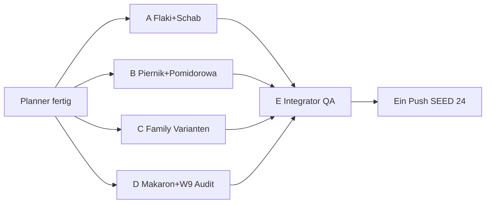

# Wave 10 — Execution Plan (Planner → 4 Implementer → Integrator)

Status: **SHIPPED** (Integrator E · 2026-07-20)  
Live: `SEED_VERSION` **24** · Rezepte **54** · Blog **36** · Families **3**

Team-Modell: **1 Planner** (dieser Doc) → **4 parallele Implementer (A–D)** → **1 Integrator/QA (E)** → **ein Push**.

---

## 1. Ist-Stand (nach Wave 9)

| Layer | LIVE | Notiz |
|-------|------|--------|
| Rezepte | **47** | Longform + `relatedPostIds`; W9 Money Pages grün |
| RecipeFamilies | **3** | Pierogi (ruskie / fleisch / kraut-pilze), Placki (4), Naleśniki (twaróg / mięso / szpinak) |
| Blog | **36** | kein neuer Pillar seit W8 nötig für W10-Set |
| Cluster-Hubs | **31** | Region thin → `noindex,follow` |
| `SEED_VERSION` | **23** | `src/lib/data/store.ts` |
| Blog:Rezept | **~1 : 1.3** | gesund |

**Family-Audit (`seed-families.ts`) — vor Varianten-Vorschlägen:**

| Family | LIVE Varianten | Fehlende starke Variante? |
|--------|----------------|---------------------------|
| Pierogi | ruskie, fleisch, **kraut-pilze** | kapusta/grzyby **schon da** → neu nur **Jagody** (süß) |
| Placki | ziemniaczane, cukinia, ser, jabłka | 4 Varianten satt → **keine** neue Placki-Variante in W10 |
| Naleśniki | twaróg, mięso, szpinak | **süß/Dżem** fehlt → Switcher-fähig |

**Silo-Lücken (nach W9, für W10):**

| Silo | Offen / dünn | W10-Antwort |
|------|--------------|-------------|
| Suppen klassisch | Flaki HOLD; Pomidorowa nur im Overview genannt | **Flaki**, **Zupa pomidorowa** |
| Backen / Wigilia-Süß | Makowiec/Sernik/Babka/Pączki; Piernik HOLD | **Piernik** (ohne neuen Pillar) |
| Fleisch / Sonntag | Schabowy paniert stark; Ofen-Schinkenbraten fehlt | **Schab pieczony** (≠ Schabowy) |
| Family Depth | Pierogi/Naleśniki ohne süße Switcher-Variante | **Pierogi jagody**, **Naleśniki dżem** |
| Alltag / Beilage-Pasta | Łazanki da; süß-herzhaft Pasta fehlt | **Makaron z serem** |
| Niche / Clash | Czernina, Placek po węgiersku, Drożdżówka | bewusst **skip** |

**HOLD-Entscheidungen (Ownership, nicht „warten auf GSC“):**

| Item | Entscheidung W10 | Begründung |
|------|------------------|------------|
| **Flaki** | **SHIP** | Einzigartiger Cook-Primary; kein Clash mit Barszcz/Żurek/Ogórkowa; Overview kann descriptiv linken |
| **Piernik** | **SHIP** ohne neuen Pillar | Intent ≠ Makowiec/Sernik/Babka; Technik nur descriptiv → `post-makowiec-technik` + Wigilia |
| **Zupa pomidorowa** | **SHIP** mit enger Primary | Owner = polnischer Cook-Intent „Zupa pomidorowa“; Overview bleibt Suppen-Pillar; **nicht** generisches DE „Tomatensuppe“ stehlen |
| Czernina | HOLD | zu niche / saisonal-riskant für Spray |
| Placek po węgiersku | HOLD | Intent-Overlap Placki + Gulasz |
| Drożdżówka | HOLD | Hefe-Clash Babka/Pączki |
| Kotlet-Family / Region-Blogs / Meal-Prep / Lab | HOLD | unverändert |

**Linking-Gate (kritisch — überall):**

| Ort | Pflicht |
|-----|---------|
| FACTS → expand() Longform | ≥ **4** Markdown-Links `/de|pl/...` pro Locale (≥2 Rezept + ≥2 Blog) |
| Neue Pillars (falls je) | ≥ **6** Inline-Links / Locale — **W10: kein neuer Pillar** |
| Steps/Tips | ≥ **2** Inline-Links / Locale |
| Related | `relatedPostIds` ≥ 3; Backlinks bidirektional (Inline **und** Related wo sinnvoll) |
| Affiliate | **guide-only** auf Rezepten |

---

## 2. Wave 10 Ziel („weiter — Depth, aggressiv aber ownership-safe“)

**Strategie:** HOLDs schließen, die jetzt ownership-klar sind (Flaki, Piernik, Pomidorowa mit enger Primary); Sonntags-Fleisch-Lücke Ofen-Schab; zwei **echte** Family-Varianten (nicht schon vorhandene kapusta/grzyby); ein Alltag-Comfort-Standalone. **Kein** neuer Blog-Pillar. Kein Region-Spray, kein Meal-Prep, kein Kotlet-Family, kein Placki-5th-Variant.

| Track | Deliverable | Warum jetzt |
|-------|-------------|-------------|
| Suppen / Klassiker | **Flaki**, **Zupa pomidorowa** | echte Silo-Lücken; Overview schon erwähnt Pomidorowa |
| Backen / Wigilia | **Piernik** | Wigilia-Süß neben Makowiec; Pillar nicht nötig |
| Fleisch / Sonntag | **Schab pieczony** | Ofenbraten ≠ panierter Schabowy |
| Family Switcher | **Pierogi z jagodami**, **Naleśniki z dżemem** | Varianten fehlen in `seed-families.ts` |
| Alltag | **Makaron z serem** | Diaspora-Comfort; ≠ Łazanki / Leniwe |

**Nach Wave 10 (Zielmengen):** Rezepte **54** (+7) · Blog **36** (+0) · Families **3** (Varianten +2) · `SEED_VERSION` **24**.

**Primary-KW (neu — Ownership-Doc erweitern):**

| Primary KW DE | Owner-URL |
|---------------|-----------|
| Flaki Rezept / Kuttelsuppe polnisch | `/rezepte/flaki` |
| Schab pieczony / Schweinebraten polnisch Ofen | `/rezepte/schab-pieczony` |
| Piernik Rezept / Polnischer Lebkuchen | `/rezepte/piernik` |
| Zupa pomidorowa Rezept | `/rezepte/zupa-pomidorowa` |
| Pierogi mit Heidelbeeren / Pierogi z jagodami | `/rezepte/pierogi/jagody` |
| Naleśniki mit Marmelade / Naleśniki z dżemem | `/rezepte/nalesniki/dzem` |
| Makaron z serem | `/rezepte/makaron-z-serem` |

**Nicht stehlen:**

| Fremd-Owner | Nur descriptive Anchors |
|-------------|-------------------------|
| Kotlet schabowy / Panieren | Schab pieczony = Ofenbraten, **keine** Panade-Primary |
| Żeberka / Rolada / Zrazy / Gulasz | Fleisch-Nachbarn |
| Barszcz / Żurek / Ogórkowa / Kapuśniak / Botwinka / Chłodnik | Flaki = Kutteln; Pomidorowa = Tomate/Reis-Śmietana-Linie |
| Polnische Suppen (Overview) | Pillar bleibt Broad-Owner; Money Pages nur Cook |
| Makowiec Technik/Rezept, Sernik, Babka, Pączki | Piernik = Lebkuchen/Gewürz; Hefe nicht Primary |
| Wigilia Speiseplan | Anlass-Owner; Piernik nur Gericht |
| Pierogi Guide / Teig | Broad/Technik; Jagody nur Varianten-Cook |
| Naleśniki Guide | Broad; Dżem nur Varianten-Cook |
| Pierogi leniwe / Knedle / Łazanki | Makaron z serem = Pasta+Twaróg(+Zucker)-Teller |
| Twaróg-Guide | Zutaten-Owner; Makaron/Naleśniki nur Cook |

**Kandidaten bewusst übersprungen (Clash / Spray / HOLD):**

| Dish | Grund |
|------|--------|
| Gołąbki, Fasolka, Bigos, Schabowy, Kapusta/Grzyby-Pierogi | bereits LIVE |
| Pierogi kraut-pilze „neu“ | **schon in Family** — nicht erneut anlegen |
| Placki 5. Variante | Family bereits 4 Varianten; Diminishing Returns |
| Placek po węgiersku | Overlap Placki + Gulasz |
| Czernina | zu niche |
| Drożdżówka | Hefe-Clash Babka/Pączki |
| Lane kluski (süß) | Overlap Risiko vs Makaron z serem / Kluski — **Makaron** gewinnt |
| Kotlet family, Meal-Prep Woche, Lab-Tests, Region-Blogs | explizit HOLD |
| Neuer Blog-Pillar | Ownership reicht über bestehende Guides |

---

## 3. Vier parallele Umsetzungspakete (A–D)

### Globale Gates (alle Pakete)

- Affiliate auf Rezepten: **guide-only** (keine neuen `relatedProductIds` / keine recipeIds in Affiliate-Katalog)
- FACTS Longform via expand ≥ **400 Wörter**/Locale
- Unique Unsplash-Cover pro neuem Asset
- Descriptive Anchors; Locale-Pfade: `/de/...` in DE, `/pl/...` in PL
- **Inline FACTS:** ≥ **4** Markdown-Links / Locale (≥2 Rezept + ≥2 Blog)
- **Steps/Tips:** ≥ **2** Inline-Links / Locale
- `relatedPostIds` ≥ 3
- **Kein** neuer Blog-Pillar in Wave 10
- `SEED_VERSION` nur Agent E → **24**
- Datei-Isolation: `wave10-a|b|c|d` — **nicht** fremde Paket-Dateien überschreiben

---

### Paket A — Suppe Klassiker + Ofenfleisch (Flaki + Schab pieczony)

**Owner-Scope (exakt anlegen):**

1. `recipe-flaki` — Flaki (Kuttelsuppe; Majeranek; Diaspora-Cook)
2. `recipe-schab-pieczony` — Schab pieczony (Ofenschweinebraten mit Knochen/ohne; Sonntag)

**Kein neuer Blog.**

**Dateien (isoliert):**

| Datei | Rolle |
|-------|--------|
| `src/lib/data/seed-recipes-wave10-a.ts` | Export `seedRecipesWave10A` |
| `src/lib/data/recipe-articles-w10-a.ts` | Export `W10_FACTS_A` (beide IDs, Markdown-Links) |
| `content/wave-10-status-a.md` | Status für E |
| `content/keyword-ownership.md` | +2 Primary-Zeilen (A-Anteil skizzieren) |

**Touch / Backlinks (erlaubt):**

- Bodies: `blog-bodies-wave2-*` (`post-sonntagsessen`, `post-polnische-suppen`), `blog-bodies-w5-*` (`post-majeranek`)
- Optional: `post-polenladen`, `post-dutch-oven` (Schab Ofen descriptiv)
- FACTS/steps Nachbarn: `recipe-schabowy` (Abgrenzung!), `recipe-zeberka`, `recipe-rosol` / barszcz (Flaki ≠), `recipe-mizeria` oder salatka (Beilage zu Schab)
- **Nicht:** `seed-recipes-wave10-b|c|d.ts`, Family-Dateien (Paket C), `SEED_VERSION`, Region-Hub-Intros

**Gates A:**

- [ ] 2 Rezepte published, unique covers
- [ ] FACTS ≥400; ≥4 Inline-Links DE+PL je Rezept
- [ ] Steps ≥2 Inline-Links DE+PL
- [ ] Flaki Intent klar ≠ Barszcz/Żurek/Ogórkowa/Botwinka
- [ ] Schab pieczony Intent klar ≠ Kotlet schabowy (Ofen vs Panade/Pfanne)
- [ ] Primary „Schab pieczony“ nicht als „Schabowy“ betiteln

**Linking-Checklist A:**

| Rezept | `relatedPostIds` (mind.) |
|--------|--------------------------|
| flaki | `post-polnische-suppen`, `post-majeranek`, `post-polenladen` oder `post-sonntagsessen` |
| schab-pieczony | `post-sonntagsessen`, `post-majeranek`, `post-panieren` nur descriptiv Abgrenzung **oder** `post-dutch-oven` / gusseisen — **nicht** Panieren-Primary stehlen |

**Inline Pflicht-Ziele FACTS:**

- Flaki ↔ polnische-suppen, majeranek, polenladen, 1 Suppen-Nachbar (Abgrenzung)
- Schab pieczony ↔ sonntagsessen, schabowy (Abgrenzung), mizeria oder salatka / ziemniaki-Feeling, majeranek

**Backlinks (bestehende URLs):**

| Bestehend | Aktion |
|-----------|--------|
| `/blog/polnische-suppen` (+ PL) | Inline + `relatedRecipeIds` → flaki (+ pomidorowa kommt von B — getrennte Absätze!) |
| `/blog/majeranek` (+ PL) | Inline → flaki und/oder schab-pieczony |
| `/blog/sonntagsessen-polnisch` (+ PL) | Inline → schab-pieczony (Ofen-Fleisch-Absatz; nicht A/B/C/D vermischen) |
| `/rezepte/kotlet-schabowy` FACTS | 1 Satz Abgrenzung → schab-pieczony |
| `/rezepte/zeberka` optional | Fleisch-Nachbar descriptiv |

---

### Paket B — Backen Wigilia + Suppe Everyday (Piernik + Zupa pomidorowa)

**Owner-Scope:**

1. `recipe-piernik` — Piernik (polnischer Lebkuchen / Honig-Gewürz; oft Wigilia/Alltag)
2. `recipe-zupa-pomidorowa` — Zupa pomidorowa (polnische Tomatensuppe, typisch Reis/Nudeln + Śmietana)

**Kein neuer Blog-Pillar.** Piernik: nur descriptive Technik zu `post-makowiec-technik` („Backen-Nachbar“), **ohne** Primary „polnisches Backen“/Hefeteig zu stehlen. Pomidorowa: Overview `post-polnische-suppen` bleibt Broad-Owner.

**Dateien:**

| Datei | Rolle |
|-------|--------|
| `src/lib/data/seed-recipes-wave10-b.ts` | `seedRecipesWave10B` |
| `src/lib/data/recipe-articles-w10-b.ts` | `W10_FACTS_B` |
| `content/wave-10-status-b.md` | Status |
| `content/keyword-ownership.md` | +2 Zeilen |

**Touch / Backlinks:**

- `blog-bodies-wave2-*`: `post-wigilia`, `post-polnische-suppen`, optional `post-smietana-schmand`
- `blog-bodies-w6-*`: `post-makowiec-technik` — 1 Abgrenzungs-Satz Piernik ≠ Makowiec-Rolle
- FACTS: `recipe-makowiec`, `recipe-sernik`, `recipe-babka` (Abgrenzung Piernik); Suppen-Nachbarn für Pomidorowa
- **Nicht:** neuen `blog-bodies-w10` Pillar; Flaki/Schab (A); Family (C); `SEED_VERSION`

**Gates B:**

- [ ] Piernik Primary nur `/rezepte/piernik`; Makowiec/Sernik/Babka unangetastet
- [ ] SEO-Titel/Description: „Zupa pomidorowa“ / „polnische Tomatensuppe“ — **nicht** generisches „beste Tomatensuppe“
- [ ] Pomidorowa ≠ Barszcz/Ogórkowa/Rosół
- [ ] Inline-Minima global; unique covers

**Linking-Checklist B:**

| Rezept | `relatedPostIds` |
|--------|------------------|
| piernik | `post-wigilia`, `post-makowiec-technik`, `post-polenladen` oder `post-ersatzprodukte-de` |
| zupa-pomidorowa | `post-polnische-suppen`, `post-smietana-schmand`, `post-sonntagsessen` oder `post-ersatzprodukte-de` |

**Inline Pflicht-Ziele:**

- Piernik ↔ Wigilia, Makowiec-Technik (descriptiv), Makowiec oder Sernik (Abgrenzung), Polenladen
- Pomidorowa ↔ polnische-suppen, śmietana, 1 Suppen-Abgrenzung, optional Rosół-Technik descriptiv (Alltags-Suppe)

**Backlinks:**

| Bestehend | Aktion |
|-----------|--------|
| `/blog/wigilia-speiseplan` (+ PL) | Inline + related → piernik |
| `/blog/makowiec-technik` (+ PL) | Abgrenzung ↔ piernik |
| `/blog/polnische-suppen` (+ PL) | Inline + related → zupa-pomidorowa (**A** patcht Flaki — getrennte Absätze!) |
| `/rezepte/makowiec`, `/rezepte/sernik`, `/rezepte/babka` | Optional 1 Abgrenzung → piernik |
| `/blog/smietana-schmand` | Optional → pomidorowa |

**Konflikt-Hotspot mit A:** `post-polnische-suppen` — A = Flaki-Absatz; B = Pomidorowa-Absatz; E dedupt Related.

---

### Paket C — Family-Varianten (Pierogi jagody + Naleśniki dżem)

**Owner-Scope:**

1. `recipe-pierogi-jagody` — Family `family-pierogi`; slugs z. B. DE/PL `jagody`; Label „Heidelbeeren“ / „z jagodami“
2. `recipe-nalesniki-dzem` — Family `family-nalesniki`; slugs z. B. `dzem` / `dzem`; Label „Marmelade“ / „z dżemem“ (Powidła ok als Zutat/Hinweis, Primary = Dżem-Variante)

**Kein neuer Blog.** Guides bleiben Broad-Owner (`post-pierogi-guide`, `post-nalesniki-guide`).

**Dateien:**

| Datei | Rolle |
|-------|--------|
| `src/lib/data/seed-recipes-wave10-c.ts` | `seedRecipesWave10C` — **oder** Varianten analog W4 in Family-Pattern; Prefer: eigene wave10-c Seed-Datei mit `familyId` + `variantLabel` wie `seedFamilyVariantRecipes` |
| `src/lib/data/recipe-articles-w10-c.ts` | `W10_FACTS_C` (falls Longform in FACTS-Pattern; sonst article in Seed + FACTS-Links sicherstellen) |
| Patch-Skizze: `seed-families.ts` | `variantIds` += beide IDs; DE/PL excerpt/seo um neue Varianten erwähnen |
| `content/wave-10-status-c.md` | Status inkl. Family-Diff |
| `content/keyword-ownership.md` | +2 Zeilen |

**Wichtig für E:** Family-Varianten müssen in denselben Merge-Pfad wie bestehende Variants (`seedFamilyVariantRecipes` **oder** Wave-Aggregator + families patch). C dokumentiert in Status-Doc **genau**, wohin E mergen soll. **Nicht** Pierogi kraut-pilze duplizieren.

**Touch / Backlinks:**

- `post-pierogi-guide`, `post-nalesniki-guide`, `post-twarog` (Naleśniki-süß Nachbar descriptiv), `post-freezer-meal-prep` optional Pierogi
- Sibling-Inline in FACTS der bestehenden Varianten (ruskie/fleisch/kraut; twarog/mieso/szpinak) — **kurze** Geschwister-Links; keine Ownership-Umschreibung
- **Nicht:** Placki anfassen; A/B/D Seed-Dateien; `SEED_VERSION`

**Gates C:**

- [ ] Beide Varianten im Family-Switcher sichtbar (`variantIds`)
- [ ] Pierogi jagody ≠ Knedle śliwki (Beeren vs Pflaume/Knödel)
- [ ] Naleśniki dżem ≠ Twaróg-süß Primary (eigene Varianten-URL)
- [ ] FACTS/article ≥4 Inline-Links/Locale; Steps ≥2
- [ ] Unique covers; guide-only affiliate

**Linking-Checklist C:**

| Asset | related |
|-------|---------|
| pierogi-jagody | `post-pierogi-guide`, `post-pierogi-teig` oder formen, `post-freezer-meal-prep` |
| nalesniki-dzem | `post-nalesniki-guide`, `post-twarog` oder `post-tlusty-czwartek` descriptiv, `post-ersatzprodukte-de` |

**Inline Pflicht-Ziele:** Sibling-Varianten-Links (Switcher-Feeling) + Guide + 1 Technik/Einkauf.

**Backlinks:**

| Bestehend | Aktion |
|-----------|--------|
| Pierogi-Guide / Naleśniki-Guide | Inline + relatedRecipeIds → neue Varianten |
| Bestehende Family-Varianten FACTS | +1 Geschwister-Link je Locale wo sinnvoll |
| `seed-families.ts` relatedPostIds | unverändert ok; excerpt Texte updaten |

---

### Paket D — Alltag Pasta + Wave-9 FACTS-Link-Audit

**Owner-Scope:**

1. Neu: `recipe-makaron-z-serem` — Makaron z serem (Butter/Twaróg/Zucker oder salzig-haushaltlich; Diaspora-Teller klar beschreiben)
2. Retrofit/Audit: FACTS Markdown-Inline-Links für **alle Wave-9 Rezept-IDs** (sicherstellen ≥4 / Locale):

   - `recipe-zeberka`, `recipe-rolada-slaska`
   - `recipe-salatka-jarzynowa`, `recipe-botwinka`
   - `recipe-babka`, `recipe-kaszanka`

   Wenn W9 bereits ≥4 hat: nur Lücken schließen + Backlinks von neuen Dish-Nachbarn; **keine** Ownership-Umschreibung.

**Dateien:**

| Datei | Rolle |
|-------|--------|
| `src/lib/data/seed-recipes-wave10-d.ts` | `seedRecipesWave10D` (nur makaron-z-serem) |
| `src/lib/data/recipe-articles-w10-d.ts` | `W10_FACTS_D` (makaron) |
| `src/lib/data/recipe-articles-w10-d-retrofit.ts` | `W10_FACTS_W9_RETROFIT` Patches |
| `content/wave-10-status-d.md` | inkl. Audit-Tabelle Linkcounts |
| `content/keyword-ownership.md` | +1 Zeile |

**Touch / Backlinks:**

- `post-twarog`, `post-ersatzprodukte-de`, `post-sonntagsessen` optional (Alltag vs Sonntag klar)
- FACTS Abgrenzung: `recipe-pierogi-leniwe`, `recipe-lazanki`, `recipe-kopytka`
- **Nicht:** Lane-Kluski parallel anlegen; Family-Dateien (C); `SEED_VERSION`

**Gates D:**

- [ ] Makaron z serem Intent ≠ Leniwe / Łazanki / Knedle
- [ ] Audit: 6 W9-IDs × DE+PL mit ≥4 FACTS-Links oder dokumentierte „already green“
- [ ] guide-only affiliate

**Linking-Checklist D (Makaron):**

- `relatedPostIds`: `post-twarog`, `post-ersatzprodukte-de`, `post-polenladen` oder `post-smietana-schmand`
- Inline ↔ twarog, leniwe (Abgrenzung), łazanki (Abgrenzung), polenladen

**Backlinks Makaron:**

| Bestehend | Aktion |
|-----------|--------|
| `/blog/twarog-deutschland` (+ PL) | Inline + related → makaron-z-serem |
| `/blog/ersatzprodukte-de` | Optional |
| `/rezepte/pierogi-leniwe` | Abgrenzung descriptiv |
| `/rezepte/lazanki` | Abgrenzung (herzhaft Kapusta vs süß-Pasta) |

---

## 4. Integrator / QA — Paket E

**Einziger Merge + Docs + SEED + Push.**

### Merge-Reihenfolge

1. A + B + C + D Rezept-Seeds → `src/lib/data/seed-recipes-wave10.ts` (Aggregator wie W9)
2. Family: C-Varianten in `seed-families.ts` `variantIds` + Variant-Recipes-Pfad (wie bestehend) — **kein Duplikat** kraut-pilze
3. `recipe-articles.ts`: `W10_FACTS_A|B|C|D` + W9-Retrofit einhängen (Links erhalten)
4. `seed.ts`: Imports, `relatedPostIds`-Maps, Blog `relatedRecipeIds` dedupt (Suppen/Sonntag/Wigilia Hotspots)
5. `SEED_VERSION` **23 → 24** in `store.ts`
6. Docs final: `recipe-expansion-w4.md` (Wave-10 Abschnitt), `topical-backlog.md`, `topical-authority-status.md`, `keyword-ownership.md`, dieses Plan-Doc → Status **SHIPPED**
7. Optional Status-Docs A–D als shipped markieren

### QA-Checkliste E

- [ ] **Ownership:** Flaki≠andere Suppen; Schab pieczony≠Schabowy; Piernik≠Makowiec/Sernik/Babka; Pomidorowa eng primary; Jagody≠Knedle; Dżem≠Twaróg-Primary-Steal; Makaron≠Leniwe/Łazanki
- [ ] **Bidirektional:** jedes neue Asset Related **und** ≥4 FACTS-Inline; alle §3-Backlink-Ziele gepatcht
- [ ] **Inline-Audit:** Stichprobe expand(FACTS) für 7 neue + W9-Audit-IDs
- [ ] **Family-Switcher:** Pierogi 4 Varianten; Naleśniki 4 Varianten; Catalog zeigt Families einmal
- [ ] **Wort-Gates:** Rezept-Longform ≥400; keine Stub-Bodies; **kein** neuer Pillar-Stub
- [ ] **Covers** unique (kein Diebstahl W4–W9)
- [ ] **Catalog / Sitemap / noindex:** Region-Hubs weiter thin=`noindex,follow`; neue URLs indexable
- [ ] **Build green** (lint + build laut Repo-Standard)
- [ ] **JSON-LD** Recipe author/dates/image ok
- [ ] **Ein Push** erst nach grünem QA — **kein** Teil-Push aus A–D

**A–D pushen nicht.** Nur lokale Worktrees/Branches; E integriert und pusht **einmal**.

---

## 5. Reihenfolge & Parallelisierung



| Parallel | Warten |
|----------|--------|
| A, B, C, D voll parallel | — |
| E | nach A+B+C+D |

**Konflikt-Hotspots (vor Merge abstimmen):**

| Datei / Body | Wer | Regel |
|--------------|-----|--------|
| `post-polnische-suppen` | A, B | A = Flaki; B = Pomidorowa; getrennte Absätze |
| `post-sonntagsessen` | A, (B/D) | A = Schab Ofen; andere nur kurze complementary |
| `post-wigilia` | B | Piernik; C nicht Wigilia-Primary stehlen |
| `seed-families.ts` | **nur C** skizziert / E merged | A/B/D nicht anfassen |
| `recipe-articles.ts` | alle | Nur eigene `w10-*` Exports; E merged |
| `seed.ts` related maps | alle skizzieren | E dedupt |
| `keyword-ownership.md` | alle | E final dedupt |

---

## 6. Explizit HOLD / out of scope Wave 10

| Item | Warum HOLD |
|------|------------|
| Kotlet family hub | SEO-safe Split separat |
| Region-Blogs / Region-Hub-Intros ≥400 | eigener Depth-Batch |
| Meal-Prep Arbeitswoche | ≠ Freezer-Pierogi Owner |
| Lab Produkt-Tests | echte Tests nötig |
| Czernina | niche |
| Placek po węgiersku | Placki + Gulasz Clash |
| Drożdżówka | Hefe-Clash Babka/Pączki |
| Lane kluski parallel | durch Makaron z serem abgedeckt / Spray |
| Placki 5. Variante | Family schon voll |
| Neuer Blog-Pillar | Ownership nicht erforderlich diese Runde |
| Spray 5. Diaspora-Guide | Qualität vor Menge |

---

## Anhang — Copy-Paste Task Prompts

### Prompt Agent A

```
Repo: /Users/timrayburkhardt/Alemniam. Du bist Implementer A (Wave 10 Flaki + Schab pieczony). Lies content/wave-10-plan.md Paket A. Kein Push. Kein SEED_VERSION-Bump.

Lege an:
- recipe-flaki (slug de/pl: flaki) — Flaki / Kuttelsuppe
- recipe-schab-pieczony (slug: schab-pieczony) — Schab pieczony Ofenbraten

Dateien isoliert:
- src/lib/data/seed-recipes-wave10-a.ts (export seedRecipesWave10A)
- src/lib/data/recipe-articles-w10-a.ts (export W10_FACTS_A mit Markdown-Inline-Links)
- content/wave-10-status-a.md
- keyword-ownership.md +2 Primary-Zeilen

Gates: unique covers; FACTS ≥400 Wörter/Locale; ≥4 Inline-Links/Locale in FACTS (≥2 Rezept + ≥2 Blog); Steps/Tips ≥2 Links/Locale; affiliate guide-only; descriptive anchors; Flaki ≠ Barszcz/Żurek/Ogórkowa/Botwinka; Schab pieczony ≠ Kotlet schabowy (Ofen vs Panade); kein Region-Blog-KW-Steal; kein neuer Pillar.

relatedPostIds + Backlinks laut Plan Paket A (polnische-suppen Flaki-Absatz, majeranek, sonntagsessen Schab-Absatz, schabowy Abgrenzung).

Am Ende: Diff-Liste + was Agent E mergen muss. Kein Commit-Push auf main.
```

### Prompt Agent B

```
Repo: /Users/timrayburkhardt/Alemniam. Du bist Implementer B (Wave 10 Piernik + Zupa pomidorowa). Lies content/wave-10-plan.md Paket B. Kein Push. Kein SEED_VERSION-Bump. KEIN neuer Blog-Pillar.

Lege an:
- recipe-piernik (slug: piernik) — Piernik / polnischer Lebkuchen
- recipe-zupa-pomidorowa (slug: zupa-pomidorowa) — Zupa pomidorowa

Dateien: seed-recipes-wave10-b.ts, recipe-articles-w10-b.ts (W10_FACTS_B), wave-10-status-b.md, keyword-ownership +2 Zeilen.

Ownership:
- Piernik Primary nur /rezepte/piernik; Makowiec Technik/Rezept, Sernik, Babka unangetastet (nur descriptive Abgrenzung über post-makowiec-technik)
- Zupa pomidorowa = Cook-Primary; post-polnische-suppen bleibt Overview-Owner
- SEO: „Zupa pomidorowa“ / „polnische Tomatensuppe“ — kein generisches „beste Tomatensuppe“

Gates: FACTS ≥4 Inline-Links/Locale; Steps ≥2; ≥400 Wörter; unique cover; guide-only affiliate.

Backlinks pflicht: wigilia → piernik; makowiec-technik Abgrenzung; polnische-suppen Pomidorowa-Absatz (nicht A-Flaki-Absatz überschreiben); optional smietana.

Am Ende: Diff-Liste für Integrator. Kein main-Push.
```

### Prompt Agent C

```
Repo: /Users/timrayburkhardt/Alemniam. Du bist Implementer C (Wave 10 Family-Varianten). Lies content/wave-10-plan.md Paket C + src/lib/data/seed-families.ts. Kein Push. Kein SEED_VERSION-Bump.

Lege an (Family-Varianten, analog bestehender seedFamilyVariantRecipes-Pattern):
- recipe-pierogi-jagody — family-pierogi, slug jagody, Label Heidelbeeren / z jagodami
- recipe-nalesniki-dzem — family-nalesniki, slug dzem, Label Marmelade / z dżemem

Dateien: seed-recipes-wave10-c.ts, recipe-articles-w10-c.ts (W10_FACTS_C), Patch-Skizze/Diff für seed-families.ts variantIds + excerpts, wave-10-status-c.md, keyword-ownership +2 Zeilen.

WICHTIG: Pierogi kraut-pilze / ruskie / fleisch und Placki-Varianten NICHT neu anlegen — die existieren. Keine 5. Placki-Variante.

Gates: Switcher-fähig; Jagody ≠ Knedle śliwki; Dżem ≠ Twaróg-Primary-Steal; FACTS ≥4 Inline/Locale; Steps ≥2; ≥400 Wörter; unique covers; guide-only; Sibling-Links zu anderen Varianten.

Backlinks: pierogi-guide, nalesniki-guide, kurze Geschwister-Links in bestehenden Varianten-FACTS wo sinnvoll.

Am Ende: exakte Merge-Anweisung für E (families + variant recipes Pfad). Kein main-Push.
```

### Prompt Agent D

```
Repo: /Users/timrayburkhardt/Alemniam. Du bist Implementer D (Wave 10 Makaron z serem + W9 FACTS-Audit). Lies content/wave-10-plan.md Paket D. Kein Push. Kein SEED_VERSION-Bump.

1) Neu: recipe-makaron-z-serem (slug: makaron-z-serem) — Cook-Intent; Primary ≠ Leniwe/Łazanki/Knedle.
2) Audit/Retrofit: FACTS für W9-IDs (zeberka, rolada-slaska, salatka-jarzynowa, botwinka, babka, kaszanka) — je Locale ≥4 echte Markdown-Links [/de|/pl/...]; Lücken in recipe-articles-w10-d-retrofit.ts schließen.

Dateien: seed-recipes-wave10-d.ts, recipe-articles-w10-d.ts, recipe-articles-w10-d-retrofit.ts, wave-10-status-d.md (Audit-Tabelle), keyword-ownership +1.

Backlinks: twarog-deutschland, optional ersatzprodukte; Abgrenzung leniwe/lazanki FACTS.

Gates: guide-only; FACTS/Steps Link-Minima; keine Lane-Kluski parallel; kein neuer Pillar.

Am Ende: Audit-Tabelle ID → Linkcount DE/PL + Diff-Liste. Kein main-Push.
```

### Prompt Agent E (Integrator/QA)

```
Repo: /Users/timrayburkhardt/Alemniam. Du bist Integrator/QA Wave 10. Lies content/wave-10-plan.md §4. Einziger Push.

Merge A–D:
- Aggregator src/lib/data/seed-recipes-wave10.ts (wie wave9)
- Family-Varianten aus C in seed-families.ts + Variant-Recipes-Pfad (kein Duplikat kraut-pilze)
- W10_FACTS_* + W9-Retrofit in recipe-articles.ts
- seed.ts Imports + related* Maps dedupt (polnische-suppen / sonntagsessen / wigilia Hotspots)
- SEED_VERSION 23→24 in store.ts

Docs final: recipe-expansion-w4.md, topical-backlog.md, topical-authority-status.md, keyword-ownership.md, wave-10-plan.md → SHIPPED.
Zielmengen: Rezepte 54, Blog 36, Families 3 (Pierogi+Naleśniki je +1 Variante).

QA: Ownership-Trennungen laut Plan; bidirektionale Links; Inline-Audit ≥4 FACTS; Family-Switcher; Wortgates; unique covers; Region-Hubs noindex; build green; JSON-LD ok.
Nur bei Grün: ein kombinierter git add . && git commit -m "..." && git push origin main (bzw. vereinbarter Branch).
A–D haben nicht gepusht.
```
