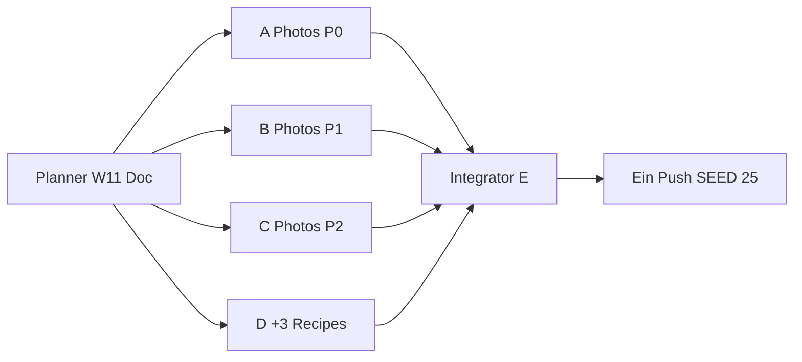

# Wave 11 — Execution Plan (Planner → 4 Implementer → Integrator)

Status: **SHIPPED** (Integrator E · 2026-07-21)  
Live: `SEED_VERSION` **25** · Rezepte **57** · Blog **36** · Families **3**

Team-Modell: **1 Planner** (dieser Doc) → **4 parallele Implementer (A–D)** → **1 Integrator/QA (E)** → **ein Push**.

**Priorität User:** Cover-Fit-Qualität vor Mengen-Spray. Deshalb Wave 11 = **3 Photo-Pakete + 1 schmales Content-Paket** (nur **+3** neue Rezepte).

---

## 1. Ist-Stand (nach Wave 10)

| Layer | LIVE | Notiz |
|-------|------|--------|
| Rezepte | **54** | inkl. Family-Varianten (`seed-families.ts` + Wave-Seeds) |
| RecipeFamilies | **3** | Pierogi (4), Placki (4), Naleśniki (4) |
| Blog | **36** | kein neuer Pillar nötig für Photo-Wave |
| `SEED_VERSION` | **24** | `src/lib/data/store.ts` |
| Cover-Pipeline | Unsplash-URLs | Format `https://images.unsplash.com/photo-{ID}?w=1600&q=80` · `next.config.ts` erlaubt nur `images.unsplash.com` · 1× lokal: `/recipes/pierogi-ruskie.jpg` |

### Cover-Mechanik (nicht neu erfinden)

| Feld | Wo | Regel |
|------|-----|--------|
| `Recipe.coverImage` | Seed-Objekte | Hero + Cards (`RecipeCard`, `RecipeExperience`) |
| `Recipe.variantImage` | optional, z. B. Pierogi ruskie | Switcher-Thumb; bei Cover-Replace mitziehen wenn gesetzt |
| `RecipeFamily.coverImage` | `seed-families.ts` | Katalog-Karte der Family |
| CDN | **nur** Unsplash wie bisher | Kein neuer CDN, kein Placeholder-Service |
| Local | `public/recipes/*` | Nur wenn bewusst (Pierogi); sonst Unsplash konsistent halten |

**Audit-Methode (Planner):** Alle 54 published Recipe-IDs aus `seed.ts` + `seed-families.ts` + `seed-recipes-wave*.ts` extrahiert; Uniqueness geprüft; HTTP GET gegen Cover-URL; visuelle Stichprobe aller downloadbaren Thumbs.

---

## 2. Photo-Audit Summary

### Counts

| Kategorie | Anzahl | Bedeutung |
|-----------|--------|-----------|
| **KEEP** | **0** | Kein Cover erfüllt „passt zum konkreten polnischen Gericht“ |
| **REPLACE** | **43** | URL erreichbar, aber offensichtlicher Mismatch (andere Cuisine / anderes Gericht / Non-Food) |
| **MISSING** | **11** | Cover-Feld gesetzt, Unsplash liefert **HTTP 404** (tot) |
| **Duplikate** | **0** | Photo-IDs aktuell unique — nach Replace weiter unique halten |
| **Gesamt zu ersetzen** | **54** | Wave 11 muss praktisch **alle** Covers neu wählen |

### MISSING (HTTP 404 — sofort kritisch)

| Recipe-ID | Aktuelle Photo-ID | Datei |
|-----------|-------------------|--------|
| `recipe-chlodnik` | `1625944525533-217feca6f147` | `seed.ts` |
| `recipe-gulasz` | `1607628311673-4fc15faa5791` | `seed.ts` |
| `recipe-kapusniak` | `1543332164-6e82f355bad8` | `seed-recipes-wave8-b.ts` |
| `recipe-kluski-slaskie` | `1612872087338-bb623d2a77d5` | `seed.ts` |
| `recipe-kotlet-mielony` | `1588346301655-83add6be44f7` | `seed.ts` |
| `recipe-mizeria` | `1604977042946-4fba4c5ec4a2` | `seed-recipes-wave8-a.ts` |
| `recipe-placki` | `1631453717818-536547643874` | `seed.ts` (+ Family-Cover) |
| `recipe-placki-cukinia` | `1565299500977-26105862a20b` | `seed-families.ts` |
| `recipe-placki-jablka` | `1488477181941-6d2ea94eb813` | `seed-families.ts` |
| `recipe-placki-ser` | `1627308595229-245cf2199a7f` | `seed-families.ts` |
| `recipe-zupa-pomidorowa` | `1548943487-a2e4e43b485c` | `seed-recipes-wave10-b.ts` |

### REPLACE — vollständige Liste (ID · was zu sehen ist · Suchbegriffe)

Implementer wählen **eine** passende Unsplash-Photo-ID, prüfen **GET 200**, visuelle Passung, Unique-Check gegen alle anderen Covers, dann URL im Projektformat setzen.

| Recipe-ID | Ist-Bild (Audit) | Unsplash-Suchbegriffe (EN, Prefer finished dish) | Optional bekannte Live-IDs* |
|-----------|------------------|--------------------------------------------------|----------------------------|
| `recipe-pierogi` | Lokal: asiatische Gyoza/pleats | `pierogi sour cream onions`, `polish dumplings plate`, `boiled dumplings butter` | `photo-1764831257619-24aa3930e02d` (raw pierogi boards — nur wenn plated nicht gefunden; **kein** Gyoza/Chopsticks) |
| `recipe-pierogi-meat` | Asiatisches Dumpling-Platter | `meat dumplings plate`, `pierogi meat fried onions` | `photo-1766309498484-a781ddb7e74c` (Hands folding — Prep ok nur als Fallback) |
| `recipe-pierogi-cabbage` | Chow-Mein + Chopsticks | `cabbage mushroom dumplings`, `sauerkraut pierogi`, `eastern european dumplings` | — |
| `recipe-pierogi-jagody` | Nur Heidelbeeren-Schüssel | `blueberry dumplings`, `sweet pierogi berries`, `fruit dumplings cream` | — |
| `recipe-uszka` | Gyoza + Sesam + Chopsticks | `tiny mushroom dumplings broth`, `uszka barszcz`, `small dumplings clear soup` | — |
| `recipe-flaki` | Shrimp-Gumbo/Jambalaya | `tripe soup`, `flaki`, `beef tripe stew marjoram` | — |
| `recipe-barszcz` | Shakshuka | `borscht beet soup`, `clear red beet broth`, `barszcz czerwony` | — |
| `recipe-zurek` | Kürbis-/Orangene Cremesuppe | `sour rye soup sausage egg`, `zurek`, `white borscht sausage` | — |
| `recipe-rosol` | Lachs-Power-Bowl | `clear chicken noodle soup`, `rosol`, `homemade chicken broth noodles` | — |
| `recipe-ogorkowa` | Drachenfrucht-Brunch | `pickle soup`, `cucumber dill soup`, `sour cucumber soup` | — |
| `recipe-botwinka` | Brokkoli-Schnitt | `beet greens soup`, `young beet soup`, `botwinka` | — |
| `recipe-bigos` | Rinderschmortopf + Sesam | `hunter stew cabbage`, `sauerkraut meat stew`, `bigos` | — |
| `recipe-golabki` | Mediterrane Hähnchenstückchen | `cabbage rolls tomato sauce`, `stuffed cabbage rolls`, `golabki` | — |
| `recipe-schabowy` | Rindersteak am Schneiden | `breaded pork cutlet`, `schnitzel pork plate`, `kotlet schabowy` | — |
| `recipe-schab-pieczony` | Seared Beef Filet | `roast pork loin oven`, `pork roast herbs`, `pieczony schab` | — |
| `recipe-zeberka` | Griechisches Souvlaki | `oven pork ribs`, `baked spare ribs`, `żeberka` | — |
| `recipe-zrazy` | BBQ-Ribs + Fritten | `beef roulades gravy`, `stuffed beef rolls`, `zrazy` | — |
| `recipe-rolada-slaska` | Bone-in Steak Gourmet | `beef roulade gravy`, `silesian roulade`, `rolled beef stew` | — |
| `recipe-kaszanka` | Steak medium-rare | `blood sausage fried onion`, `kaszanka`, `black pudding apple onion` | — |
| `recipe-karp` | Lachs + Zoodles | `fried carp`, `whole carp christmas`, `breaded carp` | — |
| `recipe-sledz` | Seeterrasse **ohne Food** | `herring onion pickle`, `marinated herring plate`, `śledź` | — |
| `recipe-fasolka` | Pasta Carbonara | `baked beans sausage tomato`, `white bean stew sausage`, `fasolka po bretonsku` | — |
| `recipe-lazanki` | Penne Bolognese | `cabbage noodles pasta`, `square noodles cabbage`, `łazanki` | — |
| `recipe-makaron-z-serem` | Pesto-Farfalle-Salat | `pasta cottage cheese`, `noodles farmer cheese butter`, `sweet pasta cheese` | — |
| `recipe-kopytka` | Hähnchen + Spargel | `potato dumplings butter`, `gnocchi potato pan fried`, `kopytka` | — |
| `recipe-pyzy` | Gebratener Reis | `large potato dumplings meat`, `pyzy`, `steamed potato dumplings` | — |
| `recipe-knedle-sliwki` | Tiramisu-Schichttorte | `plum dumplings`, `fruit dumplings sugar butter`, `knedle śliwki` | — |
| `recipe-pierogi-leniwe` | Nachos-Party-Platte | `lazy dumplings cheese`, `halusky cheese`, `leniwe` | — |
| `recipe-krokiety` | Meatballs auf Rucola | `breaded croquettes`, `rolled crepes fried`, `krokiety` | — |
| `recipe-nalesniki` | US-Pancake-Stack | `thin crepes rolled filling`, `naleśniki`, `european crepes savory` | — |
| `recipe-nalesniki-mieso` | Pancakes Blaubeere | `savory crepes meat filling`, `rolled pancakes meat` | — |
| `recipe-nalesniki-szpinak` | Tandoori-Hähnchenkeulen | `spinach crepes`, `green crepes cheese`, `crepes spinach ricotta` | — |
| `recipe-nalesniki-dzem` | French Toast | `crepes jam powdered sugar`, `rolled crepes jam` | — |
| `recipe-kapusta-zasmażana` | Rohe Kartoffeln | `braised cabbage`, `fried sauerkraut`, `kapusta zasmażana` | — |
| `recipe-salatka-jarzynowa` | Raw Rainbow Bowl | `polish vegetable salad mayo`, `russian salad mayo`, `sałatka jarzynowa` | — |
| `recipe-oscypek` | Blauschimmel-Käsebrett | `smoked sheep cheese grill`, `oscypek cranberry`, `grilled smoked cheese` | — |
| `recipe-faworki` | US Donuts mit Streuseln | `angel wings pastry powdered sugar`, `faworki`, `chrust pastry` | — |
| `recipe-paczki` | **Staubsauger** + Konfetti | `polish paczki`, `jelly filled donut powdered`, `pączki` | — |
| `recipe-makowiec` | Erdbeer-Panna-Cotta-Gläser | `poppy seed roll`, `makowiec`, `poppy seed cake swirl` | — |
| `recipe-sernik` | Himbeer-Schichttorte | `polish cheesecake`, `sernik`, `baked cheesecake plain` | — |
| `recipe-piernik` | Chocolate Brownies | `gingerbread cake`, `honey spice cake`, `piernik` | `photo-1481391319762-47dff72954d9` (prüfen: gingerbread-Fit) |
| `recipe-babka` | Schokotorte + Sterne-Streusel | `yeast bundt cake`, `babka cake`, `easter yeast cake` | — |
| `recipe-racuchy` | Artisan-Brotlaibe | `apple fritters`, `yeast apple pancakes`, `racuchy` | — |

\*Optionale IDs sind **Kandidaten** (GET 200 geprüft) — Implementer müssen trotzdem visuell matchen und Unique-Gate einhalten. Lieber bessere Suche als schwache ID forcen.

### MISSING → REPLACE (Suchbegriffe für die 11 toten URLs)

| Recipe-ID | Suchbegriffe |
|-----------|--------------|
| `recipe-chlodnik` | `cold beet soup yogurt`, `chłodnik`, `cold borscht cucumber dill` |
| `recipe-gulasz` | `pork goulash stew`, `hungarian style goulash`, `gulasz wieprzowy` |
| `recipe-kapusniak` | `sauerkraut soup`, `cabbage soup sausage`, `kapuśniak` |
| `recipe-kluski-slaskie` | `silesian dumplings gravy`, `kluski śląskie`, `potato dumplings indentation` |
| `recipe-kotlet-mielony` | `fried meat patties`, `ground pork cutlets`, `kotlet mielony` |
| `recipe-mizeria` | `cucumber sour cream salad dill`, `mizeria`, `creamy cucumber salad` |
| `recipe-placki` | `potato pancakes sour cream`, `latkes`, `placki ziemniaczane` |
| `recipe-placki-cukinia` | `zucchini fritters`, `zucchini pancakes` |
| `recipe-placki-jablka` | `apple pancakes`, `sweet apple fritters` |
| `recipe-placki-ser` | `cheese pancakes savory`, `quark fritters` |
| `recipe-zupa-pomidorowa` | `tomato soup rice cream`, `polish tomato soup`, `zupa pomidorowa` |

### Family-Cover Sync (Pflicht bei Photo-Arbeit)

| Family | defaultVariant | Family-`coverImage` mitziehen |
|--------|----------------|-------------------------------|
| `family-pierogi` | `recipe-pierogi` | ja — heute lokal Gyoza-Look |
| `family-placki` | `recipe-placki` | ja — heute 404 |
| `family-nalesniki` | `recipe-nalesniki` | ja — heute US-Pancakes |

---

## 3. Wave 11 Ziel

**Strategie:** Erst visuelle Glaubwürdigkeit der Money Pages und Klassiker herstellen (alle 54 Covers). Content nur **+3** ownership-sichere Diaspora-/Wigilia-Lücken — **kein** HOLD-Spray (Czernina, Placek po węgiersku, Drożdżówka, Kotlet-Family, Region-Blogs).

| Track | Deliverable | Warum jetzt |
|-------|-------------|-------------|
| Photos P0 | 11× MISSING + Hero-Money-Pages | Broken Images + Trust |
| Photos P1 | Suppen/Fleisch/Beilagen-Mismatch-Batch | Silo-Glaubwürdigkeit |
| Photos P2 | Backen/Süß/Family-Rest | Restkatalog |
| Content | **+3** Rezepte | Gaps ohne Clash |
| Seed | `SEED_VERSION` **24 → 25** | nur Agent E |

**Nach Wave 11 (Zielmengen):** Rezepte **57** (+3) · Blog **36** (+0) · Families **3** · `SEED_VERSION` **25**.

### Content-Kandidaten (+3) — ownership-safe

| Primary KW DE | Owner-URL | Abgrenzung |
|---------------|-----------|------------|
| Ryba po grecku / Fisch griechische Art polnisch | `/rezepte/ryba-po-grecku` | ≠ Karp (Wigilia-Fisch-Linie getrennt: Karp ganz/panier vs. Gemüse-Sauce-Fisch) |
| Golonka / Haxe polnisch geschmort | `/rezepte/golonka` | ≠ Schabowy / Schab pieczony / Żeberka |
| Kompot z suszu / Trockenobstkompot | `/rezepte/kompot-z-suszu` | Anlass descriptiv → Wigilia-Pillar; Primary = Getränk/Dessert-Kompot |

**Übersprungen (bewusst):**

| Dish | Grund |
|------|--------|
| Czernina | HOLD niche |
| Placek po węgiersku | Placki + Gulasz Clash |
| Drożdżówka | Hefe-Clash Babka/Pączki |
| Kotlet family hub | SEO-Split separat |
| Lane kluski | Overlap Makaron z serem |
| Neuer Blog-Pillar | nicht nötig |

**Linking-Gate (wie W8–10 — für neue Rezepte in D):**

| Ort | Pflicht |
|-----|---------|
| FACTS → expand() Longform | ≥ **4** Markdown-Links `/de|pl/...` pro Locale (≥2 Rezept + ≥2 Blog) |
| Steps/Tips | ≥ **2** Inline-Links / Locale |
| Related | `relatedPostIds` ≥ 3; Backlinks bidirektional wo sinnvoll |
| Affiliate | **guide-only** auf Rezepten |
| Covers | unique · GET 200 · visuell Gericht = Intent |

---

## 4. Vier parallele Umsetzungspakete (A–D)

### Globale Gates (alle Pakete)

- Cover-Format exakt: `https://images.unsplash.com/photo-{ID}?w=1600&q=80`
- Vor Merge: `curl -sI` oder GET → **200**; visuell Gericht erkennbar; **keine** Chopsticks/Gyoza für polnische Teigtaschen; **kein** Non-Food
- Unique Photo-ID über **alle 54+ neuen** Rezepte (A–D koordinieren via Status-Docs / Shared-Liste in Status)
- Kein neuer CDN · keine `placehold.co` · kein AI-Image-Service ohne Freigabe
- `SEED_VERSION` nur Agent E → **25**
- Datei-Isolation: `wave11-a|b|c|d` Status + Patch-Listen — **nicht** fremde Photo-IDs überschreiben
- Photo-Pakete ändern **nur** `coverImage` / `variantImage` / Family-`coverImage` (und ggf. gleiche URL in `images[]` falls vorhanden) — **keine** Ownership-/FACTS-Umschreibung außer D

---

### Paket A — Photo REPLACE Batch 1 (P0: Broken + Money Heroes)

**Scope (20 IDs):**

**MISSING (11):**  
`recipe-chlodnik`, `recipe-gulasz`, `recipe-kapusniak`, `recipe-kluski-slaskie`, `recipe-kotlet-mielony`, `recipe-mizeria`, `recipe-placki`, `recipe-placki-cukinia`, `recipe-placki-jablka`, `recipe-placki-ser`, `recipe-zupa-pomidorowa`

**Hero REPLACE (9):**  
`recipe-pierogi` (+ `variantImage` + `family-pierogi.coverImage`; lokal `/recipes/pierogi-ruskie.jpg` ersetzen **oder** auf Unsplash umstellen — konsistent dokumentieren),  
`recipe-pierogi-meat`, `recipe-pierogi-cabbage`, `recipe-pierogi-jagody`,  
`recipe-schabowy`, `recipe-barszcz`, `recipe-zurek`, `recipe-bigos`, `recipe-paczki`

**Dateien:**

| Datei | Rolle |
|-------|--------|
| Patch in bestehenden Seed-Dateien der IDs oben | nur Cover-Felder |
| `content/wave-11-status-a.md` | Tabelle: ID → alt Photo → neu Photo → GET-Status → Fit-Notiz |
| Optional: `public/recipes/pierogi-ruskie.jpg` | nur wenn Local-Pfad beibehalten |

**Gates A:**

- [ ] Alle 20 GET 200
- [ ] Unique vs. B/C/D (Status-Doc listet IDs)
- [ ] Pierogi-Family: keine asiatischen Dumplings/Chopsticks
- [ ] Pączki: Food, gefüllter Donut/Hefeteilchen — kein Haushaltsgerät
- [ ] Placki-Family-Cover synced

---

### Paket B — Photo REPLACE Batch 2 (P1: Suppen / Fleisch / Herzhaft)

**Scope (17 IDs):**

`recipe-flaki`, `recipe-uszka`, `recipe-rosol`, `recipe-ogorkowa`, `recipe-botwinka`,  
`recipe-golabki`, `recipe-schab-pieczony`, `recipe-zeberka`, `recipe-zrazy`, `recipe-rolada-slaska`, `recipe-kaszanka`,  
`recipe-karp`, `recipe-sledz`, `recipe-fasolka`, `recipe-lazanki`, `recipe-makaron-z-serem`, `recipe-krokiety`

**Dateien:** Seed-Patches + `content/wave-11-status-b.md` (gleiche Tabellenform wie A).

**Gates B:** Flaki ≠ Gumbo/Shrimp; Uszka ≠ Gyoza; Śledź = Fisch auf dem Teller; Gołąbki = Kohlrouladen.

---

### Paket C — Photo REPLACE Batch 3 (P2: Teigwaren / Backen / Family Naleśniki)

**Scope (17 IDs):**

`recipe-kopytka`, `recipe-pyzy`, `recipe-knedle-sliwki`, `recipe-pierogi-leniwe`,  
`recipe-nalesniki`, `recipe-nalesniki-mieso`, `recipe-nalesniki-szpinak`, `recipe-nalesniki-dzem` (+ `family-nalesniki.coverImage`),  
`recipe-kapusta-zasmażana`, `recipe-salatka-jarzynowa`, `recipe-oscypek`, `recipe-mizeria` **nur wenn A nicht schon**,  
`recipe-faworki`, `recipe-makowiec`, `recipe-sernik`, `recipe-piernik`, `recipe-babka`, `recipe-racuchy`

> **Hinweis:** `recipe-mizeria` ist MISSING → **Paket A**. C nimmt statt dessen sicher: die 17 oben **ohne** Doppelung — konkrete finale Liste in Status C gegen A abgleichen. Falls Zählung kollidiert: C ersetzt die verbleibenden aus REPLACE-Tabelle, die A/B nicht haben (Integrator E dedupt).

**Korrigierte C-Liste (17, disjunkt zu A+B):**

`recipe-kopytka`, `recipe-pyzy`, `recipe-knedle-sliwki`, `recipe-pierogi-leniwe`,  
`recipe-nalesniki`, `recipe-nalesniki-mieso`, `recipe-nalesniki-szpinak`, `recipe-nalesniki-dzem`,  
`recipe-kapusta-zasmażana`, `recipe-salatka-jarzynowa`, `recipe-oscypek`,  
`recipe-faworki`, `recipe-makowiec`, `recipe-sernik`, `recipe-piernik`, `recipe-babka`, `recipe-racuchy`

(+ Family-Cover Naleśniki)

**Dateien:** Seed-Patches + `content/wave-11-status-c.md`.

**Gates C:** Naleśniki = dünne Crepes/gerollt, keine US-Pancakes/French-Toast/Hähnchen; Makowiec = Mohnrolle; Sernik ≠ Himbeer-Torte; Faworki ≠ Streusel-Donuts.

---

### Paket D — +3 Rezepte + Cover-QA-Stichprobe / Link-Gates

**Owner-Scope:**

1. `recipe-ryba-po-grecku` — Ryba po grecku  
2. `recipe-golonka` — Golonka  
3. `recipe-kompot-z-suszu` — Kompot z suszu  

**Plus:** Stichprobe: je 3 Covers aus A/B/C Status-Docs gegen Live-URL + Fit-Kriterien; Lücken in Status melden (nicht still überschreiben).

**Kein neuer Blog-Pillar.**

**Dateien:**

| Datei | Rolle |
|-------|--------|
| `src/lib/data/seed-recipes-wave11-d.ts` | `seedRecipesWave11D` |
| `src/lib/data/recipe-articles-w11-d.ts` | `W11_FACTS_D` |
| `content/wave-11-status-d.md` | Status + Photo-Stichprobe |
| `content/keyword-ownership.md` | +3 Primary-Zeilen |

**Touch / Backlinks:**

- `post-wigilia` → ryba-po-grecku, kompot-z-suszu (descriptiv, Pillar bleibt Anlass-Owner)
- `post-sonntagsessen` → golonka
- FACTS-Abgrenzung: `recipe-karp` ↔ ryba-po-grecku; `recipe-schabowy` / `recipe-schab-pieczony` / `recipe-zeberka` ↔ golonka
- **Nicht:** Photo-IDs von A/B/C überschreiben; `SEED_VERSION`

**Gates D:** FACTS ≥400; ≥4 Inline-Links/Locale; Steps ≥2; unique covers GET 200; guide-only affiliate.

**relatedPostIds (mind.):**

| Rezept | related |
|--------|---------|
| ryba-po-grecku | `post-wigilia`, `post-polenladen` oder ersatzprodukte, `post-sonntagsessen` optional |
| golonka | `post-sonntagsessen`, `post-majeranek` oder dutch-oven, `post-polenladen` |
| kompot-z-suszu | `post-wigilia`, `post-polenladen`, `post-ersatzprodukte-de` |

---

## 5. Agent E — Integrator / QA Checklist



| Parallel | Warten |
|----------|--------|
| A, B, C, D voll parallel | Photo-ID-Kollisionen über Status-Docs kommunizieren |
| E | nach A+B+C+D |

**Merge-Checklist E:**

- [ ] Aggregator `src/lib/data/seed-recipes-wave11.ts` (oder D direkt in `seed.ts` import — Pattern wie Wave 10)
- [ ] Alle Cover-Patches A–C gemerged; keine ID doppelt
- [ ] Family-Covers Pierogi/Placki/Naleśniki synced
- [ ] `recipe-pierogi` Local vs Unsplash konsistent (`variantImage` + Family)
- [ ] `W11_FACTS_D` in `recipe-articles.ts` verdrahtet
- [ ] `keyword-ownership.md` +3 dedupt
- [ ] Docs: `topical-backlog.md`, `recipe-expansion-w4.md` / authority-status falls üblich, Plan → **SHIPPED**
- [ ] `SEED_VERSION` **24 → 25**
- [ ] Zielmengen: Rezepte **57**, Blog **36**, Families **3**

**Visual Spot-Check Liste (E, manuell im Browser — DE+PL Cards):**

1. Pierogi-Family Switcher (alle 4 Varianten)  
2. Placki-Family (alle 4) — vorher 404  
3. Naleśniki-Family (alle 4)  
4. Barszcz, Żurek, Flaki, Rosół  
5. Schabowy, Schab pieczony, Goląbki, Bigos  
6. Pączki, Faworki, Makowiec, Sernik, Piernik  
7. Neue: Ryba po grecku, Golonka, Kompot  

**Build / QA:**

- [ ] `pnpm`/`npm` build green  
- [ ] Kein Region-Hub-Index-Risiko durch diese Wave  
- [ ] Ownership-Trennungen D unverletzt  
- [ ] Ein kombinierter Push erst bei Grün

**Konflikt-Hotspots:**

| Thema | Wer | Regel |
|-------|-----|--------|
| Photo-IDs global unique | A/B/C/D | Status-Doc listet final IDs; E dedupt |
| `seed-families.ts` covers | A (Pierogi/Placki), C (Naleśniki) | nicht gegenseitig überschreiben |
| `seed.ts` große Datei | A/B | nur Cover-Zeilen der eigenen IDs |
| Wigilia-Body | D | Ryba + Kompot getrennte Sätze |

---

## 6. Explizit HOLD / out of scope Wave 11

| Item | Warum HOLD |
|------|------------|
| Czernina | niche / saisonal |
| Placek po węgiersku | Placki + Gulasz Clash |
| Drożdżówka | Hefe-Clash Babka/Pączki |
| Kotlet family hub | SEO-safe Split separat |
| Region-Blogs / Meal-Prep Woche / Lab-Tests | unverändert |
| +5–10 weitere Rezepte | Photo-Qualität zuerst; bewusst nur +3 |
| Neuer Blog-Pillar | Ownership reicht |
| Neuer Image-CDN / Eigenhosting-Pipeline | erst wenn Unsplash-Fit dauerhaft unmöglich — eigene Entscheidung später |

---

## Anhang — Copy-Paste Task Prompts

### Prompt Agent A

```
Repo: /Users/timrayburkhardt/Alemniam. Du bist Implementer A (Wave 11 Photo P0). Lies content/wave-11-plan.md Paket A. Kein Push. Kein SEED_VERSION-Bump.

Ersetze coverImage (und variantImage/Family-cover wo nötig) für:
MISSING: chlodnik, gulasz, kapusniak, kluski-slaskie, kotlet-mielony, mizeria, placki, placki-cukinia, placki-jablka, placki-ser, zupa-pomidorowa
HEROES: pierogi (+ family-pierogi + variantImage/local), pierogi-meat, pierogi-cabbage, pierogi-jagody, schabowy, barszcz, zurek, bigos, paczki

Regeln:
- Nur Unsplash images.unsplash.com Format ?w=1600&q=80 (oder bewusst neues Local für Pierogi — dokumentieren)
- Jede URL GET 200; visuell Gericht=Intent; unique Photo-IDs
- Keine Chopsticks/Gyoza für Pierogi/Uszka; Pączki = Food nicht Vacuum
- Keine FACTS/Ownership-Umschreibung
- Status: content/wave-11-status-a.md mit ID→alt→neu→HTTP→Fit
Am Ende: Diff-Liste für E. Kein main-Push.
```

### Prompt Agent B

```
Repo: /Users/timrayburkhardt/Alemniam. Du bist Implementer B (Wave 11 Photo P1). Lies content/wave-11-plan.md Paket B. Kein Push. Kein SEED_VERSION-Bump.

Ersetze Covers für: flaki, uszka, rosol, ogorkowa, botwinka, golabki, schab-pieczony, zeberka, zrazy, rolada-slaska, kaszanka, karp, sledz, fasolka, lazanki, makaron-z-serem, krokiety.

Gates: GET 200; unique vs A/C/D; Flaki≠Gumbo; Uszka≠Gyoza; Śledź=Fisch sichtbar; Gołąbki=Kohlrouladen.
Nur cover-Felder. Status wave-11-status-b.md. Kein main-Push.
```

### Prompt Agent C

```
Repo: /Users/timrayburkhardt/Alemniam. Du bist Implementer C (Wave 11 Photo P2). Lies content/wave-11-plan.md Paket C. Kein Push. Kein SEED_VERSION-Bump.

Ersetze Covers für: kopytka, pyzy, knedle-sliwki, pierogi-leniwe, nalesniki (+ family-nalesniki), nalesniki-mieso, nalesniki-szpinak, nalesniki-dzem, kapusta-zasmażana, salatka-jarzynowa, oscypek, faworki, makowiec, sernik, piernik, babka, racuchy.

Gates: Naleśniki=Crepes nicht US-Pancakes/Huhn; Makowiec=Mohnrolle; Sernik=Käsekuchen; Faworki=Angel Wings; GET 200; unique.
Status wave-11-status-c.md. Kein main-Push.
```

### Prompt Agent D

```
Repo: /Users/timrayburkhardt/Alemniam. Du bist Implementer D (Wave 11 +3 Rezepte). Lies content/wave-11-plan.md Paket D. Kein Push. Kein SEED_VERSION-Bump. KEIN neuer Blog-Pillar.

Lege an:
- recipe-ryba-po-grecku (slug: ryba-po-grecku)
- recipe-golonka (slug: golonka)
- recipe-kompot-z-suszu (slug: kompot-z-suszu)

Dateien: seed-recipes-wave11-d.ts, recipe-articles-w11-d.ts (W11_FACTS_D), wave-11-status-d.md, keyword-ownership +3.

Gates: FACTS ≥400 Wörter/Locale; ≥4 Inline-Links/Locale (≥2 Rezept + ≥2 Blog); Steps ≥2 Links; unique Unsplash covers GET 200; guide-only; Ryba≠Karp Primary; Golonka≠Schabowy/Schab/Żeberka; Kompot Primary ≠ Wigilia-Pillar-Steal.

Zusätzlich: Stichprobe je 3 Covers aus Status A/B/C — melde Failures in status-d, überschreibe fremde IDs nicht.

Am Ende: Diff-Liste für E. Kein main-Push.
```

### Prompt Agent E (Integrator/QA)

```
Repo: /Users/timrayburkhardt/Alemniam. Du bist Integrator/QA Wave 11. Lies content/wave-11-plan.md §5. Einziger Push.

Merge A–D:
- Alle Cover-Patches; global unique Photo-IDs; Family-Covers synced
- seed-recipes-wave11 (+ D) in seed.ts
- W11_FACTS_D in recipe-articles.ts
- keyword-ownership / backlog Docs
- SEED_VERSION 24→25

QA: Visual Spot-Check Liste §5; 404=0; Pierogi nicht asiatisch; Pączki=Food; Ownership D; Inline-Gates neue Rezepte; build green.
Ziel: Rezepte 57, Blog 36, Families 3.
Nur bei Grün: ein git add . && git commit -m "..." && git push origin main.
A–D haben nicht gepusht.
```

---

## Anhang — Audit-Rohdaten (Kurz)

| Metrik | Wert |
|--------|------|
| Published recipes audited | 54 |
| Unique cover URLs | 54 (0 Duplikate) |
| Local covers | 1 (`/recipes/pierogi-ruskie.jpg`) — visuell Gyoza-Mismatch |
| Unsplash covers | 53 |
| HTTP GET 404 | 11 |
| Visuell KEEP | 0 |
| Worst outliers | `recipe-paczki` = Staubsauger; `recipe-sledz` = Terrasse ohne Food; `recipe-pierogi-cabbage` = Chow Mein; `recipe-flaki` = Shrimp Gumbo |
