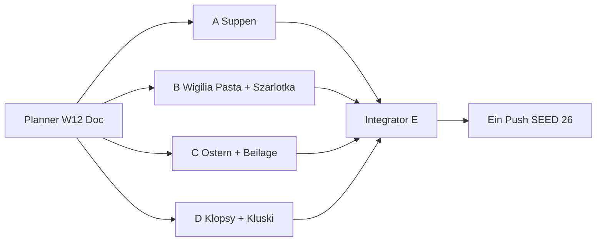

# Wave 12 — Execution Plan (Planner → 4 Implementer → Integrator)

Status: **SHIPPED** (Integrator E · 2026-07-21)  
Live: `SEED_VERSION` **26** · Rezepte **65** · Blog **36** · Families **3** (Pierogi/Placki/Naleśniki je 4)  
Baseline vor Ship: `SEED_VERSION` **25** · Rezepte **57**

Team-Modell: **1 Planner** (dieser Doc) → **4 parallele Implementer (A–D)** → **1 Integrator/QA (E)** → **ein Push**.

**User-Priorität:** Mehr **wichtige** Rezepte — klassische Diaspora-Must-haves dürfen nicht fehlen. Kein Niche-Spray. (Separater Agent: PL-404 — **out of scope** hier.)

---

## 1. Ist-Stand (nach Wave 11)

| Layer | LIVE | Notiz |
|-------|------|--------|
| Rezepte | **57** | inkl. Family-Varianten; W11: Ryba po grecku, Golonka, Kompot z suszu + Cover-Retrofit |
| RecipeFamilies | **3** | Pierogi 4 · Placki 4 · Naleśniki 4 — **keine** neue Family in W12 |
| Blog | **36** | kein neuer Pillar nötig für dieses Ship-Set |
| Cluster-Hubs | **31** | Region thin → `noindex,follow` (HOLD) |
| `SEED_VERSION` | **25** | `src/lib/data/store.ts` |
| Blog:Rezept | **~1 : 1.5** | gesund; nach W12 ~1 : 1.8 |

### LIVE Recipe-IDs (Audit 2026-07-21 — 57 unique)

**Core (`seed.ts`):**  
`recipe-barszcz`, `recipe-bigos`, `recipe-chlodnik`, `recipe-fasolka`, `recipe-faworki`, `recipe-golabki`, `recipe-gulasz`, `recipe-kluski-slaskie`, `recipe-kotlet-mielony`, `recipe-nalesniki`, `recipe-oscypek`, `recipe-pierogi`, `recipe-placki`, `recipe-racuchy`, `recipe-rosol`, `recipe-schabowy`, `recipe-zurek`

**Family-Varianten (`seed-families.ts`):**  
`recipe-pierogi-meat`, `recipe-pierogi-cabbage`, `recipe-nalesniki-mieso`, `recipe-nalesniki-szpinak`, `recipe-placki-cukinia`, `recipe-placki-ser`, `recipe-placki-jablka`

**Wave 5–11:**  
`recipe-pierogi-leniwe`, `recipe-kopytka`, `recipe-lazanki`, `recipe-pyzy`, `recipe-zrazy`,  
`recipe-makowiec`, `recipe-uszka`,  
`recipe-karp`, `recipe-krokiety`, `recipe-sernik`, `recipe-sledz`,  
`recipe-mizeria`, `recipe-kapusta-zasmażana`, `recipe-ogorkowa`, `recipe-kapusniak`, `recipe-paczki`, `recipe-knedle-sliwki`,  
`recipe-zeberka`, `recipe-rolada-slaska`, `recipe-salatka-jarzynowa`, `recipe-botwinka`, `recipe-babka`, `recipe-kaszanka`,  
`recipe-flaki`, `recipe-schab-pieczony`, `recipe-piernik`, `recipe-zupa-pomidorowa`, `recipe-pierogi-jagody`, `recipe-nalesniki-dzem`, `recipe-makaron-z-serem`,  
`recipe-ryba-po-grecku`, `recipe-golonka`, `recipe-kompot-z-suszu`

**Bereits PRESENT (nicht erneut vorschlagen):** Schabowy, Schab pieczony, Flaki, Piernik, Gulasz, Placki-Family, Makaron z serem, Babka, Pączki, Sernik, Makowiec, Golonka, Żeberka, Kotlet mielony, …

---

## 2. Gap-Analyse — Diaspora Must-Have vs LIVE

Legende: **PRESENT** = published Money Page · **MISSING** = fehlt, ownership-klar oder klarbar · **HOLD** = bewusst nicht shippen (Clash / Niche / SEO-Struktur).

### 2.1 Kern-Klassiker (Alltag / Sonntag / Fest)

| Gericht | Status | Begründung |
|---------|--------|------------|
| Pierogi (Familie) | **PRESENT** | 4 Varianten inkl. Jagody |
| Placki ziemniaczane (+ Varianten) | **PRESENT** | Family 4 |
| Naleśniki (+ Varianten) | **PRESENT** | Family 4 |
| Żurek | **PRESENT** | |
| Barszcz czerwony | **PRESENT** | |
| Rosół | **PRESENT** | |
| Bigos | **PRESENT** | |
| Gołąbki | **PRESENT** | |
| Kotlet schabowy | **PRESENT** | `recipe-schabowy` |
| Kotlet mielony | **PRESENT** | Standalone; **kein** Family-Hub |
| Schab pieczony | **PRESENT** | ≠ Schabowy |
| Golonka | **PRESENT** | W11 |
| Żeberka | **PRESENT** | |
| Gulasz wieprzowy | **PRESENT** | |
| Fasolka po bretonsku | **PRESENT** | |
| Flaki | **PRESENT** | |
| Zupa pomidorowa | **PRESENT** | |
| Ogórkowa / Kapuśniak / Botwinka / Chłodnik | **PRESENT** | |
| **Zupa grzybowa** | **MISSING** | Wigilia + Herbst; klar ≠ Barszcz/Flaki |
| **Grochówka** | **MISSING** | Klassische Erbsensuppe; Overview erwähnt Krupnik-Familie, Money Page fehlt |
| **Krupnik** | **MISSING** | später (nach Grochówka — verwandte Suppen-Linie, nicht parallel sprayen) |
| **Zupa szczawiowa** | **MISSING** | saisonal → später |
| Czernina | **HOLD** | niche / Blut / saisonal-riskant |
| Kwaśnica | **HOLD** | regional thin Hub-Risiko |

### 2.2 Teigwaren / Beilagen / Sonntagsplatte

| Gericht | Status | Begründung |
|---------|--------|------------|
| Kluski śląskie | **PRESENT** | |
| Kopytka / Pyzy / Leniwe / Łazanki | **PRESENT** | |
| Makaron z serem | **PRESENT** | Alltag Pasta+Twaróg |
| **Makaron z makiem** | **MISSING** | Wigilia-Must; ≠ Makowiec, ≠ Makaron z serem |
| **Kluski kładzione** | **MISSING** | Rosół-Begleiter Alltag; ≠ Kluski śląskie (Form/Teig) |
| Lane kluski | **HOLD** | Overlap-Risiko vs Makaron/Kładzione |
| Mizeria / Kapusta zasmażana / Sałatka jarzynowa | **PRESENT** | |
| **Buraczki** (warme Rote-Bete-Beilage / ćwikła-Linie) | **MISSING** | Sonntag mit Schabowy; ≠ Botwinka/Barszcz/Salat |
| Placek po węgiersku | **HOLD** | Intent-Clash Placki + Gulasz (Restaurant-Teller ≠ neue Primary) |

### 2.3 Fleisch / „Kotlet“-Cluster

| Gericht | Status | Begründung |
|---------|--------|------------|
| Schabowy + Mielony | **PRESENT** | zwei getrennte Cook-URLs |
| **Kotlet family hub** | **HOLD** | SEO-safe Split separat; Ownership schon klar über Guides + 2 Money Pages — Hub jetzt = Cannibal-Risiko ohne Mehrwert |
| Zrazy / Rolada / Kaszanka | **PRESENT** | |
| **Klopsy / pulpety** (Soße, oft Dill) | **MISSING** | ≠ Mielony (Bulette paniert ≠ Kugeln in Sauce) |
| Biała kiełbasa (Cook) | **MISSING** | später (Ostern; Lexikon Kiełbasa bleibt Arten-Owner) |
| Pasztet | **MISSING** | später |

### 2.4 Fisch / Wigilia-Getränk

| Gericht | Status | Begründung |
|---------|--------|------------|
| Karp / Śledź / Ryba po grecku / Uszka / Kompot z suszu | **PRESENT** | |
| Kutia | **MISSING** | Ostpolen/diaspora; später nach Makaron z makiem (nicht zwei neue Wigilia-Süß parallel ohne Messung) |

### 2.5 Backen / Süß

| Gericht | Status | Begründung |
|---------|--------|------------|
| Makowiec / Sernik / Babka / Piernik / Pączki / Faworki / Racuchy | **PRESENT** | |
| **Szarlotka** | **MISSING** | Bäckerei-Klassiker; hohe Diaspora-Nachfrage; ≠ Racuchy |
| **Mazurek** | **MISSING** | Oster-Must; ≠ Sernik/Babka/Makowiec/Piernik |
| Drożdżówka / Placek drożdżowy | **HOLD** | Hefe-Clash Babka / Pączki / Racuchy |
| Napoleonka / kremówka | **MISSING** | später (Backen-Depth) |
| Chałka | **MISSING** | später |
| Sękacz | **HOLD** | regional / schwer cover-fit |

### 2.6 Explizite Kandidaten-Entscheidung (User-Liste)

| Kandidat | Entscheidung W12 | Grund |
|----------|------------------|--------|
| **Czernina** | **HOLD / skip** | Niche, saisonal, schwierige Zutaten/Cover-Glaubwürdigkeit; kein Diaspora-Mainstream-Must |
| **Placek po węgiersku** | **HOLD / skip** | Placki-Family + `recipe-gulasz` decken Intent ab → Cannibal |
| **Drożdżówka** | **HOLD / skip** | Primary-Clash Babka / Pączki / Racuchy (Hefeteig-süß) |
| **Kotlet family SEO-split** | **HOLD / skip** | Schabowy + Mielony bereits LIVE; Family-Hub erst nach GSC-Clash-Beweis |
| **Schab** | **PRESENT** | `recipe-schab-pieczony` — kein Duplikat |
| **Flaki / Piernik / …** | **PRESENT** | Audit bestätigt — nicht erneut anlegen |

---

## 3. Wave 12 Ziel — Ship-Set **+8**

**Strategie:** Die wichtigsten **MISSING**-Gerichte mit klarer Primary und Diaspora-Relevanz (DE/PL) schließen. Kein neuer Blog-Pillar. Keine neue RecipeFamily. Kein Region-/Meal-Prep-/Lab-Spray.

| # | ID (neu) | Gericht | Primary KW DE (eng) | Abgrenzung |
|---|----------|---------|---------------------|------------|
| 1 | `recipe-zupa-grzybowa` | Zupa grzybowa | Zupa grzybowa / Pilzsuppe polnisch | ≠ Barszcz, ≠ Flaki, ≠ Ogórkowa; Overview bleibt Broad |
| 2 | `recipe-grochowka` | Grochówka | Grochówka / Erbsensuppe polnisch | ≠ Kapuśniak, ≠ Rosół, ≠ Fasolka (Bohnen≠Erbsen) |
| 3 | `recipe-makaron-z-makiem` | Makaron z makiem | Makaron z makiem / Nudeln mit Mohn | ≠ Makowiec (Rolle), ≠ Makaron z serem |
| 4 | `recipe-szarlotka` | Szarlotka | Szarlotka / Polnischer Apfelkuchen | ≠ Racuchy, ≠ Piernik, ≠ Sernik |
| 5 | `recipe-mazurek` | Mazurek | Mazurek / Osterkuchen polnisch | ≠ Babka, ≠ Sernik, ≠ Makowiec, ≠ Piernik |
| 6 | `recipe-klopsy` | Klopsy / pulpety | Klopsy Rezept / Pulpety Soße | ≠ Kotlet mielony (panierte Bulette) |
| 7 | `recipe-buraczki` | Buraczki | Buraczki / Rote-Bete-Beilage polnisch | ≠ Botwinka (Suppe), ≠ Barszcz, ≠ Sałatka |
| 8 | `recipe-kluski-kladzione` | Kluski kładzione | Kluski kładzione / Fallnudeln | ≠ Kluski śląskie, ≠ Kopytka, ≠ Makaron z serem |

**Nach Wave 12 (Zielmengen):**

| Metrik | Ist | Ziel |
|--------|-----|------|
| Rezepte | 57 | **65** (+8) |
| Blog | 36 | **36** (+0) |
| Families | 3 | **3** (unverändert) |
| `SEED_VERSION` | 25 | **26** (nur Agent E) |

**Primary-KW → Owner-URL (Ownership-Doc erweitern):**

| Primary KW DE | Owner-URL |
|---------------|-----------|
| Zupa grzybowa / Pilzsuppe polnisch | `/rezepte/zupa-grzybowa` |
| Grochówka / Erbsensuppe polnisch | `/rezepte/grochowka` |
| Makaron z makiem | `/rezepte/makaron-z-makiem` |
| Szarlotka / Polnischer Apfelkuchen | `/rezepte/szarlotka` |
| Mazurek / Osterkuchen polnisch | `/rezepte/mazurek` |
| Klopsy / Pulpety | `/rezepte/klopsy` |
| Buraczki / Rote-Bete-Beilage | `/rezepte/buraczki` |
| Kluski kładzione | `/rezepte/kluski-kladzione` |

**Nicht stehlen:**

| Fremd-Owner | Nur descriptive Anchors |
|-------------|-------------------------|
| Polnische Suppen (Overview) | Broad bleibt Pillar |
| Barszcz / Flaki / Ogórkowa / Kapuśniak / Botwinka | Pilz ≠ Rote Bete ≠ Kutteln ≠ Gurke ≠ Kraut |
| Wigilia Speiseplan | Anlass-Owner; Grzybowa/Makaron nur Cook |
| Makowiec Technik/Rezept | Makaron z makiem = Nudeln+Mohn, keine Rolle |
| Makaron z serem / Twaróg-Guide | andere Pasta-Linie |
| Racuchy / Piernik / Sernik / Babka | Szarlotka = Apfelkuchen-Blech/Tarte-Intent |
| Wielkanoc Speiseplan | Anlass; Mazurek = Cook |
| Kotlet mielony / Panieren / Schabowy | Klopsy = Kugeln in Sauce |
| Kluski śląskie / Kopytka | andere Teig-/Form-Technik |
| Sonntagsessen | descriptiv → Buraczki/Klopsy |

### Linking-Gate (wie W8–11)

| Ort | Pflicht |
|-----|---------|
| FACTS → expand() Longform | ≥ **4** Markdown-Links `/de|pl/...` pro Locale (≥2 Rezept + ≥2 Blog) |
| Steps/Tips | ≥ **2** Inline-Links / Locale |
| Related | `relatedPostIds` ≥ 3; Backlinks bidirektional wo sinnvoll |
| Affiliate | **guide-only** auf Rezepten |
| Covers | dish-fit Unsplash · **HTTP GET 200** · Photo-ID **global unique** vs alle 57+8 |
| Longform | ≥ **400** Wörter / Locale via expand |
| Blog | **kein** neuer Pillar |

---

## 4. Vier parallele Umsetzungspakete (A–D) + Integrator E

### Globale Gates (alle Pakete)

- Affiliate: **guide-only**
- Unique Unsplash-Cover: `https://images.unsplash.com/photo-{ID}?w=1600&q=80`
- Vor Merge: `curl -sI` / GET → **200**; visuell Gericht = Intent
- Descriptive Anchors; Locale-Pfade `/de/...` bzw. `/pl/...`
- `SEED_VERSION` nur Agent E → **26**
- Datei-Isolation: `wave12-a|b|c|d` — **nicht** fremde Paket-Dateien überschreiben
- Kein neuer CDN · keine Placeholder · kein AI-Image ohne Freigabe



---

### Paket A — Suppen-Klassiker (Zupa grzybowa + Grochówka)

**Owner-Scope:**

1. `recipe-zupa-grzybowa` — Zupa grzybowa (getrocknete/frische Pilze; oft Wigilia-klar oder cremig — **eine** klare Hausvariante wählen und im Excerpt festnageln)
2. `recipe-grochowka` — Grochówka (Erbsensuppe; oft mit Wurst/Rauch — Diaspora-DE-Einkauf erwähnen)

**Kein neuer Blog.**

**Dateien (isoliert):**

| Datei | Rolle |
|-------|--------|
| `src/lib/data/seed-recipes-wave12-a.ts` | Export `seedRecipesWave12A` |
| `src/lib/data/recipe-articles-w12-a.ts` | Export `W12_FACTS_A` |
| `content/wave-12-status-a.md` | Status für E |
| `content/keyword-ownership.md` | +2 Primary-Zeilen (A-Anteil) |

**Touch / Backlinks (erlaubt):**

- Bodies: `post-polnische-suppen`, `post-wigilia` (Grzybowa descriptiv), `post-polenladen` / `post-ersatzprodukte-de`
- FACTS-Abgrenzung: barszcz, flaki, ogorkowa, kapusniak, fasolka (≠ Erbsen)
- **Nicht:** `seed-recipes-wave12-b|c|d.ts`, `SEED_VERSION`, Family-Dateien

**Gates A:**

- [ ] 2 Rezepte published, unique covers GET 200
- [ ] FACTS ≥400; ≥4 Inline-Links DE+PL je Rezept
- [ ] Steps ≥2 Inline-Links DE+PL
- [ ] Grzybowa Intent klar ≠ Barszcz/Flaki
- [ ] Grochówka Intent klar ≠ Fasolka / Kapuśniak

**relatedPostIds (mind.):**

| Rezept | related |
|--------|---------|
| zupa-grzybowa | `post-polnische-suppen`, `post-wigilia`, `post-polenladen` |
| grochowka | `post-polnische-suppen`, `post-kielbasa-arten` oder `post-polenladen`, `post-sonntagsessen` |

**Cover-Suchbegriffe (EN, finished dish):**  
`mushroom soup bowl`, `polish mushroom soup`, `pea soup sausage`, `split pea soup bowl`

---

### Paket B — Wigilia-Pasta + Apfelkuchen (Makaron z makiem + Szarlotka)

**Owner-Scope:**

1. `recipe-makaron-z-makiem` — Makaron z makiem (gekochte Nudeln + Mohn/Zucker/Butter oder klassische Wigilia-Variante)
2. `recipe-szarlotka` — Szarlotka (Apfelkuchen polnisch; Blech oder klassische Form — **eine** Variante)

**Kein neuer Blog.**

**Dateien:**

| Datei | Rolle |
|-------|--------|
| `src/lib/data/seed-recipes-wave12-b.ts` | `seedRecipesWave12B` |
| `src/lib/data/recipe-articles-w12-b.ts` | `W12_FACTS_B` |
| `content/wave-12-status-b.md` | Status |
| `content/keyword-ownership.md` | +2 Zeilen |

**Touch / Backlinks:**

- `post-wigilia` → makaron-z-makiem (descriptiv)
- `post-makowiec-technik` / makowiec FACTS → Abgrenzung Mohn-Rolle vs Nudeln+Mohn
- `post-twarog` / `recipe-makaron-z-serem` → Abgrenzung Pasta-Linien
- Racuchy / Piernik FACTS optional Abgrenzung Szarlotka
- **Nicht:** Mazurek-Dateien (Paket C)

**Gates B:** Makaron z makiem ≠ Makowiec Primary; Szarlotka ≠ Racuchy/Piernik; Covers dish-fit GET 200.

**relatedPostIds (mind.):**

| Rezept | related |
|--------|---------|
| makaron-z-makiem | `post-wigilia`, `post-makowiec-technik` oder `post-polenladen`, `post-ersatzprodukte-de` |
| szarlotka | `post-sonntagsessen` oder freezer optional, `post-ersatzprodukte-de`, `post-tlusty-czwartek` nur wenn sinnvoll sonst `post-polenladen` |

**Cover-Suchbegriffe:**  
`poppy seed noodles`, `pasta poppy seeds`, `polish apple cake`, `apple pie crumb topping`

---

### Paket C — Ostern + Sonntags-Beilage (Mazurek + Buraczki)

**Owner-Scope:**

1. `recipe-mazurek` — Mazurek (flacher Osterkuchen mit Masse/Belag — **eine** Hausvariante, z. B. kajmak oder Nuss, klar im Title)
2. `recipe-buraczki` — Buraczki (warme Rote-Bete-Beilage; ggf. mit Apfel/Meerrettich — klar ≠ Suppe)

**Kein neuer Blog.**

**Dateien:**

| Datei | Rolle |
|-------|--------|
| `src/lib/data/seed-recipes-wave12-c.ts` | `seedRecipesWave12C` |
| `src/lib/data/recipe-articles-w12-c.ts` | `W12_FACTS_C` |
| `content/wave-12-status-c.md` | Status |
| `content/keyword-ownership.md` | +2 Zeilen |

**Touch / Backlinks:**

- `post-wielkanoc` → mazurek
- `post-sonntagsessen` / Schabowy FACTS → buraczki
- Abgrenzung: botwinka, barszcz, salatka-jarzynowa, babka, sernik, makowiec

**Gates C:** Mazurek ≠ Babka/Sernik; Buraczki ≠ Botwinka/Barszcz; Covers GET 200 unique.

**relatedPostIds (mind.):**

| Rezept | related |
|--------|---------|
| mazurek | `post-wielkanoc`, `post-makowiec-technik` oder babka-Nachbar descriptiv, `post-polenladen` |
| buraczki | `post-sonntagsessen`, `post-panieren` oder `post-smietana-schmand`, `post-wielkanoc` optional |

**Cover-Suchbegriffe:**  
`polish mazurek cake`, `flat easter cake topping`, `beet salad side dish`, `cooked beets horseradish`

---

### Paket D — Alltag Fleisch + Rosół-Nudeln (Klopsy + Kluski kładzione)

**Owner-Scope:**

1. `recipe-klopsy` — Klopsy / pulpety (Hackfleischkugeln in Dill- oder Tomatensoße — **eine** Soßenlinie im Primary festhalten; Dill empfohlen für polnischen Intent)
2. `recipe-kluski-kladzione` — Kluski kładzione (Fallnudeln / dropped noodles; typisch zu Rosół)

**Kein neuer Blog.**

**Dateien:**

| Datei | Rolle |
|-------|--------|
| `src/lib/data/seed-recipes-wave12-d.ts` | `seedRecipesWave12D` |
| `src/lib/data/recipe-articles-w12-d.ts` | `W12_FACTS_D` |
| `content/wave-12-status-d.md` | Status |
| `content/keyword-ownership.md` | +2 Zeilen |

**Touch / Backlinks:**

- `post-sonntagsessen`, `post-rosol-technik`, `post-panieren` (Abgrenzung Klopsy ≠ Mielony)
- FACTS: `recipe-kotlet-mielony`, `recipe-rosol`, `recipe-kluski-slaskie` (Abgrenzung)
- Optional Stichprobe: 2 Cover-URLs aus A/B/C Status gegen GET 200 melden (nicht überschreiben)

**Gates D:** Klopsy ≠ Mielony; Kładzione ≠ Śląskie/Kopytka; Inline-Gates; unique covers.

**relatedPostIds (mind.):**

| Rezept | related |
|--------|---------|
| klopsy | `post-sonntagsessen`, `post-panieren` (Abgrenzung), `post-smietana-schmand` oder `post-polenladen` |
| kluski-kladzione | `post-rosol-technik`, `post-polnische-suppen`, `post-sonntagsessen` |

**Cover-Suchbegriffe:**  
`meatballs dill sauce`, `meatballs gravy plate`, `dropped noodles broth`, `egg noodles homemade soup`

---

## 5. Agent E — Integrator / QA Checklist

| Parallel | Warten |
|----------|--------|
| A, B, C, D voll parallel | Photo-ID-Kollisionen über Status-Docs |
| E | nach A+B+C+D |

**Merge-Checklist E:**

- [x] Aggregator `src/lib/data/seed-recipes-wave12.ts` → Import in `seed.ts` (Pattern W10/W11)
- [x] Alle `W12_FACTS_*` in `recipe-articles.ts` verdrahtet
- [x] `keyword-ownership.md` +8 Primary-Zeilen dedupt + Intent-Trennung-Absatz W12
- [x] Docs: `topical-backlog.md`, `topical-authority-status.md` → LIVE W12; Plan → **SHIPPED**
- [x] `SEED_VERSION` **25 → 26**
- [x] Zielmengen: Rezepte **65**, Blog **36**, Families **3**
- [x] Global unique Cover Photo-IDs (57 alt + 8 neu); alle neuen GET **200**
- [x] Inline-Gates stichprobenartig je Paket (≥4 FACTS / ≥2 Steps)
- [x] Ownership-Abgrenzungen unverletzt (Tabelle §3)
- [x] Build green
- [x] **Ein** kombinierter Push erst bei Grün — A–D pushen nicht

**Konflikt-Hotspots:**

| Thema | Wer | Regel |
|-------|-----|--------|
| Photo-IDs unique | A–D | Status listet finale IDs; E dedupt |
| `post-wigilia` Body | A + B | getrennte Sätze; nicht gegenseitig überschreiben |
| `post-polnische-suppen` | A (+ D Rosół-Linie) | getrennte Absätze Grzybowa / Grochówka |
| `keyword-ownership.md` | alle | E final dedupt |
| Mohn-Cluster | B | Makaron z makiem ≠ Makowiec Anchors |

**Visual Spot-Check (E, DE+PL Cards):**

1. Zupa grzybowa, Grochówka (Suppenteller erkennbar)  
2. Makaron z makiem (Nudeln+Mohn, **keine** Mohnrolle)  
3. Szarlotka (Apfelkuchen)  
4. Mazurek (flacher Belag-Kuchen)  
5. Buraczki (Beete-Beilage, keine Suppe)  
6. Klopsy (Kugeln in Sauce ≠ panierte Bulette)  
7. Kluski kładzione (mit/ohne Rosół-Kontext)  
8. Stichprobe Nachbarn: Schabowy, Rosół, Makowiec, Botwinka — keine Cover-Regression

---

## 6. Explizit HOLD / bleibt nach W12 fehlend

### Nach Wave 12 weiterhin MISSING (für spätere Waves)

| Dish | Priorität später | Notiz |
|------|------------------|--------|
| Krupnik | hoch | nach Grochówka messen; verwandte Suppen-Linie |
| Kutia | mittel–hoch | Wigilia Ost; nach Makaron z makiem |
| Napoleonka / kremówka | hoch | Bäckerei-SEO |
| Chałka | mittel | Hefe-Brot; Ownership vs Babka prüfen |
| Biała kiełbasa (Cook) | mittel | Ostern; Lexikon bleibt Arten-Owner |
| Zupa szczawiowa | mittel | saisonal |
| Pasztet | mittel | Fest/Aufschnitt |
| Jajka faszerowane | niedrig–mittel | Ostern-Beilage |
| Zapiekanka | niedrig | Street-Food Nostalgie |
| Leczo | niedrig | ungarisch-polnisch Crossover |
| Kaczka pieczona | niedrig | Festbraten |

### Bewusst HOLD (nicht „später einfach shippen“ ohne neuen Ownership-Plan)

| Item | Warum |
|------|--------|
| Czernina | niche / saisonal / Zutaten-Risiko |
| Placek po węgiersku | Placki + Gulasz Cannibal |
| Drożdżówka | Hefe-Clash Babka/Pączki/Racuchy |
| Kotlet family hub | SEO-Split erst nach GSC-Beweis |
| Lane kluski | Overlap Kładzione/Makaron |
| Region-Blogs / Meal-Prep Woche / Lab-Tests | unverändert |
| Region-Hub-Intros ≥400 vor Index | unverändert |
| Neuer Blog-Pillar | Ownership reicht über bestehende Guides |
| 5. Placki-/Pierogi-/Naleśniki-Variante | Families satt (4/4/4) |

---

## Anhang — Copy-Paste Task Prompts

### Prompt Agent A

```
Repo: /Users/timrayburkhardt/Alemniam. Du bist Implementer A (Wave 12 Paket A). Lies content/wave-12-plan.md Paket A. Kein Push. Kein SEED_VERSION-Bump. KEIN neuer Blog-Pillar.

Lege an:
- recipe-zupa-grzybowa (slug: zupa-grzybowa)
- recipe-grochowka (slug: grochowka)

Dateien: seed-recipes-wave12-a.ts, recipe-articles-w12-a.ts (W12_FACTS_A), content/wave-12-status-a.md, keyword-ownership +2 Primary-Zeilen.

Gates:
- FACTS ≥400 Wörter/Locale; ≥4 Inline-Links/Locale (≥2 Rezept + ≥2 Blog); Steps ≥2 Links
- Unique Unsplash covers Format ?w=1600&q=80; GET 200; dish-fit (Pilzsuppe / Erbsensuppe)
- Grzybowa ≠ Barszcz/Flaki Primary; Grochówka ≠ Fasolka/Kapuśniak
- Affiliate guide-only; Isolation: keine wave12-b|c|d Dateien anfassen

Backlinks: post-polnische-suppen, post-wigilia (Grzybowa), post-polenladen/kielbasa wo sinnvoll.
Am Ende: Diff-Liste für E. Kein main-Push.
```

### Prompt Agent B

```
Repo: /Users/timrayburkhardt/Alemniam. Du bist Implementer B (Wave 12 Paket B). Lies content/wave-12-plan.md Paket B. Kein Push. Kein SEED_VERSION-Bump. KEIN neuer Blog-Pillar.

Lege an:
- recipe-makaron-z-makiem (slug: makaron-z-makiem)
- recipe-szarlotka (slug: szarlotka)

Dateien: seed-recipes-wave12-b.ts, recipe-articles-w12-b.ts (W12_FACTS_B), content/wave-12-status-b.md, keyword-ownership +2.

Gates:
- FACTS ≥400; ≥4 Inline-Links/Locale; Steps ≥2; unique Unsplash GET 200 dish-fit
- Makaron z makiem ≠ Makowiec (keine Mohnrollen-Primary); ≠ Makaron z serem
- Szarlotka ≠ Racuchy/Piernik/Sernik
- Isolation vs A/C/D; guide-only

Backlinks: post-wigilia → makaron-z-makiem; Makowiec-Technik/Rezept nur Abgrenzung; Racuchy optional.
Am Ende: Diff-Liste für E. Kein main-Push.
```

### Prompt Agent C

```
Repo: /Users/timrayburkhardt/Alemniam. Du bist Implementer C (Wave 12 Paket C). Lies content/wave-12-plan.md Paket C. Kein Push. Kein SEED_VERSION-Bump. KEIN neuer Blog-Pillar.

Lege an:
- recipe-mazurek (slug: mazurek)
- recipe-buraczki (slug: buraczki)

Dateien: seed-recipes-wave12-c.ts, recipe-articles-w12-c.ts (W12_FACTS_C), content/wave-12-status-c.md, keyword-ownership +2.

Gates:
- FACTS ≥400; ≥4 Inline-Links/Locale; Steps ≥2; unique Unsplash GET 200
- Mazurek ≠ Babka/Sernik/Makowiec/Piernik; Buraczki ≠ Botwinka/Barszcz/Sałatka
- Cover: flacher Osterkuchen bzw. Rote-Bete-Beilage (keine Suppe)
- Isolation; guide-only

Backlinks: post-wielkanoc → mazurek; post-sonntagsessen / Schabowy → buraczki.
Am Ende: Diff-Liste für E. Kein main-Push.
```

### Prompt Agent D

```
Repo: /Users/timrayburkhardt/Alemniam. Du bist Implementer D (Wave 12 Paket D). Lies content/wave-12-plan.md Paket D. Kein Push. Kein SEED_VERSION-Bump. KEIN neuer Blog-Pillar.

Lege an:
- recipe-klopsy (slug: klopsy) — Pulpety/Klopsy in Soße (eine Soßenlinie, bevorzugt Dill)
- recipe-kluski-kladzione (slug: kluski-kladzione)

Dateien: seed-recipes-wave12-d.ts, recipe-articles-w12-d.ts (W12_FACTS_D), content/wave-12-status-d.md, keyword-ownership +2.

Gates:
- FACTS ≥400; ≥4 Inline-Links/Locale; Steps ≥2; unique Unsplash GET 200
- Klopsy ≠ Kotlet mielony (Kugeln in Sauce ≠ panierte Bulette)
- Kluski kładzione ≠ Kluski śląskie / Kopytka / Makaron z serem
- Optional: Stichprobe je 2 Cover-URLs aus Status A/B/C — Failures melden, nicht überschreiben
- Isolation; guide-only

Backlinks: post-sonntagsessen, post-rosol-technik, Abgrenzung in mielony/rosol/kluski-slaskie FACTS.
Am Ende: Diff-Liste für E. Kein main-Push.
```

### Prompt Agent E (Integrator/QA)

```
Repo: /Users/timrayburkhardt/Alemniam. Du bist Integrator/QA Wave 12. Lies content/wave-12-plan.md §5. Einziger Push.

Merge A–D:
- seed-recipes-wave12.ts Aggregator + Import in seed.ts
- Alle W12_FACTS_* in recipe-articles.ts
- keyword-ownership +8 dedupt + Intent-Trennung W12
- topical-backlog.md + topical-authority-status.md aktualisieren; Plan → SHIPPED
- SEED_VERSION 25→26

QA:
- Rezepte 65, Blog 36, Families 3
- Alle 8 neuen Covers GET 200, global unique Photo-IDs
- Inline-Gates ≥4 FACTS / ≥2 Steps stichprobenartig
- Ownership: Grzybowa≠Barszcz/Flaki; Makaron z makiem≠Makowiec; Szarlotka≠Racuchy; Mazurek≠Babka; Klopsy≠Mielony; Buraczki≠Botwinka; Kładzione≠Śląskie
- Visual Spot-Check §5; build green

Nur bei Grün: ein git add . && git commit -m "..." && git push origin main.
A–D haben nicht gepusht. PL-404 ist out of scope (separater Agent).
```

---

## Kurzfazit Planner

Wave 12 schließt **8** ownership-sichere Diaspora-Lücken (Suppen, Wigilia-Pasta, Apfelkuchen, Ostern, Sonntagsplatte, Rosół-Nudeln). HOLDs aus W10/W11 (Czernina, Placek po węgiersku, Drożdżówka, Kotlet-Family) bleiben HOLD. Target: **65** Rezepte · `SEED_VERSION` **26** · kein neuer Pillar.
