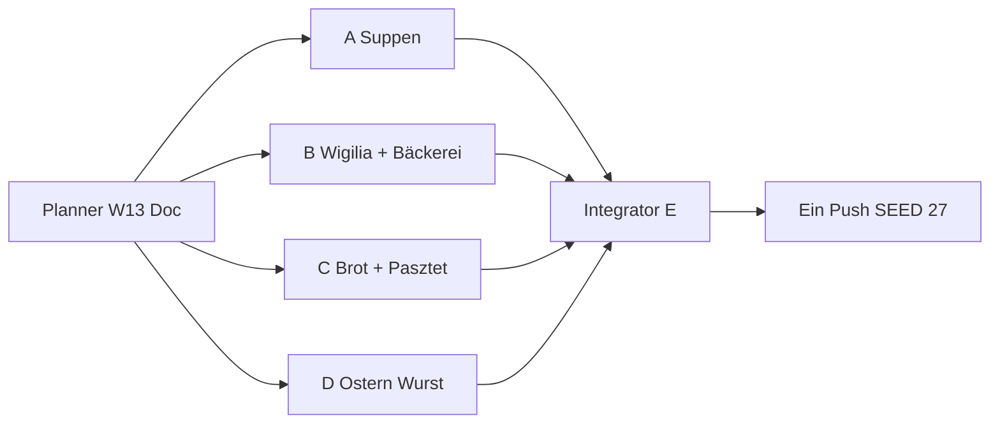

# Wave 13 — Execution Plan (Planner → 4 Implementer → Integrator)

Status: **SHIPPED** (Integrator E · 2026-07-21)  
LIVE: `SEED_VERSION` **27** · Rezepte **72** · Blog **36** · Families **3** (Pierogi/Placki/Naleśniki je 4)

Team-Modell: **1 Planner** (dieser Doc) → **4 parallele Implementer (A–D)** → **1 Integrator/QA (E)** → **ein Push**.

**User-Priorität:** Weitere **wichtige** Diaspora-Klassiker schließen (Suppen-Rest, Wigilia-Süß, Ostern-Wurst, Bäckerei, Aufschnitt). Starke **Cover-Fit**-QA (Gericht ≠ Stock-Mismatch). Kein Niche-Spray. Kein neuer Blog-Pillar.

---

## 1. Ist-Stand (nach Wave 12 SHIPPED)

| Layer | LIVE | Notiz |
|-------|------|--------|
| Rezepte | **65** | inkl. Family-Varianten; W12: Grzybowa, Grochówka, Makaron z makiem, Szarlotka, Mazurek, Buraczki, Klopsy, Kluski kładzione |
| RecipeFamilies | **3** | Pierogi 4 · Placki 4 · Naleśniki 4 — **keine** neue Family in W13 |
| Blog | **36** | kein neuer Pillar nötig |
| Cluster-Hubs | **31** | Region thin → `noindex,follow` (HOLD) |
| `SEED_VERSION` | **26** | `src/lib/data/store.ts` |
| Blog:Rezept | **~1 : 1.8** | nach W13 ~1 : 2.0 — noch gesund |

### LIVE Recipe-IDs (Audit 2026-07-21 — 65 unique)

**Core (`seed.ts`):**  
`recipe-barszcz`, `recipe-bigos`, `recipe-chlodnik`, `recipe-fasolka`, `recipe-faworki`, `recipe-golabki`, `recipe-gulasz`, `recipe-kluski-slaskie`, `recipe-kotlet-mielony`, `recipe-nalesniki`, `recipe-oscypek`, `recipe-pierogi`, `recipe-placki`, `recipe-racuchy`, `recipe-rosol`, `recipe-schabowy`, `recipe-zurek`

**Family-Varianten (`seed-families.ts` + W10):**  
`recipe-pierogi-meat`, `recipe-pierogi-cabbage`, `recipe-pierogi-jagody`, `recipe-nalesniki-mieso`, `recipe-nalesniki-szpinak`, `recipe-nalesniki-dzem`, `recipe-placki-cukinia`, `recipe-placki-ser`, `recipe-placki-jablka`

**Wave 5–12:**  
`recipe-pierogi-leniwe`, `recipe-kopytka`, `recipe-lazanki`, `recipe-pyzy`, `recipe-zrazy`,  
`recipe-makowiec`, `recipe-uszka`,  
`recipe-karp`, `recipe-krokiety`, `recipe-sernik`, `recipe-sledz`,  
`recipe-mizeria`, `recipe-kapusta-zasmażana`, `recipe-ogorkowa`, `recipe-kapusniak`, `recipe-paczki`, `recipe-knedle-sliwki`,  
`recipe-zeberka`, `recipe-rolada-slaska`, `recipe-salatka-jarzynowa`, `recipe-botwinka`, `recipe-babka`, `recipe-kaszanka`,  
`recipe-flaki`, `recipe-schab-pieczony`, `recipe-piernik`, `recipe-zupa-pomidorowa`, `recipe-makaron-z-serem`,  
`recipe-ryba-po-grecku`, `recipe-golonka`, `recipe-kompot-z-suszu`,  
`recipe-zupa-grzybowa`, `recipe-grochowka`, `recipe-makaron-z-makiem`, `recipe-szarlotka`, `recipe-mazurek`, `recipe-buraczki`, `recipe-klopsy`, `recipe-kluski-kladzione`

**Bereits PRESENT (nicht erneut vorschlagen):** Grochówka, Grzybowa, Makaron z makiem, Szarlotka, Mazurek, Babka, Makowiec, Sernik, Pączki, Kaszanka, Żurek (+ biała als Einlage, kein Cook-Owner), …

---

## 2. Gap-Audit — Diaspora-Klassiker vs LIVE

Legende: **PRESENT** = published Money Page · **MISSING** = fehlt, ownership-klar oder klarbar · **HOLD** = bewusst nicht shippen (Clash / Niche / SEO-Struktur).

### 2.1 Suppen

| Gericht | Status | Begründung |
|---------|--------|------------|
| Żurek / Barszcz / Rosół / Ogórkowa / Kapuśniak / Botwinka / Chłodnik / Pomidorowa / Flaki / Grzybowa / Grochówka | **PRESENT** | W8–W12 |
| **Krupnik** | **MISSING** | Gersten-/Gemüsesuppe; Overview + Grochówka-FACTS verweisen explizit „Krupnik später“ — jetzt fällig; ≠ Grochówka (Erbsen) ≠ Grzybowa |
| **Zupa szczawiowa** | **MISSING** | Sauerampfersuppe; saisonal Frühling/Sommer; ≠ Botwinka ≠ Ogórkowa ≠ Chłodnik |
| Czernina | **HOLD** | niche / Blut / Cover-Glaubwürdigkeit |
| Kwaśnica | **HOLD** | regional thin Hub-Risiko |

### 2.2 Wigilia / Fest-süß / Getreide

| Gericht | Status | Begründung |
|---------|--------|------------|
| Uszka / Karp / Śledź / Ryba po grecku / Makaron z makiem / Kompot z suszu / Grzybowa | **PRESENT** | |
| **Kutia** | **MISSING** | Weizen/Mohn/Honig (Ostpolen-Diaspora); ≠ Makaron z makiem (Nudeln) ≠ Makowiec (Rolle) |
| Napoleonka / kremówka | **MISSING** → **SHIP W13** | Bäckerei-Klassiker; ≠ Szarlotka ≠ Sernik |
| Wuzetka | **MISSING** → **HOLD (nach W13)** | Schoko-Sahne-Torte; nicht parallel zu Napoleonka sprayen |
| Kasza als Cook-Money | **HOLD** | Lexikon `post-kasza` bleibt Broad; kein zweites Primary ohne GSC |

### 2.3 Ostern / Wurst / Aufschnitt

| Gericht | Status | Begründung |
|---------|--------|------------|
| Babka / Mazurek / Żurek / Sałatka / Mizeria | **PRESENT** | |
| **Biała kiełbasa (Cook)** | **MISSING** | Ostern/Żurek-Einlage als eigenes Cook; Lexikon `post-kielbasa-arten` bleibt Arten-Owner |
| **Pasztet** | **MISSING** | Fest-/Aufschnitt-Klassiker; ≠ Kaszanka ≠ Hackbraten-Intent |
| Jajka faszerowane | **MISSING** → **HOLD (später)** | Ostern-Beilage; nach Biała messen |
| Kaszanka | **PRESENT** | Cook schon LIVE |

### 2.4 Backen / Brot / Bäckerei

| Gericht | Status | Begründung |
|---------|--------|------------|
| Makowiec / Sernik / Babka / Piernik / Pączki / Faworki / Racuchy / Szarlotka / Mazurek | **PRESENT** | |
| **Chałka** | **MISSING** | geflochtenes Hefebrot (oft Sesam); ≠ Babka (Form/Gugelhupf) ≠ Pączki ≠ Drożdżówka-HOLD |
| Drożdżówka / Placek drożdżowy | **HOLD** | Hefe-Clash Babka / Pączki / Racuchy / jetzt auch Chałka-Nähe |
| Sękacz | **HOLD** | regional / Cover schwer |

### 2.5 Fleisch / Sonntag (Rest)

| Gericht | Status | Begründung |
|---------|--------|------------|
| Schabowy / Mielony / Klopsy / Golonka / Żeberka / Schab / Zrazy / Rolada / Gulasz | **PRESENT** | |
| Kotlet family hub | **HOLD** | erst nach GSC-Clash |
| Placek po węgiersku | **HOLD** | Placki + Gulasz Cannibal |
| Kaczka pieczona / Leczo / Zapiekanka | **MISSING** → **HOLD / später** | niedrigere Diaspora-Must-Priorität |

### 2.6 Explizite User-Kandidaten (nach W12 Remaining)

| Kandidat | Entscheidung W13 | Grund |
|----------|------------------|--------|
| **Krupnik** | **SHIP** | nach Grochówka fällig; ownership-klar |
| **Szczawiowa** | **SHIP** | saisonaler Must; klar ≠ Botwinka/Ogórkowa |
| **Pasztet** | **SHIP** | Fest/Aufschnitt-Lücke |
| **Chałka** | **SHIP** | Brot-Intent ≠ Babka-Form |
| **Napoleonka** (nicht Wuzetka) | **SHIP** | höhere Bäckerei-/Diaspora-Nachfrage; Wuzetka HOLD |
| **Kutia** | **SHIP** | nach Makaron z makiem; Wigilia-Ost |
| **Biała kiełbasa Cook** | **SHIP** | Ostern-Must; Lexikon bleibt Arten-Owner |
| Wuzetka | **HOLD** | nicht parallel zu Napoleonka |
| Jajka faszerowane | **HOLD / später** | nach Biała messen |

---

## 3. Wave 13 Ziel — Ship-Set **+7**

**Strategie:** Die sieben ownership-sicheren Rest-Must-haves aus dem W12-Remaining schließen. Kein neuer Blog-Pillar. Keine neue RecipeFamily. Starke Photo-Acceptance-Criteria pro Gericht.

| # | ID (neu) | Gericht | Primary KW DE (eng) | Abgrenzung |
|---|----------|---------|---------------------|------------|
| 1 | `recipe-krupnik` | Krupnik | Krupnik / Gerstensuppe polnisch | ≠ Grochówka (Erbsen) ≠ Grzybowa ≠ Kapuśniak ≠ Rosół-Primary |
| 2 | `recipe-szczawiowa` | Zupa szczawiowa | Szczawiowa / Sauerampfersuppe | ≠ Botwinka ≠ Ogórkowa ≠ Chłodnik ≠ Żurek |
| 3 | `recipe-kutia` | Kutia | Kutia / Weizen Mohn Wigilia | ≠ Makaron z makiem ≠ Makowiec ≠ Kompot z suszu |
| 4 | `recipe-napoleonka` | Napoleonka / kremówka | Napoleonka / Kremówka Rezept | ≠ Szarlotka ≠ Sernik ≠ Mazurek ≠ Wuzetka (HOLD) |
| 5 | `recipe-chalka` | Chałka | Chałka / Polnisches Hefezopf-Brot | ≠ Babka ≠ Pączki ≠ Racuchy ≠ Drożdżówka-HOLD |
| 6 | `recipe-pasztet` | Pasztet | Pasztet / Polnisches Pastete Rezept | ≠ Kaszanka ≠ Kotlet mielony ≠ Klopsy |
| 7 | `recipe-biala-kielbasa` | Biała kiełbasa | Biała kiełbasa Rezept / Weiße Wurst polnisch kochen | ≠ Kiełbasa-Arten-Lexikon (Broad) ≠ Kaszanka ≠ geräucherte Grillwurst-Stock |

**Nach Wave 13 (Zielmengen):**

| Metrik | Ist | Ziel |
|--------|-----|------|
| Rezepte | 65 | **72** (+7) |
| Blog | 36 | **36** (+0) |
| Families | 3 | **3** (unverändert) |
| `SEED_VERSION` | 26 | **27** (nur Agent E) |

**Primary-KW → Owner-URL (Ownership-Doc erweitern):**

| Primary KW DE | Owner-URL |
|---------------|-----------|
| Krupnik / Gerstensuppe polnisch | `/rezepte/krupnik` |
| Szczawiowa / Sauerampfersuppe | `/rezepte/szczawiowa` |
| Kutia | `/rezepte/kutia` |
| Napoleonka / Kremówka | `/rezepte/napoleonka` |
| Chałka | `/rezepte/chalka` |
| Pasztet | `/rezepte/pasztet` |
| Biała kiełbasa Rezept (Cook) | `/rezepte/biala-kielbasa` |

**Nicht stehlen:**

| Fremd-Owner | Nur descriptive Anchors |
|-------------|-------------------------|
| Polnische Suppen (Overview) | Broad bleibt Pillar |
| Grochówka / Grzybowa / Kapuśniak / Botwinka / Ogórkowa | andere Suppen-Primary |
| Wigilia Speiseplan | Anlass-Owner; Kutia nur Cook |
| Makaron z makiem / Makowiec | Kutia = Weizenkörner+Mohn, keine Nudeln/Rolle |
| Szarlotka / Sernik / Mazurek | Napoleonka = Blätterteig+Creme |
| Babka / Pączki / Racuchy | Chałka = geflochtenes Brot/Laib |
| Kiełbasa-Arten Lexikon | Arten/Qualität Broad; Cook eng auf `biala-kielbasa` |
| Żurek / Wielkanoc Speiseplan | Anlass/Suppe; Biała = Cook-Einlage/Haupt |
| Kaszanka | Blutwurst-Cook ≠ Pastete |

### Linking-Gate (wie W8–12)

| Ort | Pflicht |
|-----|---------|
| FACTS → expand() Longform | ≥ **4** Markdown-Links `/de|pl/...` pro Locale (≥2 Rezept + ≥2 Blog) |
| Steps/Tips | ≥ **2** Inline-Links / Locale |
| Related | `relatedPostIds` ≥ 3; Backlinks bidirektional wo sinnvoll |
| Affiliate | **guide-only** auf Rezepten |
| Covers | dish-fit Unsplash · **HTTP GET 200** · Photo-ID **global unique** vs alle 65+7 |
| Longform | ≥ **400** Wörter / Locale via expand |
| Blog | **kein** neuer Pillar |
| Photo QA in Status | je Cover: Photo-ID · GET 200 · **1–2 Sätze Visual-Fit** (was man sieht + warum Intent passt) |

### Cover Acceptance Criteria (pro Gericht — Pflicht für A–D)

| Gericht | Cover MUSS zeigen | Cover DARF NICHT sein |
|---------|-------------------|------------------------|
| **Krupnik** | Helle/goldene Gemüse- oder Gerstensuppe im Teller/Topf; klar Suppen-Intent; ideal sichtbar Gerste/Gemüse | Dicke Erbsenpüree-Suppe (Grochówka-Clash); dunkle Pilzbrühe; Steak/Gyoza/Vacuum |
| **Szczawiowa** | **Grüne** Sauerampfer-/Kräutersuppe; oft Ei-Scheibe oder Sahne-Tupfer ok | Rote Bete / Botwinka-Rosa; klare Barszcz; Gurkensuppe-Beige ohne Grün |
| **Kutia** | Süßes Getreide-Dessert: Weizen/Körner + **Mohn** (sichtbar); Schale/Bowl | Nudeln mit Mohn (Makaron z makiem); Mohn**rolle**; Kompot-Glas |
| **Napoleonka** | Geschichteter Blätterteig/Creme-Schnitt (millefeuille/kremówka); Puderzucker ok | Apfelkuchen; Käsekuchen; Schoko-Torte (Wuzetka); Donuts |
| **Chałka** | **Geflochtenes** helles Hefebrot/Zopf (Sesam optional); Laib/angeschnitten ok | Gugelhupf/Babka-Form; Berliner/Pączki; Apfel-Pfannkuchen |
| **Pasztet** | Pastete/Terrine angeschnitten oder Aufschnitt-Scheiben; Brot-Kontext ok | Blutwurst/Kaszanka-Ring; panierte Bulette; Grillsteak |
| **Biała kiełbasa** | **Helle** frische/gekochte Weißwurst (Teller, mit Meerrettich/Senf/Brot oder in heller Sauce); Ostern-Buffet ok | Dunkel geräucherte Grillkiełbasa; Hotdog; Chorizo; Vakuum-Pack-Stock ohne Gericht |

**Unsplash-Workflow (alle Pakete):**

1. Suche EN finished-dish Terms (siehe Pakete) → Kandidaten-IDs.  
2. `curl -sI` / GET auf `https://images.unsplash.com/photo-{ID}?w=1600&q=80` → **200**.  
3. Visuell gegen Tabelle oben prüfen (kein „ungefähr Food“).  
4. Photo-ID gegen **gesamten** Live-Katalog dedupen (Status A–D + E final).  
5. Status-Doc: Fit-Notiz schreiben (Agent E liest das).

---

## 4. Vier parallele Umsetzungspakete (A–D) + Integrator E

### Globale Gates (alle Pakete)

- Affiliate: **guide-only**
- Unique Unsplash-Cover: `https://images.unsplash.com/photo-{ID}?w=1600&q=80`
- Vor Merge: GET → **200**; visuell = Acceptance Criteria
- Descriptive Anchors; Locale-Pfade `/de/...` bzw. `/pl/...`
- `SEED_VERSION` nur Agent E → **27**
- Datei-Isolation: `wave13-a|b|c|d` — **nicht** fremde Paket-Dateien überschreiben
- Kein neuer CDN · keine Placeholder · kein AI-Image ohne Freigabe



---

### Paket A — Suppen-Rest (Krupnik + Szczawiowa)

**Owner-Scope:**

1. `recipe-krupnik` — Krupnik (Gersten-/Gemüsesuppe; **eine** klare Hausvariante: z. B. mit Gerste + Wurzelgemüse, optional Hühnerfleisch — im Excerpt festnageln)
2. `recipe-szczawiowa` — Zupa szczawiowa (Sauerampfer; oft mit Ei/Sahne — **eine** Linie)

**Kein neuer Blog.**

**Dateien (isoliert):**

| Datei | Rolle |
|-------|--------|
| `src/lib/data/seed-recipes-wave13-a.ts` | Export `seedRecipesWave13A` |
| `src/lib/data/recipe-articles-w13-a.ts` | Export `W13_FACTS_A` |
| `content/wave-13-status-a.md` | Status für E inkl. Photo QA |
| `content/keyword-ownership.md` | +2 Primary-Zeilen (A-Anteil) |

**Touch / Backlinks (erlaubt):**

- Bodies: `post-polnische-suppen` (Krupnik + Szczawiowa getrennte Absätze)
- FACTS-Abgrenzung: grochowka, zupa-grzybowa, botwinka, ogorkowa, chlodnik
- Optional: `post-sonntagsessen` descriptiv Krupnik
- **Nicht:** `seed-recipes-wave13-b|c|d.ts`, `SEED_VERSION`, Family-Dateien

**Gates A:**

- [ ] 2 Rezepte published, unique covers GET 200 + Visual-Fit-Notizen in Status
- [ ] FACTS ≥400; ≥4 Inline-Links DE+PL je Rezept
- [ ] Steps ≥2 Inline-Links DE+PL
- [ ] Krupnik ≠ Grochówka/Grzybowa Primary
- [ ] Szczawiowa ≠ Botwinka/Ogórkowa/Chłodnik

**relatedPostIds (mind.):**

| Rezept | related |
|--------|---------|
| krupnik | `post-polnische-suppen`, `post-sonntagsessen`, `post-polenladen` oder `post-rosol-technik` |
| szczawiowa | `post-polnische-suppen`, `post-ersatzprodukte-de` (Sauerampfer DE), `post-smietana-schmand` oder `post-sonntagsessen` |

**Cover-Suchbegriffe (EN, finished dish):**  
`barley vegetable soup bowl`, `pearl barley soup`, `green sorrel soup egg`, `creamy green herb soup`

**Cover Acceptance (A):** siehe §3 Tabelle Krupnik / Szczawiowa.

---

### Paket B — Wigilia-Süß + Bäckerei-Creme (Kutia + Napoleonka)

**Owner-Scope:**

1. `recipe-kutia` — Kutia (Weizen/Kasza manna-Variante vermeiden wenn „klassisch Weizen“ — **eine** Variante im Title/Excerpt; Mohn+Süßung klar)
2. `recipe-napoleonka` — Napoleonka / kremówka (Blätterteig + Vanillecreme — **eine** Hausvariante; nicht Wuzetka)

**Kein neuer Blog.**

**Dateien:**

| Datei | Rolle |
|-------|--------|
| `src/lib/data/seed-recipes-wave13-b.ts` | `seedRecipesWave13B` |
| `src/lib/data/recipe-articles-w13-b.ts` | `W13_FACTS_B` |
| `content/wave-13-status-b.md` | Status + Photo QA |
| `content/keyword-ownership.md` | +2 Zeilen |

**Touch / Backlinks:**

- `post-wigilia` → kutia (descriptiv; Speiseplan bleibt Anlass-Owner)
- Makaron z makiem / Makowiec FACTS → Abgrenzung Kutia
- Szarlotka / Sernik FACTS optional → Abgrenzung Napoleonka
- **Nicht:** Chałka/Pasztet-Dateien (Paket C); Wuzetka nicht anlegen

**Gates B:** Kutia ≠ Makaron z makiem/Makowiec; Napoleonka ≠ Szarlotka/Sernik; Covers Acceptance + GET 200.

**relatedPostIds (mind.):**

| Rezept | related |
|--------|---------|
| kutia | `post-wigilia`, `post-makowiec-technik` oder `post-polenladen`, `post-ersatzprodukte-de` |
| napoleonka | `post-tlusty-czwartek` nur wenn sinnvoll sonst `post-sonntagsessen`, `post-ersatzprodukte-de`, `post-polenladen` |

**Cover-Suchbegriffe:**  
`wheat berry poppy seed dessert`, `kutia bowl poppy`, `millefeuille cream pastry`, `napoleon cake slice powdered sugar`

**Cover Acceptance (B):** siehe §3 Kutia / Napoleonka — Kutia **keine** Nudeln; Napoleonka **kein** Schoko-Torten-Clash (Wuzetka).

---

### Paket C — Hefezopf + Aufschnitt (Chałka + Pasztet)

**Owner-Scope:**

1. `recipe-chalka` — Chałka (geflochtener Hefezopf; Sesam optional — klar als Brot/Laib, nicht Babka-Form)
2. `recipe-pasztet` — Pasztet (Haus-Pastete; Geflügel/Fleisch **eine** Linie im Primary festhalten)

**Kein neuer Blog.**

**Dateien:**

| Datei | Rolle |
|-------|--------|
| `src/lib/data/seed-recipes-wave13-c.ts` | `seedRecipesWave13C` |
| `src/lib/data/recipe-articles-w13-c.ts` | `W13_FACTS_C` |
| `content/wave-13-status-c.md` | Status + Photo QA |
| `content/keyword-ownership.md` | +2 Zeilen |

**Touch / Backlinks:**

- `post-wielkanoc` / `post-sonntagsessen` → chalka / pasztet wo sinnvoll
- Abgrenzung FACTS: babka, paczki, kaszanka, mielony
- **Nicht:** Biała-Dateien (Paket D)

**Gates C:** Chałka ≠ Babka/Pączki; Pasztet ≠ Kaszanka; Covers Acceptance + GET 200.

**relatedPostIds (mind.):**

| Rezept | related |
|--------|---------|
| chalka | `post-wielkanoc` oder `post-sonntagsessen`, `post-polenladen`, `post-ersatzprodukte-de` |
| pasztet | `post-sonntagsessen`, `post-wielkanoc` optional, `post-polenladen` oder `post-kielbasa-arten` (descriptiv Aufschnitt) |

**Cover-Suchbegriffe:**  
`braided challah bread sesame`, `braided sweet bread loaf`, `meat pate sliced terrine`, `liver pate on bread` (Pastete-Fit prüfen — keine Kaszanka)

**Cover Acceptance (C):** siehe §3 Chałka / Pasztet — Zopf sichtbar; Pastete angeschnitten.

---

### Paket D — Ostern-Wurst-Cook (Biała kiełbasa)

**Owner-Scope:**

1. `recipe-biala-kielbasa` — Biała kiełbasa (kochen/backen als Cook-Primary; Einlage in Żurek descriptiv verlinken; **nicht** Arten-Lexikon stehlen)

**Kein neuer Blog.** Paket D bewusst **1 Rezept** (Ostern-Must ohne Parallel-Spray Jajka/Wuzetka).

**Dateien:**

| Datei | Rolle |
|-------|--------|
| `src/lib/data/seed-recipes-wave13-d.ts` | `seedRecipesWave13D` |
| `src/lib/data/recipe-articles-w13-d.ts` | `W13_FACTS_D` |
| `content/wave-13-status-d.md` | Status + Photo QA |
| `content/keyword-ownership.md` | +1 Zeile |

**Touch / Backlinks:**

- `post-wielkanoc` → biala-kielbasa (Cook)
- `post-kielbasa-arten` → descriptive Link zur Cook-URL (Arten bleiben Owner)
- Żurek FACTS/Steps: Einlage → Cook descriptiv
- Optional Stichprobe: 2 Cover-URLs aus Status A/B/C gegen GET 200 melden (nicht überschreiben)

**Gates D:** Cook ≠ Lexikon-Primary; Cover = helle Weißwurst (nicht geräuchert dunkel); Inline-Gates.

**relatedPostIds (mind.):**

| Rezept | related |
|--------|---------|
| biala-kielbasa | `post-kielbasa-arten`, `post-wielkanoc`, `post-zakwas-zurek` oder `post-polenladen` |

**Cover-Suchbegriffe:**  
`white sausage plate mustard`, `boiled white sausage horseradish`, `polish white sausage easter`, `fresh pork sausage cooked pale`

**Cover Acceptance (D):** siehe §3 Biała kiełbasa — **hell**, Gericht-Teller, kein Smokehouse-Grillstock.

---

## 5. Agent E — Integrator / QA Checklist

| Parallel | Warten |
|----------|--------|
| A, B, C, D voll parallel | Photo-ID-Kollisionen über Status-Docs |
| E | nach A+B+C+D |

**Merge-Checklist E:**

- [ ] Aggregator `src/lib/data/seed-recipes-wave13.ts` → Import in `seed.ts` (Pattern W12)
- [ ] Alle `W13_FACTS_*` in `recipe-articles.ts` verdrahtet
- [ ] `keyword-ownership.md` +7 Primary-Zeilen dedupt + Intent-Trennung-Absatz W13
- [ ] Docs: `topical-backlog.md`, `topical-authority-status.md` → LIVE W13; Plan → **SHIPPED**
- [ ] `SEED_VERSION` **26 → 27**
- [ ] Zielmengen: Rezepte **72**, Blog **36**, Families **3**
- [ ] Global unique Cover Photo-IDs (65 alt + 7 neu); alle neuen GET **200**
- [ ] Status A–D Visual-Fit-Notizen gelesen; Spot-Check gegen Acceptance Criteria §3
- [ ] Inline-Gates stichprobenartig je Paket (≥4 FACTS / ≥2 Steps)
- [ ] Ownership-Abgrenzungen unverletzt (Tabelle §3)
- [ ] Build green
- [ ] **Ein** kombinierter Push erst bei Grün — A–D pushen nicht

**Konflikt-Hotspots:**

| Thema | Wer | Regel |
|-------|-----|--------|
| Photo-IDs unique | A–D | Status listet finale IDs + Fit-Notiz; E dedupt |
| `post-polnische-suppen` | A | getrennte Absätze Krupnik / Szczawiowa |
| `post-wigilia` | B | Kutia-Satz; nicht mit A überschreiben |
| `post-wielkanoc` / `post-kielbasa-arten` | C + D | getrennte Sätze Chałka/Pasztet vs Biała |
| `keyword-ownership.md` | alle | E final dedupt |
| Mohn-Cluster | B | Kutia ≠ Makaron z makiem ≠ Makowiec |
| Wurst-Cluster | D | Cook ≠ Arten-Lexikon |

**Visual Spot-Check (E, DE+PL Cards):**

1. Krupnik (Gerste/Gemüse-Suppe ≠ Erbsenpüree)  
2. Szczawiowa (**grün**, Ei ok)  
3. Kutia (Körner+Mohn, **keine** Nudeln)  
4. Napoleonka (Blätterteig-Creme-Schnitt, **keine** Schoko-Wuzetka)  
5. Chałka (**Zopf**/Laib, keine Babka-Form)  
6. Pasztet (Terrine/Aufschnitt ≠ Kaszanka)  
7. Biała kiełbasa (**hell** gekocht ≠ dunkle Grillwurst)  
8. Stichprobe Nachbarn: Grochówka, Makaron z makiem, Babka, Szarlotka, Żurek — keine Cover-Regression

---

## 6. Explizit HOLD / bleibt nach W13 fehlend

### Nach Wave 13 weiterhin MISSING / später

| Dish | Priorität später | Notiz |
|------|------------------|--------|
| Wuzetka | mittel–hoch | nach Napoleonka messen; Schoko-Sahne ≠ Kremówka |
| Jajka faszerowane | mittel | Ostern-Beilage nach Biała |
| Zapiekanka | niedrig | Street-Food Nostalgie |
| Leczo | niedrig | ungarisch-polnisch Crossover |
| Kaczka pieczona | niedrig | Festbraten |
| Cover-Proxy-Upgrades | mittel | Żurek, Bigos, Kapuśniak, Mizeria, Faworki, … (Retrofit-Wave) |

### Bewusst HOLD (nicht ohne neuen Ownership-Plan)

| Item | Warum |
|------|--------|
| Czernina | niche / saisonal / Zutaten-Risiko |
| Placek po węgiersku | Placki + Gulasz Cannibal |
| Drożdżówka | Hefe-Clash Babka/Pączki/Racuchy/**Chałka** |
| Kotlet family hub | SEO-Split erst nach GSC-Beweis |
| Lane kluski | Overlap Kładzione/Makaron |
| Region-Blogs / Meal-Prep Woche / Lab-Tests | unverändert |
| Region-Hub-Intros ≥400 vor Index | unverändert |
| Neuer Blog-Pillar | Ownership reicht über bestehende Guides |
| 5. Placki-/Pierogi-/Naleśniki-Variante | Families satt (4/4/4) |
| Wuzetka parallel zu Napoleonka | ein Creme-/Bäckerei-Ship pro Wave |

---

## Anhang — Copy-Paste Task Prompts

### Prompt Agent A

```
Repo: /Users/timrayburkhardt/Alemniam. Du bist Implementer A (Wave 13 Paket A). Lies content/wave-13-plan.md Paket A + Cover Acceptance Criteria §3. Kein Push. Kein SEED_VERSION-Bump. KEIN neuer Blog-Pillar.

Lege an:
- recipe-krupnik (slug: krupnik)
- recipe-szczawiowa (slug: szczawiowa)

Dateien: seed-recipes-wave13-a.ts, recipe-articles-w13-a.ts (W13_FACTS_A), content/wave-13-status-a.md, keyword-ownership +2 Primary-Zeilen.

Gates:
- FACTS ≥400 Wörter/Locale; ≥4 Inline-Links/Locale (≥2 Rezept + ≥2 Blog); Steps ≥2 Links
- Unique Unsplash covers Format ?w=1600&q=80; GET 200; dish-fit laut Acceptance:
  · Krupnik = Gerste/Gemüsesuppe (NICHT Erbsenpüree/Grochówka, NICHT Pilzbrühe)
  · Szczawiowa = GRÜNE Sauerampfersuppe (Ei ok; NICHT Botwinka-Rosa/Barszcz)
- In Status: je Cover Photo-ID + HTTP 200 + 1–2 Sätze Visual-Fit
- Krupnik ≠ Grochówka/Grzybowa; Szczawiowa ≠ Botwinka/Ogórkowa/Chłodnik
- Affiliate guide-only; Isolation: keine wave13-b|c|d Dateien anfassen

Backlinks: post-polnische-suppen (getrennte Absätze), Abgrenzung in Grochówka/Grzybowa FACTS wo sinnvoll.
Am Ende: Diff-Liste für E. Kein main-Push.
```

### Prompt Agent B

```
Repo: /Users/timrayburkhardt/Alemniam. Du bist Implementer B (Wave 13 Paket B). Lies content/wave-13-plan.md Paket B + Cover Acceptance Criteria §3. Kein Push. Kein SEED_VERSION-Bump. KEIN neuer Blog-Pillar. KEINE Wuzetka.

Lege an:
- recipe-kutia (slug: kutia)
- recipe-napoleonka (slug: napoleonka)

Dateien: seed-recipes-wave13-b.ts, recipe-articles-w13-b.ts (W13_FACTS_B), content/wave-13-status-b.md, keyword-ownership +2.

Gates:
- FACTS ≥400; ≥4 Inline-Links/Locale; Steps ≥2; unique Unsplash GET 200
- Cover Acceptance:
  · Kutia = Weizen/Körner + Mohn-Dessert (NICHT Nudeln/Makaron z makiem, NICHT Mohnrolle)
  · Napoleonka = Blätterteig-Creme-Schnitt/millefeuille (NICHT Szarlotka, NICHT Schoko-Wuzetka)
- Status: Photo-ID + GET 200 + Visual-Fit-Notiz je Cover
- Kutia ≠ Makaron z makiem/Makowiec; Napoleonka ≠ Szarlotka/Sernik/Mazurek
- Isolation vs A/C/D; guide-only

Backlinks: post-wigilia → kutia (descriptiv); Makowiec/Makaron-z-makiem nur Abgrenzung.
Am Ende: Diff-Liste für E. Kein main-Push.
```

### Prompt Agent C

```
Repo: /Users/timrayburkhardt/Alemniam. Du bist Implementer C (Wave 13 Paket C). Lies content/wave-13-plan.md Paket C + Cover Acceptance Criteria §3. Kein Push. Kein SEED_VERSION-Bump. KEIN neuer Blog-Pillar.

Lege an:
- recipe-chalka (slug: chalka)
- recipe-pasztet (slug: pasztet)

Dateien: seed-recipes-wave13-c.ts, recipe-articles-w13-c.ts (W13_FACTS_C), content/wave-13-status-c.md, keyword-ownership +2.

Gates:
- FACTS ≥400; ≥4 Inline-Links/Locale; Steps ≥2; unique Unsplash GET 200
- Cover Acceptance:
  · Chałka = geflochtenes helles Hefebrot/Zopf (NICHT Babka-Gugelhupf, NICHT Pączki)
  · Pasztet = Pastete/Terrine angeschnitten oder Aufschnitt (NICHT Kaszanka-Ring, NICHT Steak)
- Status: Photo-ID + GET 200 + Visual-Fit-Notiz je Cover
- Chałka ≠ Babka/Pączki/Racuchy; Pasztet ≠ Kaszanka/Mielony
- Isolation; guide-only

Backlinks: post-wielkanoc / post-sonntagsessen wo sinnvoll; Abgrenzung Babka/Kaszanka FACTS.
Am Ende: Diff-Liste für E. Kein main-Push.
```

### Prompt Agent D

```
Repo: /Users/timrayburkhardt/Alemniam. Du bist Implementer D (Wave 13 Paket D). Lies content/wave-13-plan.md Paket D + Cover Acceptance Criteria §3. Kein Push. Kein SEED_VERSION-Bump. KEIN neuer Blog-Pillar.

Lege an:
- recipe-biala-kielbasa (slug: biala-kielbasa) — Cook-Primary (kochen/backen); Lexikon post-kielbasa-arten bleibt Arten-Owner

Dateien: seed-recipes-wave13-d.ts, recipe-articles-w13-d.ts (W13_FACTS_D), content/wave-13-status-d.md, keyword-ownership +1.

Gates:
- FACTS ≥400; ≥4 Inline-Links/Locale; Steps ≥2; unique Unsplash GET 200
- Cover Acceptance: HELLE frische/gekochte Weißwurst auf Teller (Meerrettich/Senf/Brot ok) — NICHT dunkle geräucherte Grillkiełbasa, kein Hotdog/Chorizo/Vacuum-Pack-Stock
- Status: Photo-ID + GET 200 + Visual-Fit-Notiz (explizit „hell / cooked white sausage“)
- Primary Cook ≠ Kiełbasa-Arten-Lexikon stehlen; ≠ Kaszanka
- Optional: Stichprobe je 2 Cover-URLs aus Status A/B/C — Failures melden, nicht überschreiben
- Isolation; guide-only

Backlinks: post-wielkanoc → cook; post-kielbasa-arten descriptive → /rezepte/biala-kielbasa; Żurek Einlage descriptiv.
Am Ende: Diff-Liste für E. Kein main-Push.
```

### Prompt Agent E (Integrator/QA)

```
Repo: /Users/timrayburkhardt/Alemniam. Du bist Integrator/QA Wave 13. Lies content/wave-13-plan.md §5 + Cover Acceptance Criteria §3. Einziger Push.

Merge A–D:
- seed-recipes-wave13.ts Aggregator + Import in seed.ts
- Alle W13_FACTS_* in recipe-articles.ts
- keyword-ownership +7 dedupt + Intent-Trennung W13
- topical-backlog.md + topical-authority-status.md aktualisieren; Plan → SHIPPED
- SEED_VERSION 26→27

QA:
- Rezepte 72, Blog 36, Families 3
- Alle 7 neuen Covers GET 200, global unique Photo-IDs
- Status A–D Visual-Fit-Notizen prüfen gegen Acceptance Criteria (Krupnik≠Erbsen; Szczawiowa=grün; Kutia≠Nudeln; Napoleonka≠Wuzetka-Schoko; Chałka=Zopf; Pasztet≠Kaszanka; Biała=hell)
- Inline-Gates ≥4 FACTS / ≥2 Steps stichprobenartig
- Ownership: Krupnik≠Grochówka; Kutia≠Makaron z makiem/Makowiec; Chałka≠Babka; Biała Cook≠Arten-Lexikon; Napoleonka≠Szarlotka
- Visual Spot-Check §5; build green

Nur bei Grün: ein git add . && git commit -m "..." && git push origin main.
A–D haben nicht gepusht. Keine Rezept-Implementierung über den Merge hinaus.
```

---

## Kurzfazit Planner

Wave 13 schließt **7** ownership-sichere Diaspora-Lücken aus dem W12-Remaining: Krupnik, Szczawiowa, Kutia, Napoleonka, Chałka, Pasztet, Biała kiełbasa. Wuzetka und Jajka faszerowane bewusst HOLD (kein Parallel-Spray). Photo-QA ist Gate: Acceptance Criteria + GET 200 + Fit-Notiz in jedem Status-Doc. Target: **72** Rezepte · `SEED_VERSION` **27** · kein neuer Pillar.
