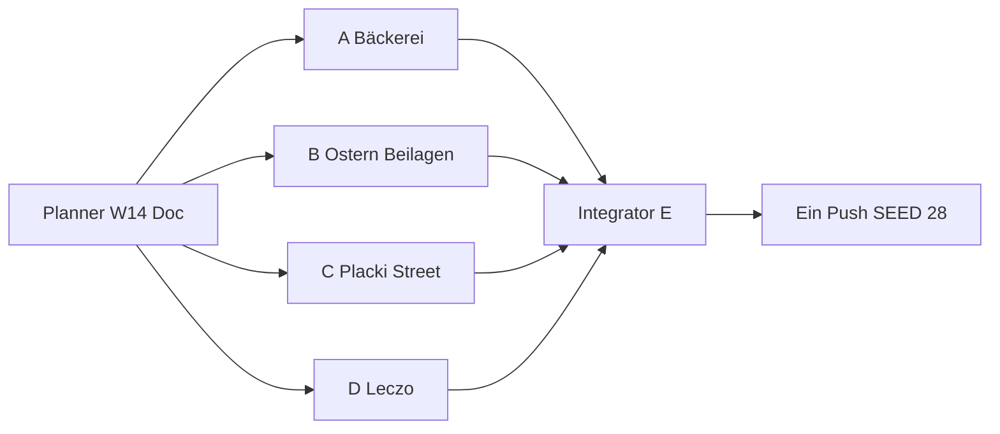

# Wave 14 — Execution Plan (Planner → 4 Implementer → Integrator)

Status: **SHIPPED** (Integrator E · 2026-07-21)  
Nach Ship: `SEED_VERSION` **28** · Rezepte **79** · Blog **36** · Families **3** (Pierogi/Placki/Naleśniki je 4)

Team-Modell: **1 Planner** (dieser Doc) → **4 parallele Implementer (A–D)** → **1 Integrator/QA (E)** → **ein Push**.

**User-Priorität:** „ok weitere rezepte“ — W13-HOLD-Leftovers mit Diaspora-Wert schließen + 2–3 klare Alltag-/Straßen-/Fest-Lücken. Kein Niche-Spray (Czernina bleibt HOLD). Kein neuer Blog-Pillar. Keine Żurek-Variante. Keine Duplikate (Fasolka, Kopytka schon LIVE).

---

## 1. Ist-Stand (nach Wave 13 SHIPPED)

| Layer | LIVE | Notiz |
|-------|------|--------|
| Rezepte | **72** | inkl. Family-Varianten; W13: Krupnik, Szczawiowa, Kutia, Napoleonka, Chałka, Pasztet, Biała kiełbasa |
| RecipeFamilies | **3** | Pierogi 4 · Placki 4 · Naleśniki 4 — **keine** neue Family in W14 |
| Blog | **36** | kein neuer Pillar nötig |
| Cluster-Hubs | **31** | Region thin → `noindex,follow` (HOLD) |
| `SEED_VERSION` | **27** | `src/lib/data/store.ts` |
| Blog:Rezept | **~1 : 2.0** | nach W14 ~1 : 2.2 — noch akzeptabel |

### LIVE Recipe-IDs (Audit 2026-07-21 — 72 unique)

**Core (`seed.ts`):**  
`recipe-barszcz`, `recipe-bigos`, `recipe-chlodnik`, `recipe-fasolka`, `recipe-faworki`, `recipe-golabki`, `recipe-gulasz`, `recipe-kluski-slaskie`, `recipe-kotlet-mielony`, `recipe-nalesniki`, `recipe-oscypek`, `recipe-pierogi`, `recipe-placki`, `recipe-racuchy`, `recipe-rosol`, `recipe-schabowy`, `recipe-zurek`

**Family-Varianten:**  
`recipe-pierogi-meat`, `recipe-pierogi-cabbage`, `recipe-pierogi-jagody`, `recipe-nalesniki-mieso`, `recipe-nalesniki-szpinak`, `recipe-nalesniki-dzem`, `recipe-placki-cukinia`, `recipe-placki-ser`, `recipe-placki-jablka`

**Wave 5–13:**  
`recipe-pierogi-leniwe`, `recipe-kopytka`, `recipe-lazanki`, `recipe-pyzy`, `recipe-zrazy`,  
`recipe-makowiec`, `recipe-uszka`,  
`recipe-karp`, `recipe-krokiety`, `recipe-sernik`, `recipe-sledz`,  
`recipe-mizeria`, `recipe-kapusta-zasmażana`, `recipe-ogorkowa`, `recipe-kapusniak`, `recipe-paczki`, `recipe-knedle-sliwki`,  
`recipe-zeberka`, `recipe-rolada-slaska`, `recipe-salatka-jarzynowa`, `recipe-botwinka`, `recipe-babka`, `recipe-kaszanka`,  
`recipe-flaki`, `recipe-schab-pieczony`, `recipe-piernik`, `recipe-zupa-pomidorowa`, `recipe-makaron-z-serem`,  
`recipe-ryba-po-grecku`, `recipe-golonka`, `recipe-kompot-z-suszu`,  
`recipe-zupa-grzybowa`, `recipe-grochowka`, `recipe-makaron-z-makiem`, `recipe-szarlotka`, `recipe-mazurek`, `recipe-buraczki`, `recipe-klopsy`, `recipe-kluski-kladzione`,  
`recipe-krupnik`, `recipe-szczawiowa`, `recipe-kutia`, `recipe-napoleonka`, `recipe-chalka`, `recipe-pasztet`, `recipe-biala-kielbasa`

**Bereits PRESENT (nicht erneut vorschlagen):** Fasolka po bretońsku, Kopytka, Napoleonka, Chałka, Babka, Pączki, Racuchy, Placki (4), Gulasz, Buraczki, Biała kiełbasa, Pasztet, alle Suppen aus W8–W13, …

---

## 2. Gap-Audit — wichtige Diaspora-Klassiker vs LIVE

Legende: **PRESENT** = published Money Page · **MISSING** = fehlt, ownership-klar oder klarbar · **HOLD** = bewusst nicht shippen (Clash / Niche / SEO-Struktur).

### 2.1 Bäckerei / Creme / Hefe (nach W13)

| Gericht | Status | Begründung |
|---------|--------|------------|
| Napoleonka / Szarlotka / Sernik / Babka / Chałka / Pączki / Racuchy / Makowiec / Mazurek / Piernik | **PRESENT** | |
| **Wuzetka** | **MISSING** → **SHIP W14** | Schoko-Sahne-Torte; nach Napoleonka messbar; klar ≠ Blätterteig-Kremówka |
| **Drożdżówka / Placek drożdżowy** | **MISSING** → **SHIP W14** | Alltags-Hefekuchen/-teilchen mit Streusel/Obst; Form ≠ Chałka-Zopf ≠ Babka-Gugelhupf ≠ Pączki-Fritt ≠ Racuchy-Pfanne |
| Sękacz | **HOLD** | regional / Cover schwer |

### 2.2 Ostern / Fest-Beilagen

| Gericht | Status | Begründung |
|---------|--------|------------|
| Babka / Mazurek / Żurek / Sałatka / Mizeria / Biała / Pasztet / Chałka | **PRESENT** | |
| **Jajka faszerowane** | **MISSING** → **SHIP W14** | Ostern-Buffet-Klassiker; nach Biała fällig; ≠ Sałatka ≠ Mizeria |
| **Ćwikła** | **MISSING** → **SHIP W14** | Rote Bete + Meerrettich (kalt); ≠ Buraczki (warme Beilage) ≠ Barszcz ≠ Botwinka |
| Czernina | **HOLD** | niche / Blut / Cover-Glaubwürdigkeit |

### 2.3 Placki / Street / Alltag-Fleisch

| Gericht | Status | Begründung |
|---------|--------|------------|
| Placki (4) / Gulasz / Schabowy / Golonka / … | **PRESENT** | |
| **Placek po węgiersku** | **MISSING** → **SHIP W14** | Composed Primary: Placki **+** Gulasz (+ oft Käse); SEO-sicher wenn Primary = „ungarischer Kartoffelpuffer-Teller“, nicht Placki-/Gulasz-Broad stehlen |
| **Zapiekanka** | **MISSING** → **SHIP W14** | Straßen-/Nostalgie-Baguette; kein Clash im Katalog |
| **Leczo** | **MISSING** → **SHIP W14** | Paprika-Paprika-Tomaten-Eintopf (± Wurst); ≠ Gulasz wieprzowy (Schweine-Schmor) |
| **Kaczka pieczona** | **MISSING** → **HOLD (später)** | Festbraten; nach W14 messen — Wave schon voll mit 7 |
| Kotlet family hub | **HOLD** | erst nach GSC-Clash |

### 2.4 Explizit ausgeschlossen (User-/Plan-Checks)

| Kandidat | Entscheidung | Grund |
|----------|--------------|--------|
| Fasolka po bretońsku | **PRESENT** | `recipe-fasolka` LIVE + Guide |
| Kopytka | **PRESENT** | `recipe-kopytka` LIVE |
| Żurek-Varianten | **HOLD** | Primary bleibt `/rezepte/zurek`; kein Spray |
| Czernina | **HOLD** | niche |
| Kasza als Cook-Money | **HOLD** | Lexikon `post-kasza` Broad |

### 2.5 Explizite User-Kandidaten (W13 Remaining)

| Kandidat | Entscheidung W14 | Grund |
|----------|------------------|--------|
| **Wuzetka** | **SHIP** | ≠ Napoleonka (Schoko-Sahne ≠ Blätterteig-Creme) |
| **Drożdżówka** | **SHIP** | ≠ Babka / Chałka / Pączki / Racuchy (Form + Garart) |
| **Jajka faszerowane** | **SHIP** | nach Biała; Ostern-Must |
| **Placek po węgiersku** | **SHIP** | Composed-Intent; Placki/Gulasz bleiben Einzeln-Owner |
| Fasolka / Kopytka / Żurek-Varianten | **SKIP** | schon LIVE bzw. HOLD |
| Czernina | **HOLD** | unverändert |

---

## 3. Wave 14 Ziel — Ship-Set **+7**

**Strategie:** Drei W13-HOLD-Leftovers mit höchstem Diaspora-Wert (Wuzetka, Drożdżówka, Jajka) + Placek po węgiersku (jetzt ownership-klar als Composed) + Ćwikła (Ostern-Vervollständigung) + Zapiekanka + Leczo (Alltag/Nostalgie). Kein neuer Blog-Pillar. Keine neue RecipeFamily. Starke Photo-Acceptance-Criteria pro Gericht.

| # | ID (neu) | Gericht | Primary KW DE (eng) | Abgrenzung |
|---|----------|---------|---------------------|------------|
| 1 | `recipe-wuzetka` | Wuzetka | Wuzetka / Schoko-Sahne-Torte polnisch | ≠ Napoleonka ≠ Sernik ≠ Szarlotka |
| 2 | `recipe-drozdzowka` | Drożdżówka / Placek drożdżowy | Drożdżówka / Polnischer Hefekuchen Streusel | ≠ Chałka (Zopf) ≠ Babka (Gugelhupf) ≠ Pączki ≠ Racuchy |
| 3 | `recipe-jajka-faszerowane` | Jajka faszerowane | Jajka faszerowane / Gefüllte Eier polnisch | ≠ Sałatka jarzynowa ≠ Mizeria ≠ Pasztet |
| 4 | `recipe-cwikla` | Ćwikła | Ćwikła / Rote Bete Meerrettich | ≠ Buraczki (warm) ≠ Barszcz ≠ Botwinka ≠ Sałatka |
| 5 | `recipe-placek-po-wegiersku` | Placek po węgiersku | Placek po węgiersku / Ungarischer Kartoffelpuffer | ≠ Placki ziemniaczane alone ≠ Gulasz alone |
| 6 | `recipe-zapiekanka` | Zapiekanka | Zapiekanka / Polnisches Baguette überbacken | ≠ Krokiety ≠ Naleśniki ≠ Pierogi |
| 7 | `recipe-leczo` | Leczo | Leczo / Paprikagemüse polnisch | ≠ Gulasz wieprzowy ≠ Bigos ≠ Fasolka |

**Nach Wave 14 (Zielmengen):**

| Metrik | Ist | Ziel |
|--------|-----|------|
| Rezepte | 72 | **79** (+7) |
| Blog | 36 | **36** (+0) |
| Families | 3 | **3** (unverändert) |
| `SEED_VERSION` | 27 | **28** (nur Agent E) |

**Primary-KW → Owner-URL (Ownership-Doc erweitern):**

| Primary KW DE | Owner-URL |
|---------------|-----------|
| Wuzetka / Schoko-Sahne-Torte | `/rezepte/wuzetka` |
| Drożdżówka / Placek drożdżowy | `/rezepte/drozdzowka` |
| Jajka faszerowane | `/rezepte/jajka-faszerowane` |
| Ćwikła / Rote Bete Meerrettich | `/rezepte/cwikla` |
| Placek po węgiersku | `/rezepte/placek-po-wegiersku` |
| Zapiekanka | `/rezepte/zapiekanka` |
| Leczo | `/rezepte/leczo` |

**Nicht stehlen:**

| Fremd-Owner | Nur descriptive Anchors |
|-------------|-------------------------|
| Napoleonka / Szarlotka / Sernik | Wuzetka = Kakao-Biskuit + Sahne (+ Glasur) |
| Chałka / Babka / Pączki / Racuchy | Drożdżówka = Blech/Teilchen Streusel/Obst |
| Wielkanoc Speiseplan | Anlass-Owner; Jajka/Ćwikła nur Cook |
| Buraczki / Barszcz / Botwinka | Ćwikła = kalt Bete+Meerrettich |
| Placki-Guide / Placki ziemniaczane | Puffer allein; Composed = Placek po węgiersku |
| Gulasz wieprzowy | Eintopf allein; auf Placek nur descriptive |
| Krokiety / Naleśniki | Zapiekanka = Baguette-Street |
| Bigos / Fasolka | Leczo = Paprika-Paprika-Tomate |

### Linking-Gate (wie W8–13)

| Ort | Pflicht |
|-----|---------|
| FACTS → expand() Longform | ≥ **4** Markdown-Links `/de|pl/...` pro Locale (≥2 Rezept + ≥2 Blog) |
| Steps/Tips | ≥ **2** Inline-Links / Locale |
| Related | `relatedPostIds` ≥ 3; Backlinks bidirektional wo sinnvoll |
| Affiliate | Stable **guide-only** auf Rezepten |
| Covers | dish-fit Unsplash · **HTTP GET 200** · Photo-ID **global unique** vs alle 72+7 |
| Longform | ≥ **400** Wörter / Locale via expand |
| Blog | **kein** neuer Pillar |
| Photo QA in Status | je Cover: Photo-ID · GET 200 · **1–2 Sätze Visual-Fit** |

### Cover Acceptance Criteria (pro Gericht — Pflicht für A–D)

| Gericht | Cover MUSS zeigen | Cover DARF NICHT sein |
|---------|-------------------|------------------------|
| **Wuzetka** | Dunkle Schoko-/Kakao-Torte mit heller Sahne-Schicht (Schnitt oder Stück); Glasur ok | Blätterteig-Napoleonka; Apfelkuchen; Käsekuchen; Donuts |
| **Drożdżówka** | Hefe-Blechkuchen oder Hefeteilchen mit **Streusel** und/oder sichtbarem Obst/Mohn-Belag; angeschnitten ok | Geflochtener Chałka-Zopf; Babka-Gugelhupf; frittierte Pączki; Apfel-Pfannkuchen |
| **Jajka faszerowane** | Aufgeschnittene gefüllte Eier (Mayo/Füllung sichtbar) auf Platte/Buffet | Mayo-Gemüsesalat (Sałatka); Gurkensalat; ganze ungeöffnete Eier ohne Füll-Intent |
| **Ćwikła** | Rote-Bete-Salat/-Dip mit **Meerrettich**-Charakter (gerieben/geraspelt, oft Glas/Schüssel); kalt | Warme Buraczki-Beilage-Pfanne; klare Barszcz-Brühe; Botwinka-Suppe |
| **Placek po węgiersku** | Kartoffelpuffer **mit** Gulasch-/Fleischsoße obenauf (Composed Plate); Käse optional | Nackte Placki ohne Topping; reine Gulasch-Schüssel ohne Puffer; Pizza/Zapiekanka |
| **Zapiekanka** | Langes überbackenes Baguette/Halbes Brot mit Käse-Schmelz (+ Pilze/Schinken ok) | Krokiety-Rollen; Naleśniki; Pierogi; Pizza-Slice ohne Baguette-Form |
| **Leczo** | Paprika-Gemüse-Eintopf (rot/gelb Paprika + Tomate sichtbar); Wurstscheiben optional | Dunkler Bigos-Krauttopf; reine Gulasch-Fleischsoße ohne Paprika-Dominanz; Fasolka-Bohnen |

**Unsplash-Workflow (alle Pakete):**

1. Suche EN finished-dish Terms (siehe Pakete) → Kandidaten-IDs.  
2. `curl -sI` / GET auf `https://images.unsplash.com/photo-{ID}?w=1600&q=80` → **200**.  
3. Visuell gegen Tabelle oben prüfen (kein „ungefähr Food“).  
4. Photo-ID gegen **gesamten** Live-Katalog dedupen (Status A–D + E final).  
5. Status-Doc: Fit-Notiz schreiben (Agent E liest das).

---

## 4. Vier parallele Umsetzungspakete (A–D) + Integrator E

### Globale Gates (alle Pakete)

- Affiliate: **guide-only**
- Unique Unsplash-Cover: `https://images.unsplash.com/photo-{ID}?w=1600&q=80`
- Vor Merge: GET → **200**; visuell = Acceptance Criteria
- Descriptive Anchors; Locale-Pfade `/de/...` bzw. `/pl/...`
- `SEED_VERSION` nur Agent E → **28**
- Datei-Isolation: `wave14-a|b|c|d` — **nicht** fremde Paket-Dateien überschreiben
- Kein neuer CDN · keine Placeholder · kein AI-Image ohne Freigabe



---

### Paket A — Bäckerei-Rest (Wuzetka + Drożdżówka)

**Owner-Scope:**

1. `recipe-wuzetka` — Wuzetka (Kakao-Biskuit + Sahne + Schoko-Glasur — **eine** klare Hausvariante; nicht Napoleonka)
2. `recipe-drozdzowka` — Drożdżówka / Placek drożdżowy (Hefeteig Blech oder Teilchen mit Streusel; Obst **eine** Linie im Excerpt festnageln — z. B. Streusel + optional Pflaume/Apfel)

**Kein neuer Blog.**

**Dateien (isoliert):**

| Datei | Rolle |
|-------|--------|
| `src/lib/data/seed-recipes-wave14-a.ts` | Export `seedRecipesWave14A` |
| `src/lib/data/recipe-articles-w14-a.ts` | Export `W14_FACTS_A` |
| `content/wave-14-status-a.md` | Status für E inkl. Photo QA |
| `content/keyword-ownership.md` | +2 Primary-Zeilen (A-Anteil) |

**Touch / Backlinks (erlaubt):**

- FACTS-Abgrenzung: napoleonka, sernik, szarlotka, chalka, babka, paczki, racuchy
- Optional: `post-sonntagsessen` / `post-tlusty-czwartek` descriptiv (kein Primary-Steal)
- **Nicht:** `seed-recipes-wave14-b|c|d.ts`, `SEED_VERSION`, Family-Dateien

**Gates A:**

- [ ] 2 Rezepte published, unique covers GET 200 + Visual-Fit-Notizen in Status
- [ ] FACTS ≥400; ≥4 Inline-Links DE+PL je Rezept
- [ ] Steps ≥2 Inline-Links DE+PL
- [ ] Wuzetka ≠ Napoleonka/Sernik/Szarlotka
- [ ] Drożdżówka ≠ Chałka/Babka/Pączki/Racuchy

**relatedPostIds (mind.):**

| Rezept | related |
|--------|---------|
| wuzetka | `post-sonntagsessen`, `post-ersatzprodukte-de`, `post-polenladen` |
| drozdzowka | `post-sonntagsessen` oder `post-tlusty-czwartek`, `post-polenladen`, `post-ersatzprodukte-de` |

**Cover-Suchbegriffe (EN, finished dish):**  
`chocolate cream cake slice layered`, `cocoa sponge whipped cream cake`, `yeast cake streusel crumb`, `polish yeast bun crumble topping`

**Cover Acceptance (A):** siehe §3 Tabelle Wuzetka / Drożdżówka.

---

### Paket B — Ostern-Beilagen (Jajka faszerowane + Ćwikła)

**Owner-Scope:**

1. `recipe-jajka-faszerowane` — Jajka faszerowane (gefüllte Eier; **eine** Füll-Linie: z. B. Eigelb-Mayo-Schnittlauch — im Title/Excerpt festnageln)
2. `recipe-cwikla` — Ćwikła (geriebene Rote Bete + Meerrettich; kalt; ≠ warme Buraczki)

**Kein neuer Blog.**

**Dateien:**

| Datei | Rolle |
|-------|--------|
| `src/lib/data/seed-recipes-wave14-b.ts` | `seedRecipesWave14B` |
| `src/lib/data/recipe-articles-w14-b.ts` | `W14_FACTS_B` |
| `content/wave-14-status-b.md` | Status + Photo QA |
| `content/keyword-ownership.md` | +2 Zeilen |

**Touch / Backlinks:**

- `post-wielkanoc` → jajka-faszerowane + cwikla (getrennte descriptive Sätze)
- Abgrenzung FACTS: buraczki, salatka-jarzynowa, mizeria, barszcz, botwinka, biala-kielbasa, pasztet
- **Nicht:** Placek/Zapiekanka-Dateien (Paket C)

**Gates B:** Jajka ≠ Sałatka/Mizeria; Ćwikła ≠ Buraczki/Barszcz/Botwinka; Covers Acceptance + GET 200.

**relatedPostIds (mind.):**

| Rezept | related |
|--------|---------|
| jajka-faszerowane | `post-wielkanoc`, `post-sonntagsessen`, `post-polenladen` oder `post-ersatzprodukte-de` |
| cwikla | `post-wielkanoc`, `post-polenladen`, `post-ersatzprodukte-de` (Meerrettich DE) |

**Cover-Suchbegriffe:**  
`deviled eggs platter mayo`, `stuffed eggs buffet`, `beet horseradish salad bowl`, `grated beetroot relish`

**Cover Acceptance (B):** siehe §3 Jajka / Ćwikła — Eier **gefüllt/aufgeschnitten**; Ćwikła **kalt gerieben**, nicht warme Buraczki.

---

### Paket C — Composed Placki + Street (Placek po węgiersku + Zapiekanka)

**Owner-Scope:**

1. `recipe-placek-po-wegiersku` — Placek po węgiersku (Kartoffelpuffer + Gulasch-Topping; Käse optional — **eine** Hauslinie; Primary = Composed Dish)
2. `recipe-zapiekanka` — Zapiekanka (Baguette + Pilze/Schinken + Käse überbacken — **eine** klassische Linie)

**Kein neuer Blog.**

**Dateien:**

| Datei | Rolle |
|-------|--------|
| `src/lib/data/seed-recipes-wave14-c.ts` | `seedRecipesWave14C` |
| `src/lib/data/recipe-articles-w14-c.ts` | `W14_FACTS_C` |
| `content/wave-14-status-c.md` | Status + Photo QA |
| `content/keyword-ownership.md` | +2 Zeilen |

**Touch / Backlinks:**

- Placki FACTS / `post-placki-guide` → descriptive „Placek po węgiersku“ (Composed), **ohne** Placki-Primary zu stehlen
- Gulasz FACTS → descriptive Link zur Composed-URL
- Optional: `post-sonntagsessen` → placek-po-wegiersku; diaspora → zapiekanka
- **Nicht:** Leczo-Dateien (Paket D); keine 5. Placki-Family-Variante anlegen

**Gates C:** Placek po węgiersku ≠ Placki-alone ≠ Gulasz-alone; Zapiekanka ≠ Krokiety/Naleśniki; Covers Acceptance + GET 200.

**relatedPostIds (mind.):**

| Rezept | related |
|--------|---------|
| placek-po-wegiersku | `post-placki-guide`, `post-sonntagsessen`, `post-dutch-oven` oder `post-polenladen` |
| zapiekanka | `post-polenladen`, `post-ersatzprodukte-de`, `post-sonntagsessen` oder `post-freezer-meal-prep` |

**Cover-Suchbegriffe:**  
`potato pancake goulash topping`, `latke stew gravy plate`, `baguette pizza melted cheese mushrooms`, `open faced baked baguette cheese`

**Cover Acceptance (C):** siehe §3 — Placek **muss** Puffer+Soße zeigen; Zapiekanka **muss** Baguette-Form zeigen.

---

### Paket D — Alltag-Eintopf (Leczo)

**Owner-Scope:**

1. `recipe-leczo` — Leczo (Paprika + Zwiebel + Tomate; Wurst optional aber im Excerpt klar — **eine** Linie; ≠ Gulasz-Primary)

**Kein neuer Blog.** Paket D bewusst **1 Rezept** (Ownership-sensible Nähe zu Gulasz — kein Parallel-Spray Kaczka).

**Dateien:**

| Datei | Rolle |
|-------|--------|
| `src/lib/data/seed-recipes-wave14-d.ts` | `seedRecipesWave14D` |
| `src/lib/data/recipe-articles-w14-d.ts` | `W14_FACTS_D` |
| `content/wave-14-status-d.md` | Status + Photo QA |
| `content/keyword-ownership.md` | +1 Zeile |

**Touch / Backlinks:**

- Gulasz FACTS: Abgrenzung Leczo (Paprika-Gemüse ≠ Schweine-Schmor-Primary)
- `post-sonntagsessen` / `post-polenladen` descriptiv
- Optional Stichprobe: 2 Cover-URLs aus Status A/B/C gegen GET 200 melden (nicht überschreiben)

**Gates D:** Leczo ≠ Gulasz/Bigos/Fasolka; Cover = Paprika-dominant; Inline-Gates.

**relatedPostIds (mind.):**

| Rezept | related |
|--------|---------|
| leczo | `post-sonntagsessen`, `post-polenladen`, `post-majeranek` oder `post-kielbasa-arten` (descriptiv Wurst) |

**Cover-Suchbegriffe:**  
`pepper tomato stew sausage`, `hungarian lecho peppers`, `paprika vegetable stew bowl`

**Cover Acceptance (D):** siehe §3 Leczo — Paprika sichtbar, kein Bigos-Kraut-Clash.

---

## 5. Agent E — Integrator / QA Checklist

| Parallel | Warten |
|----------|--------|
| A, B, C, D voll parallel | Photo-ID-Kollisionen über Status-Docs |
| E | nach A+B+C+D |

**Merge-Checklist E:**

- [ ] Aggregator `src/lib/data/seed-recipes-wave14.ts` → Import in `seed.ts` (Pattern W13)
- [ ] Alle `W14_FACTS_*` in `recipe-articles.ts` verdrahtet
- [ ] `keyword-ownership.md` +7 Primary-Zeilen dedupt + Intent-Trennung-Absatz W14
- [ ] Docs: `topical-backlog.md`, `topical-authority-status.md` → LIVE W14; Plan → **SHIPPED**
- [ ] `SEED_VERSION` **27 → 28**
- [ ] Zielmengen: Rezepte **79**, Blog **36**, Families **3**
- [ ] Global unique Cover Photo-IDs (72 alt + 7 neu); alle neuen GET **200**
- [ ] Status A–D Visual-Fit-Notizen gelesen; Spot-Check gegen Acceptance Criteria §3
- [ ] Inline-Gates stichprobenartig je Paket (≥4 FACTS / ≥2 Steps)
- [ ] Ownership-Abgrenzungen unverletzt (Tabelle §3) — besonders Placek vs Placki/Gulasz, Drożdżówka vs Chałka/Babka, Wuzetka vs Napoleonka, Ćwikła vs Buraczki
- [ ] Build green
- [ ] **Ein** kombinierter Push erst bei Grün — A–D pushen nicht

**Konflikt-Hotspots:**

| Thema | Wer | Regel |
|-------|-----|--------|
| Photo-IDs unique | A–D | Status listet finale IDs + Fit-Notiz; E dedupt |
| `post-wielkanoc` | B | getrennte Sätze Jajka / Ćwikła |
| Placki-Guide / Gulasz FACTS | C | descriptive Composed-Links; Primary nicht stehlen |
| Gulasz vs Leczo | C + D | C rührt Gulasz nur für Placek-Abgrenzung an; D schreibt Leczo-Primary |
| `keyword-ownership.md` | alle | E final dedupt |
| Hefe-Cluster | A | Drożdżówka ≠ Chałka ≠ Babka ≠ Pączki |
| Bäckerei-Creme | A | Wuzetka ≠ Napoleonka |

**Visual Spot-Check (E, DE+PL Cards):**

1. Wuzetka (Schoko-Sahne-Schnitt ≠ Napoleonka-Blätterteig)  
2. Drożdżówka (Streusel-Hefekuchen ≠ Chałka-Zopf ≠ Babka)  
3. Jajka faszerowane (gefüllt/aufgeschnitten)  
4. Ćwikła (kalt gerieben + Meerrettich ≠ warme Buraczki)  
5. Placek po węgiersku (Puffer **+** Gulasch oben)  
6. Zapiekanka (Baguette überbacken)  
7. Leczo (Paprika-Eintopf ≠ Bigos/Gulasz-Fleischsoße)  
8. Stichprobe Nachbarn: Napoleonka, Chałka, Babka, Placki, Gulasz, Buraczki — keine Cover-Regression

---

## 6. Explizit HOLD / bleibt nach W14 fehlend

### Nach Wave 14 weiterhin MISSING / später

| Dish | Priorität später | Notiz |
|------|------------------|--------|
| Kaczka pieczona | mittel | Festbraten; nach W14 messen |
| Cover-Proxy-Upgrades | mittel | Żurek, Bigos, Kapuśniak, Mizeria, Faworki, … (Retrofit-Wave) |
| Sękacz | niedrig | regional / Cover |

### Bewusst HOLD (nicht ohne neuen Ownership-Plan)

| Item | Warum |
|------|--------|
| Czernina | niche / saisonal / Zutaten-Risiko |
| Żurek-Varianten | Primary bleibt `recipe-zurek` |
| Kotlet family hub | SEO-Split erst nach GSC-Beweis |
| Lane kluski | Overlap Kładzione/Makaron |
| Region-Blogs / Meal-Prep Woche / Lab-Tests | unverändert |
| Region-Hub-Intros ≥400 vor Index | unverändert |
| Neuer Blog-Pillar | Ownership reicht über bestehende Guides |
| 5. Placki-/Pierogi-/Naleśniki-Variante | Families satt (4/4/4); Placek po węgiersku = **Standalone Composed**, keine Family-Variante |
| Kasza Cook-Money | Lexikon Broad bleibt |
| Fasolka / Kopytka erneut | schon LIVE |

---

## Anhang — Copy-Paste Task Prompts

### Prompt Agent A

```
Repo: /Users/timrayburkhardt/Alemniam. Du bist Implementer A (Wave 14 Paket A). Lies content/wave-14-plan.md Paket A + Cover Acceptance Criteria §3. Kein Push. Kein SEED_VERSION-Bump. KEIN neuer Blog-Pillar.

Lege an:
- recipe-wuzetka (slug: wuzetka)
- recipe-drozdzowka (slug: drozdzowka)

Dateien: seed-recipes-wave14-a.ts, recipe-articles-w14-a.ts (W14_FACTS_A), content/wave-14-status-a.md, keyword-ownership +2 Primary-Zeilen.

Gates:
- FACTS ≥400 Wörter/Locale; ≥4 Inline-Links/Locale (≥2 Rezept + ≥2 Blog); Steps ≥2 Links
- Unique Unsplash covers Format ?w=1600&q=80; GET 200; dish-fit laut Acceptance:
  · Wuzetka = Schoko/Kakao-Torte mit Sahne-Schicht (NICHT Napoleonka-Blätterteig, NICHT Szarlotka/Sernik)
  · Drożdżówka = Hefe-Blech/Teilchen mit Streusel (NICHT Chałka-Zopf, NICHT Babka-Gugelhupf, NICHT Pączki, NICHT Racuchy)
- In Status: je Cover Photo-ID + HTTP 200 + 1–2 Sätze Visual-Fit
- Affiliate guide-only; Isolation: keine wave14-b|c|d Dateien anfassen

Backlinks: Abgrenzung in Napoleonka/Chałka/Babka FACTS wo sinnvoll.
Am Ende: Diff-Liste für E. Kein main-Push.
```

### Prompt Agent B

```
Repo: /Users/timrayburkhardt/Alemniam. Du bist Implementer B (Wave 14 Paket B). Lies content/wave-14-plan.md Paket B + Cover Acceptance Criteria §3. Kein Push. Kein SEED_VERSION-Bump. KEIN neuer Blog-Pillar.

Lege an:
- recipe-jajka-faszerowane (slug: jajka-faszerowane)
- recipe-cwikla (slug: cwikla)

Dateien: seed-recipes-wave14-b.ts, recipe-articles-w14-b.ts (W14_FACTS_B), content/wave-14-status-b.md, keyword-ownership +2.

Gates:
- FACTS ≥400; ≥4 Inline-Links/Locale; Steps ≥2; unique Unsplash GET 200
- Cover Acceptance:
  · Jajka = aufgeschnittene gefüllte Eier (NICHT Sałatka-Mayo-Salat, NICHT Mizeria)
  · Ćwikła = kalt geriebene Rote Bete + Meerrettich (NICHT warme Buraczki, NICHT Barszcz/Botwinka)
- Status: Photo-ID + GET 200 + Visual-Fit-Notiz je Cover
- Isolation vs A/C/D; guide-only

Backlinks: post-wielkanoc → beide Cooks (getrennte Sätze); Abgrenzung Buraczki/Sałatka FACTS.
Am Ende: Diff-Liste für E. Kein main-Push.
```

### Prompt Agent C

```
Repo: /Users/timrayburkhardt/Alemniam. Du bist Implementer C (Wave 14 Paket C). Lies content/wave-14-plan.md Paket C + Cover Acceptance Criteria §3. Kein Push. Kein SEED_VERSION-Bump. KEIN neuer Blog-Pillar. KEINE 5. Placki-Family-Variante.

Lege an:
- recipe-placek-po-wegiersku (slug: placek-po-wegiersku) — Composed Primary (Puffer + Gulasch)
- recipe-zapiekanka (slug: zapiekanka)

Dateien: seed-recipes-wave14-c.ts, recipe-articles-w14-c.ts (W14_FACTS_C), content/wave-14-status-c.md, keyword-ownership +2.

Gates:
- FACTS ≥400; ≥4 Inline-Links/Locale; Steps ≥2; unique Unsplash GET 200
- Cover Acceptance:
  · Placek po węgiersku = Kartoffelpuffer MIT Gulasch-Topping (NICHT nackte Placki, NICHT reine Gulasch-Schüssel)
  · Zapiekanka = überbackenes Baguette mit Käse (NICHT Krokiety/Naleśniki/Pierogi)
- Status: Photo-ID + GET 200 + Visual-Fit-Notiz je Cover
- Primary Composed ≠ Placki-Broad ≠ Gulasz-Primary stehlen; nur descriptive Crosslinks
- Isolation; guide-only

Backlinks: post-placki-guide + Gulasz FACTS descriptive → Composed-URL; diaspora → zapiekanka.
Am Ende: Diff-Liste für E. Kein main-Push.
```

### Prompt Agent D

```
Repo: /Users/timrayburkhardt/Alemniam. Du bist Implementer D (Wave 14 Paket D). Lies content/wave-14-plan.md Paket D + Cover Acceptance Criteria §3. Kein Push. Kein SEED_VERSION-Bump. KEIN neuer Blog-Pillar. KEINE Kaczka.

Lege an:
- recipe-leczo (slug: leczo) — Paprika-Gemüse-Eintopf; ≠ Gulasz-Primary

Dateien: seed-recipes-wave14-d.ts, recipe-articles-w14-d.ts (W14_FACTS_D), content/wave-14-status-d.md, keyword-ownership +1.

Gates:
- FACTS ≥400; ≥4 Inline-Links/Locale; Steps ≥2; unique Unsplash GET 200
- Cover Acceptance: Paprika-Tomaten-Eintopf sichtbar (Wurst ok) — NICHT Bigos-Kraut, NICHT reine Gulasch-Fleischsoße, NICHT Fasolka-Bohnen
- Status: Photo-ID + GET 200 + Visual-Fit-Notiz
- Primary ≠ Gulasz/Bigos/Fasolka
- Optional: Stichprobe je 2 Cover-URLs aus Status A/B/C — Failures melden, nicht überschreiben
- Isolation; guide-only

Backlinks: Abgrenzung in Gulasz FACTS; post-sonntagsessen / post-polenladen descriptiv.
Am Ende: Diff-Liste für E. Kein main-Push.
```

### Prompt Agent E (Integrator/QA)

```
Repo: /Users/timrayburkhardt/Alemniam. Du bist Integrator/QA Wave 14. Lies content/wave-14-plan.md §5 + Cover Acceptance Criteria §3. Einziger Push.

Merge A–D:
- seed-recipes-wave14.ts Aggregator + Import in seed.ts
- Alle W14_FACTS_* in recipe-articles.ts
- keyword-ownership +7 dedupt + Intent-Trennung W14
- topical-backlog.md + topical-authority-status.md aktualisieren; Plan → SHIPPED
- SEED_VERSION 27→28

QA:
- Rezepte 79, Blog 36, Families 3
- Alle 7 neuen Covers GET 200, global unique Photo-IDs
- Status A–D Visual-Fit gegen Acceptance (Wuzetka≠Napoleonka; Drożdżówka≠Chałka/Babka; Jajka=gefüllt; Ćwikła≠Buraczki; Placek=Puffer+Gulasch; Zapiekanka=Baguette; Leczo=Paprika)
- Inline-Gates ≥4 FACTS / ≥2 Steps stichprobenartig
- Ownership: Placek≠Placki/Gulasz alone; Drożdżówka≠Chałka/Babka/Pączki; Wuzetka≠Napoleonka; Ćwikła≠Buraczki; Leczo≠Gulasz
- Visual Spot-Check §5; build green

Nur bei Grün: ein git add . && git commit -m "..." && git push origin main.
A–D haben nicht gepusht. Keine Rezept-Implementierung über den Merge hinaus.
```

---

## Kurzfazit Planner

Wave 14 schließt **7** ownership-sichere Diaspora-Lücken: Wuzetka, Drożdżówka, Jajka faszerowane, Ćwikła, Placek po węgiersku (Composed), Zapiekanka, Leczo. Fasolka/Kopytka/Żurek-Varianten bewusst ausgelassen (LIVE bzw. HOLD). Czernina + Kaczka bleiben später. Photo-QA ist Gate: Acceptance Criteria + GET 200 + Fit-Notiz in jedem Status-Doc. Target: **79** Rezepte · `SEED_VERSION` **28** · kein neuer Pillar.
