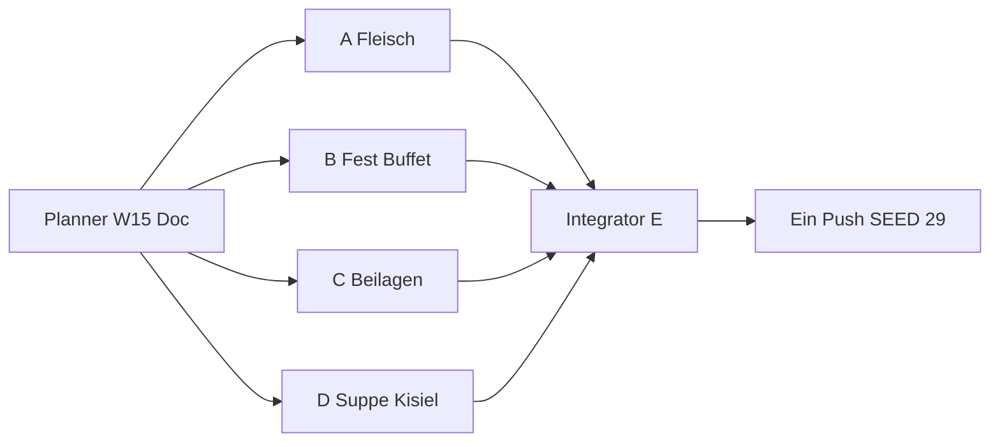

# Wave 15 — Execution Plan (Planner → 4 Implementer → Integrator)

Status: **PLANNED** (noch nicht shipped)  
Basis: `content/catalog-inventory.md` (SEED **28** · **79** Rezepte · **36** Blog)  
Nach Ship: `SEED_VERSION` **29** · Rezepte **87** (+8) · Blog **36** · Families **3** (unverändert 4/4/4)

Team-Modell: **1 Planner** (dieser Doc) → **4 parallele Implementer (A–D)** → **1 Integrator/QA (E)** → **ein Push**.

**Priorität:** Nach Wave 14 sind die Kern-Money-Pages weitgehend voll (≥8 wichtige MISSING bleiben). Wave 15 schließt die klarsten Rest-Klassiker (Festbraten, Buffet/Aspik, Wigilia-Salat, Sonntags-Beilagen, Dillsuppe, Hackbraten, Kisiel) — **kein Niche-Spray**. Czernina / Barszcz biały / Sękacz bleiben HOLD. Kein neuer Blog-Pillar. Keine 5. Family-Variante. **PL-Routing nicht brechen.**

---

## 1. Ist-Stand (nach Wave 14 SHIPPED)

| Layer | LIVE | Notiz |
|-------|------|--------|
| Rezepte | **79** | inkl. Family-Varianten |
| RecipeFamilies | **3** | Pierogi 4 · Placki 4 · Naleśniki 4 |
| Blog | **36** | kein neuer Pillar nötig |
| Cluster-Hubs | **31** | Region thin → `noindex,follow` (HOLD) |
| `SEED_VERSION` | **28** | `src/lib/data/store.ts` |
| Blog:Rezept | **~1 : 2.19** | nach W15 ~1 : 2.4 — noch ok; kein Pillar erzwingen |

Vollständige Listen: [`catalog-inventory.md`](./catalog-inventory.md).

---

## 2. Gap-Audit (Kurz — Details im Inventory)

| Gericht | Status | Entscheidung W15 |
|---------|--------|------------------|
| **Kaczka pieczona** | MISSING | **SHIP** |
| **Galareta / nóźki w galarecie** | MISSING | **SHIP** |
| **Sałatka śledziowa** | MISSING | **SHIP** (≠ Śledź w oleju) |
| **Marchewka z groszkiem** | MISSING | **SHIP** |
| **Zupa koperkowa** | MISSING | **SHIP** |
| **Pieczeń rzymska** | MISSING | **SHIP** |
| **Kisiel owocowy** | MISSING | **SHIP** |
| **Fasolka szparagowa po polsku** | MISSING | **SHIP** |
| Kotlet de volaille | MISSING | **HOLD** (Panade-Nähe Schabowy — nach GSC) |
| Surówka z kapusty | MISSING | **HOLD / später** |
| Barszcz biały | HOLD | Intent ≈ Żurek |
| Czernina | HOLD | niche / Cover |
| Sękacz / Kwaśnica / Kasza Cook / 5. Family-Variante | HOLD | unverändert |

---

## 3. Wave 15 Ziel — Ship-Set **+8**

**Strategie:** Hochwertige Rest-Lücken mit klarem Intent-Split und dish-fit Covers. Kein neuer Blog. Keine neue RecipeFamily.

| # | ID (neu) | Gericht | Primary KW DE (eng) | Abgrenzung |
|---|----------|---------|---------------------|------------|
| 1 | `recipe-kaczka` | Kaczka pieczona | Kaczka pieczona / Ente polnisch Ofen | ≠ Schab pieczony ≠ Golonka ≠ Żeberka |
| 2 | `recipe-pieczen-rzymska` | Pieczeń rzymska | Pieczeń rzymska / Polnischer Hackbraten | ≠ Kotlet mielony (Pfanne) ≠ Pasztet |
| 3 | `recipe-galareta` | Galareta / nóźki w galarecie | Galareta / Schweinefüße Aspik polnisch | ≠ Pasztet ≠ Sałatka ≠ Jajka |
| 4 | `recipe-salatka-sledziowa` | Sałatka śledziowa | Sałatka śledziowa / Heringssalat Mayo | ≠ `recipe-sledz` (Öl) ≠ Sałatka jarzynowa |
| 5 | `recipe-marchewka-groszek` | Marchewka z groszkiem | Marchewka z groszkiem / Möhren Erbsen Beilage | ≠ Mizeria ≠ Buraczki ≠ Surówka-HOLD |
| 6 | `recipe-fasolka-szparagowa` | Fasolka szparagowa po polsku | Fasolka szparagowa / Grüne Bohnen polnisch | ≠ Fasolka po bretońsku (Eintopf) |
| 7 | `recipe-koperkowa` | Zupa koperkowa | Zupa koperkowa / Dillsuppe polnisch | ≠ Rosół ≠ Szczawiowa ≠ Botwinka ≠ Ogórkowa |
| 8 | `recipe-kisiel` | Kisiel owocowy | Kisiel / Fruchtkisiel polnisch | ≠ Kompot z suszu ≠ Kutia |

**Nach Wave 15 (Zielmengen):**

| Metrik | Ist | Ziel |
|--------|-----|------|
| Rezepte | 79 | **87** (+8) |
| Blog | 36 | **36** (+0) |
| Families | 3 | **3** (unverändert) |
| `SEED_VERSION` | 28 | **29** (nur Agent E) |

**Primary-KW → Owner-URL (Ownership-Doc erweitern):**

| Primary KW DE | Owner-URL |
|---------------|-----------|
| Kaczka pieczona | `/rezepte/kaczka` |
| Pieczeń rzymska | `/rezepte/pieczen-rzymska` |
| Galareta / nóźki w galarecie | `/rezepte/galareta` |
| Sałatka śledziowa | `/rezepte/salatka-sledziowa` |
| Marchewka z groszkiem | `/rezepte/marchewka-groszek` |
| Fasolka szparagowa po polsku | `/rezepte/fasolka-szparagowa` |
| Zupa koperkowa | `/rezepte/koperkowa` |
| Kisiel owocowy | `/rezepte/kisiel` |

**Nicht stehlen:**

| Fremd-Owner | Nur descriptive Anchors |
|-------------|-------------------------|
| Schab / Golonka / Żeberka | Kaczka = ganze/halbe Ente Ofen |
| Kotlet mielony / Pasztet | Pieczeń = Ofen-Hacklaib |
| Śledź w oleju / Sałatka jarzynowa | Śledziowa = Mayo-Salat mit Hering |
| Fasolka po bretońsku Guide+Cook | Szparagowa = grüne Stangenbohnen-Beilage |
| Rosół / Szczawiowa / Botwinka | Koperkowa = Dill-dominant |
| Kompot z suszu / Wigilia-Pillar | Kisiel = gestärktes Fruchtgetränk/Dessert |
| Sonntagsessen / Wigilia / Wielkanoc | bleiben Anlass-Owner |

### Linking-Gate (wie W8–14)

| Ort | Pflicht |
|-----|---------|
| FACTS → expand() Longform | ≥ **4** Markdown-Links `/de\|pl/...` pro Locale (≥2 Rezept + ≥2 Blog) |
| Steps/Tips | ≥ **2** Inline-Links / Locale |
| Related | `relatedPostIds` ≥ 3 |
| Affiliate | **guide-only** auf Rezepten |
| Covers | dish-fit Unsplash · **HTTP GET 200** · Photo-ID **global unique** vs alle 79+8 |
| Longform | ≥ **400** Wörter / Locale |
| Blog | **kein** neuer Pillar |
| Photo QA in Status | je Cover: Photo-ID · GET 200 · **1–2 Sätze Visual-Fit** |
| Routing | **PL-Slugs/Paths nicht brechen**; Family-Hubs unangetastet |

### Cover Acceptance Criteria

| Gericht | Cover MUSS zeigen | Cover DARF NICHT sein |
|---------|-------------------|------------------------|
| **Kaczka pieczona** | Gebratene Ente (ganzes/halbes Stück oder klarer Entenbraten-Schnitt); Ofen/Festteller | Schweinebraten-Schab; Haxe Golonka; Rippen; Huhn ohne Enten-Charakter |
| **Pieczeń rzymska** | Geschnittener Hackbraten-/Fleischlaib aus dem Ofen (Scheiben sichtbar) | Flache Frikadellen/Mielony; Pastete-Terrine; Roh-Hack |
| **Galareta** | Klare Aspik-/Sülze mit Fleischstücken in Gelee (Teller/Form) | Warme Suppe; Pastete; Wurstscheiben ohne Gelee |
| **Sałatka śledziowa** | Cremiger Heringssalat (Mayo/Śmietana sichtbar; Hering-/Zwiebel-Charakter) | Reine Heringe in Öl (Śledź w oleju); Mayo-Gemüsesalat ohne Hering |
| **Marchewka z groszkiem** | Möhren + Erbsen als warme Beilage (Butter/Glasur ok) | Roher Rohkostsalat; Rote-Bete-Buraczki; Gurken-Mizeria |
| **Fasolka szparagowa** | Grüne Stangenbohnen als Beilage (Butter/Semmelbrösel ok) | Fasolka-po-bretońsku-Eintopf mit weißen Bohnen/Speck-Sauce |
| **Zupa koperkowa** | Helle Dillsuppe (grünlich; Dill sichtbar); oft mit Ei/Kartoffeln | Klare Rosół-Goldbrühe; rote Barszcz; Sauerampfer-Szczawiowa |
| **Kisiel** | Semi-transparente Fruchtcreme/-getränk in Glas/Schüssel (Beeren/Farbe klar) | Kompot mit ganzen Trockenobststücken; Kutia-Weizen; Pudding-Haut ohne Frucht |

---

## 4. Pakete A–D + Integrator E



### Globale Gates

- Affiliate: **guide-only**
- Unique Unsplash: `https://images.unsplash.com/photo-{ID}?w=1600&q=80`
- GET **200** + Visual-Fit vor Merge
- Descriptive Anchors; Locale-Pfade `/de/...` · `/pl/...`
- `SEED_VERSION` nur Agent E → **29**
- Datei-Isolation: `wave15-a|b|c|d` — fremde Pakete nicht überschreiben
- **Kein PL-Routing-Break** (keine Legacy-Slug-Regression an Families)

---

### Paket A — Festfleisch (Kaczka + Pieczeń rzymska)

1. `recipe-kaczka` — Kaczka pieczona (Ofenente; **eine** Hauslinie: z. B. Äpfel/Majoran — im Excerpt festnageln)
2. `recipe-pieczen-rzymska` — Pieczeń rzymska (Ofen-Hackbraten; **eine** Füll-/Gewürzlinie)

**Dateien:**

| Datei | Rolle |
|-------|--------|
| `src/lib/data/seed-recipes-wave15-a.ts` | `seedRecipesWave15A` |
| `src/lib/data/recipe-articles-w15-a.ts` | `W15_FACTS_A` |
| `content/wave-15-status-a.md` | Status + Photo QA |
| `content/keyword-ownership.md` | +2 Primary-Zeilen |

**relatedPostIds (mind.):**

| Rezept | related |
|--------|---------|
| kaczka | `post-sonntagsessen`, `post-majeranek`, `post-polenladen` |
| pieczen-rzymska | `post-sonntagsessen`, `post-fleischwolf` oder `post-panieren`, `post-ersatzprodukte-de` |

**Cover-Suche (EN):** `roast duck whole oven`, `sliced roast duck plate`, `meatloaf sliced dinner`, `polish meatloaf oven`

**Gates A:** Kaczka ≠ Schab/Golonka; Pieczeń ≠ Mielony/Pasztet; Covers Acceptance + GET 200.

---

### Paket B — Fest / Wigilia-Buffet (Galareta + Sałatka śledziowa)

1. `recipe-galareta` — Galareta / nóźki w galarecie (kalte Sülze; **eine** klare Hausvariante)
2. `recipe-salatka-sledziowa` — Sałatka śledziowa (Mayo-Heringssalat; ≠ Öl-Hering)

**Dateien:** `seed-recipes-wave15-b.ts`, `recipe-articles-w15-b.ts`, `wave-15-status-b.md`, Ownership +2.

**Touch:** `post-wigilia` → descriptive Links; Abgrenzung FACTS zu `sledz`, `salatka-jarzynowa`, `pasztet`, `jajka-faszerowane`.

**relatedPostIds:**

| Rezept | related |
|--------|---------|
| galareta | `post-wigilia` oder `post-sonntagsessen`, `post-polenladen`, `post-wielkanoc` |
| salatka-sledziowa | `post-wigilia`, `post-polenladen`, `post-ersatzprodukte-de` |

**Cover-Suche:** `meat aspic jelly plate`, `pork trotter aspic`, `herring salad mayonnaise`, `creamy herring onion salad`

**Gates B:** Galareta = Gelee sichtbar; Śledziowa ≠ Śledź w oleju ≠ Jarzynowa.

---

### Paket C — Sonntags-Beilagen (Marchewka + Fasolka szparagowa)

1. `recipe-marchewka-groszek` — Marchewka z groszkiem (warme Beilage)
2. `recipe-fasolka-szparagowa` — Fasolka szparagowa po polsku (grüne Bohnen; Semmelbrösel/Butter ok)

**Dateien:** `seed-recipes-wave15-c.ts`, `recipe-articles-w15-c.ts`, `wave-15-status-c.md`, Ownership +2.

**Touch:** `post-sonntagsessen` descriptive; FACTS-Abgrenzung zu `recipe-fasolka` (bretońsku), Mizeria, Buraczki. **Nicht** Fasolka-Guide-Primary stehlen.

**relatedPostIds:**

| Rezept | related |
|--------|---------|
| marchewka-groszek | `post-sonntagsessen`, `post-polenladen`, `post-ersatzprodukte-de` |
| fasolka-szparagowa | `post-sonntagsessen`, `post-fasolka-guide` (descriptiv: Beilage ≠ Eintopf), `post-polenladen` |

**Cover-Suche:** `buttered carrots peas side`, `glazed carrots green peas`, `green beans butter breadcrumbs`, `sauteed green beans side dish`

**Gates C:** Szparagowa ≠ Fasolka po bretońsku; Marchewka ≠ Rohkost/Mizeria.

---

### Paket D — Suppe + Kisiel (Koperkowa + Kisiel)

1. `recipe-koperkowa` — Zupa koperkowa (Dillsuppe; oft Kartoffel/Ei — **eine** Linie)
2. `recipe-kisiel` — Kisiel owocowy (**eine** Fruchtlinie im Excerpt, z. B. Himbeere/Johannisbeere)

**Dateien:** `seed-recipes-wave15-d.ts`, `recipe-articles-w15-d.ts`, `wave-15-status-d.md`, Ownership +2.

**Touch:** `post-polnische-suppen` → koperkowa descriptive; `post-wigilia` → kisiel descriptive (kein Speiseplan-Steal).

**relatedPostIds:**

| Rezept | related |
|--------|---------|
| koperkowa | `post-polnische-suppen`, `post-sonntagsessen`, `post-polenladen` |
| kisiel | `post-wigilia`, `post-polenladen`, `post-ersatzprodukte-de` |

**Cover-Suche:** `dill soup creamy bowl`, `potato dill soup`, `fruit kissel berry dessert glass`, `red berry jelly drink bowl`

**Gates D:** Koperkowa ≠ Rosół/Szczawiowa; Kisiel ≠ Kompot z suszu.

---

### Paket E — Integrator / QA

**Nur E:**

1. Merge A–D → `seed-recipes-wave15.ts` + Wire in `seed.ts`
2. Related-Maps / Bidirektion wo sinnvoll (ohne Pillar-Steal)
3. Cover-Dedup global (alle 87 Photo-IDs unique)
4. Stichprobe: keine PL-Family-Routing-Regression (`/pl/przepisy/pierogi/...` etc.)
5. `SEED_VERSION` **28 → 29** in `store.ts`
6. Ownership-Intent-Trennung-Absatz Wave 15
7. Update `topical-backlog.md` / `topical-authority-status.md` (kurz)
8. **Ein** Push nach grünem Lint/Build-Smoke (nur wenn User/Integrator freigibt)

**Nicht E:** neue Rezept-Bodies schreiben; fremde Waves anfassen.

---

## 5. Explizit HOLD / out of scope Wave 15

| Item | Warum |
|------|--------|
| Czernina | niche / Blut / Cover |
| Barszcz biały | ≈ Żurek Primary |
| Sękacz / Kwaśnica | regional / thin |
| Kotlet de volaille | Schabowy-Panade-Clash-Risiko |
| Surówka z kapusty | nach W15 messen |
| Kasza Cook-Money | Lexikon Broad |
| 5. Pierogi/Placki/Naleśniki-Variante | Families satt |
| Neuer Blog-Pillar | Ownership reicht |
| Region-Hub Index | erst Intro ≥400 |
| Cover-Proxy-Retrofit-Welle | parallel möglich, aber **nicht** Blocker für A–D |

---

## Anhang — Copy-Paste Task Prompts

### Prompt Agent A

```
Repo: /Users/timrayburkhardt/Alemniam. Du bist Implementer A (Wave 15 Paket A). Lies content/wave-15-plan.md Paket A + Cover Acceptance Criteria. Kein Push. Kein SEED_VERSION-Bump. KEIN neuer Blog-Pillar. Keine Family-Änderungen. PL-Routing nicht brechen.

Lege an:
- recipe-kaczka (slug: kaczka)
- recipe-pieczen-rzymska (slug: pieczen-rzymska)

Dateien: seed-recipes-wave15-a.ts, recipe-articles-w15-a.ts (W15_FACTS_A), content/wave-15-status-a.md, keyword-ownership +2 Primary-Zeilen.

Gates:
- FACTS ≥400 Wörter/Locale; ≥4 Inline-Links/Locale (≥2 Rezept + ≥2 Blog); Steps ≥2 Links
- Unique Unsplash covers ?w=1600&q=80; GET 200; dish-fit:
  · Kaczka = Ente Ofen/Fest (NICHT Schab, NICHT Golonka, NICHT Żeberka)
  · Pieczeń rzymska = geschnittener Ofen-Hackbraten (NICHT Mielony-Pfanne, NICHT Pasztet)
- Status: je Cover Photo-ID + HTTP 200 + 1–2 Sätze Visual-Fit
```

### Prompt Agent B

```
Repo: /Users/timrayburkhardt/Alemniam. Du bist Implementer B (Wave 15 Paket B). Lies content/wave-15-plan.md Paket B + Cover Acceptance. Kein Push. Kein SEED_VERSION-Bump. KEIN neuer Blog. PL-Routing nicht brechen.

Lege an:
- recipe-galareta (slug: galareta)
- recipe-salatka-sledziowa (slug: salatka-sledziowa)

Dateien: seed-recipes-wave15-b.ts, recipe-articles-w15-b.ts (W15_FACTS_B), content/wave-15-status-b.md, keyword-ownership +2.

Gates:
- FACTS/Links wie Plan; Covers GET 200 + Fit
- Galareta = Aspik/Gelee mit Fleisch (NICHT Pastete, NICHT warme Suppe)
- Sałatka śledziowa = Mayo-Heringssalat (NICHT Śledź w oleju, NICHT Sałatka jarzynowa)
- Abgrenzung FACTS zu recipe-sledz + salatka-jarzynowa
```

### Prompt Agent C

```
Repo: /Users/timrayburkhardt/Alemniam. Du bist Implementer C (Wave 15 Paket C). Lies content/wave-15-plan.md Paket C + Cover Acceptance. Kein Push. Kein SEED_VERSION-Bump. KEIN neuer Blog. PL-Routing nicht brechen.

Lege an:
- recipe-marchewka-groszek (slug: marchewka-groszek)
- recipe-fasolka-szparagowa (slug: fasolka-szparagowa)

Dateien: seed-recipes-wave15-c.ts, recipe-articles-w15-c.ts (W15_FACTS_C), content/wave-15-status-c.md, keyword-ownership +2.

Gates:
- FACTS/Links wie Plan; Covers GET 200 + Fit
- Marchewka z groszkiem = warme Möhren+Erbsen-Beilage (NICHT Mizeria/Buraczki)
- Fasolka szparagowa = grüne Stangenbohnen-Beilage (NICHT Fasolka po bretońsku Eintopf)
- post-fasolka-guide nur descriptive; Primary bleibt Eintopf-Cook
```

### Prompt Agent D

```
Repo: /Users/timrayburkhardt/Alemniam. Du bist Implementer D (Wave 15 Paket D). Lies content/wave-15-plan.md Paket D + Cover Acceptance. Kein Push. Kein SEED_VERSION-Bump. KEIN neuer Blog. KEINE Czernina. PL-Routing nicht brechen.

Lege an:
- recipe-koperkowa (slug: koperkowa)
- recipe-kisiel (slug: kisiel)

Dateien: seed-recipes-wave15-d.ts, recipe-articles-w15-d.ts (W15_FACTS_D), content/wave-15-status-d.md, keyword-ownership +2.

Gates:
- FACTS/Links wie Plan; Covers GET 200 + Fit
- Koperkowa = Dillsuppe (NICHT Rosół, NICHT Szczawiowa, NICHT Botwinka)
- Kisiel = Fruchtkisiel (NICHT Kompot z suszu, NICHT Kutia)
- polnische-suppen / wigilia nur descriptive Anchors
```

### Prompt Agent E (Integrator)

```
Repo: /Users/timrayburkhardt/Alemniam. Du bist Integrator E (Wave 15). Lies content/wave-15-plan.md Paket E + Status A–D. Kein Rezept-Writing von Null. PL-Routing Smoke-Check Pflicht.

Aufgaben:
1) Merge seed-recipes-wave15-a|b|c|d → seed-recipes-wave15.ts; wire in seed.ts
2) relatedPostIds / Backlinks konsolidieren (kein Pillar-Steal)
3) Cover-Dedup: alle 87 Photo-IDs unique; GET 200 Stichprobe Neuware
4) keyword-ownership Intent-Trennung Wave 15 Absatz
5) SEED_VERSION 28 → 29 nur hier
6) topical-backlog + topical-authority-status kurz updaten
7) Smoke: Families Pierogi/Placki/Naleśniki DE+PL Pfade unverändert
8) Push nur nach expliziter Freigabe / wenn Auftrag Push enthält
```

---

## Kurzfazit Planner

Wave 15 = **+8** ownership-sichere Diaspora-Restklassiker nach vollständiger Seed-Inventur. Ziel **87** Rezepte · `SEED_VERSION` **29** · kein Pillar · keine Family-Erweiterung. Czernina/Barszcz biały bewusst draußen. Parallel weiterhin sinnvoll: Cover-Proxy-QA + GSC-Messung — aber Content-Lücken ≥6 rechtfertigen diese Wave.
