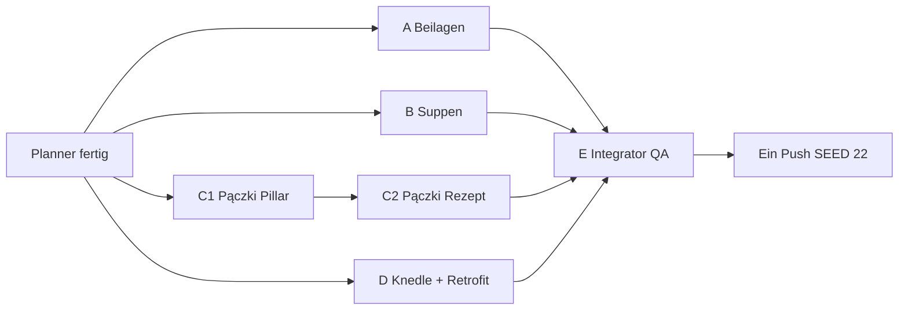

# Wave 8 — Execution Plan (Planner → 4 Implementer → Integrator)

Status: **SHIPPED** (Integrator E · 2026-07-20)  
Stand: `SEED_VERSION` **22** · Rezepte **41** · Blog **36**

Team-Modell: **1 Planner** (dieser Doc) → **4 parallele Implementer (A–D)** → **1 Integrator/QA (E)** → **ein Push**.

---

## 1. Ist-Stand (nach Wave 7)

| Layer | LIVE | Notiz |
|-------|------|--------|
| Rezepte | **35** | + Family-Hubs; alle Longform + `relatedPostIds` |
| RecipeFamilies | **3** | Pierogi, Placki, Naleśniki |
| Blog | **35** | unverändert seit W6/W5b (W7 = nur Rezepte) |
| Cluster-Hubs | **31** | Region thin → `noindex,follow` |
| `SEED_VERSION` | **21** | `src/lib/data/store.ts` |
| Blog:Rezept | **1:1** | gesund |

**Linking-Ist (kritisch):**

| Ort | Inline-Markdown `[Anker](/de|pl/...)` |
|-----|----------------------------------------|
| Blog-Bodies | gut (Guides oft ≥10–18 Links) |
| Rezept-Steps/Tips (v. a. W5–W7) | teilweise (≥2–4 / Locale) |
| `recipe-articles.ts` FACTS → expand() Longform | **fehlt** — nur Klartext-Erwähnungen, keine URLs |

User-Anforderung Wave 8: **überall** bidirektionale Links Dish↔Article — auch **inline im Body**, nicht nur Related-Cards.

---

## 2. Wave 8 Ziel („mehr“ ohne Spray)

**Strategie:** Silo schließen mit klaren Ownership-Rändern + Link-Dichte nachziehen. Kein Region-Spray, kein Meal-Prep-Clash, kein Kotlet-Family-Umbau.

| Track | Deliverable | Warum jetzt |
|-------|-------------|-------------|
| Beilagen | **Mizeria**, **Kapusta zasmażana** | Sonntag/Schabowy/Wielkanoc-Loop ohne Pillar |
| Suppen | **Ogórkowa**, **Kapuśniak** | Suppen-Guide nennt Kapuśniak schon; eigene Money Pages |
| Festtag-Süß | **Pączki-Technik-Pillar** + **Pączki-Rezept** | HOLD auflösen, ownership-clean vs Tłusty/Faworki |
| Knödel + Links | **Knedle ze śliwkami** + FACTS-Link-Retrofit W5–W7 | Intent ≠ Pierogi/Leniwe/Pyzy; User-Link-Gate |

**Nach Wave 8 (Zielmengen):** Rezepte **41** (+6) · Blog **36** (+1) · Families **3** · `SEED_VERSION` **22**.

**Primary-KW (neu — Ownership-Doc erweitern):**

| Primary KW DE | Owner-URL |
|---------------|-----------|
| Mizeria Rezept | `/rezepte/mizeria` |
| Kapusta zasmażana | `/rezepte/kapusta-zasmażana` (Slug final: `kapusta-zasmażana` / PL `kapusta-zasmażana`) |
| Zupa ogórkowa | `/rezepte/ogorkowa` |
| Kapuśniak Rezept | `/rezepte/kapusniak` |
| Pączki Technik / Hefe frittieren | `/blog/paczek-technik` · `/blog/paczki-technika` |
| Pączki Rezept | `/rezepte/paczki` |
| Knedle mit Pflaumen | `/rezepte/knedle-sliwki` |

**Nicht stehlen:** Tłusty Czwartek (Anlass), Faworki Technik/Rezept, Makowiec, Sernik, Pierogi broad/guide, Freezer-Pierogi, Żurek/Barszcz/Chłodnik Primary, Kasza-Guide (nur Pairing).

---

## 3. Vier parallele Umsetzungspakete (A–D)

### Globale Gates (alle Pakete)

- Affiliate auf Rezepten: **guide-only**
- FACTS Longform via expand ≥ **400 Wörter**/Locale (bestehende Logik)
- Neue Blog-Pillars: Body ≥ **1100 Wörter**/Locale, kein H1 im Body, FAQ wo üblich
- Unique Unsplash-Cover pro neuem Asset (kein Cover-Diebstahl)
- Descriptive Anchors (nie nackte KW-Stuffing-Anchors auf Fremd-Owner)
- Locale-Pfade: `/de/...` in DE-Text, `/pl/...` in PL-Text
- **Inline-Link-Minimum Longform (FACTS-Felder origin/shop/serve/variants/diaspora):** ≥ **4** Markdown-Links / Locale, davon ≥ **2** auf andere Rezepte und ≥ **2** auf Blog-Posts
- **Steps/Tips:** ≥ **2** Inline-Links / Locale
- `relatedPostIds` ≥ 3; bei Blog neu: `relatedRecipeIds` ≥ 3
- `SEED_VERSION` nur Agent E bumpst → **22**

---

### Paket A — Beilagen-Silo (Sonntag schließen)

**Owner-Scope (exakt anlegen):**

1. `recipe-mizeria` — Mizeria (Gurkensalat mit Śmietana)
2. `recipe-kapusta-zasmażana` — Kapusta zasmażana (geschmortes/saures Kraut)

**Kein neuer Blog.**

**Dateien (wahrscheinlich):**

- `src/lib/data/seed-recipes-wave8.ts` (neu; oder `seed-recipes-wave8a.ts` wenn gesplittet — **Integrator merged zu einer Wave8-Datei**)
- `src/lib/data/recipe-articles.ts` — FACTS beider IDs **mit Markdown-Links**
- `src/lib/data/seed.ts` — Import + `relatedPostIds`-Map für beide
- Touch (Backlinks): `src/lib/data/blog-bodies-wave2-de.ts` + `-pl.ts` (`post-sonntagsessen`, ggf. `post-wielkanoc`), `blog-bodies-w3c-*` (`post-panieren`), ggf. Schabowy-FACTS in `recipe-articles.ts`
- Docs: `keyword-ownership.md` Zeilen A; Status-Docs **nur skizzieren**, final schreibt E

**Gates A:**

- [ ] 2 Rezepte published, unique covers
- [ ] FACTS ≥400 expand; ≥4 Inline-Links DE+PL je Rezept
- [ ] Steps ≥2 Inline-Links DE+PL
- [ ] Kein „Salat“-KW-Clash mit Chłodnik; kein Kiszenie-Owner-Steal (Kapusta verlinkt Kiszenie descriptiv)

**Linking-Checklist A:**

| Typ | Pflicht |
|-----|---------|
| `relatedPostIds` Mizeria | `post-sonntagsessen`, `post-smietana-schmand`, `post-wielkanoc` (+ optional `post-panieren`) |
| `relatedPostIds` Kapusta | `post-kiszenie`, `post-sonntagsessen`, `post-kielbasa-arten` oder `post-majeranek` |
| Related recipes (via Steps/FACTS + ggf. seed fields) | → `recipe-schabowy`, `recipe-kotlet-mielony`, `recipe-rosol` |
| Inline FACTS | Mizeria ↔ Śmietana-Blog, Schabowy, Sonntagsessen, Wielkanoc |
| Inline FACTS | Kapusta ↔ Kiszenie, Schabowy, Bigos (descriptiv „verwandter Kohl“, Bigos bleibt Stew-Owner) |

**Backlinks (bestehende URLs updaten — concrete):**

| Bestehend | Aktion |
|-----------|--------|
| `/blog/sonntagsessen-polnisch` (+ PL) | Inline + `relatedRecipeIds` → mizeria, kapusta-zasmażana |
| `/blog/wielkanoc-speiseplan` (+ PL) | Inline → mizeria (Beilage) |
| `/blog/panierowanie-kotlet` / panieren | Inline → mizeria als klassische Beilage |
| `/rezepte/kotlet-schabowy` FACTS/steps | Inline → mizeria + kapusta |
| `/rezepte/kotlet-mielony` | Inline → mizeria optional |
| `/blog/smietana-schmand` | Inline → mizeria (Anwendungsfall Śmietana) |
| `/blog/kiszenie-guide` | Inline → kapusta zasmażana (Verwertung) |

**Task-Prompt A (copy-paste):** siehe Anhang unten.

---

### Paket B — Suppen-Vertiefung

**Owner-Scope:**

1. `recipe-ogorkowa` — Zupa ogórkowa (Saure-Gurken-Suppe)
2. `recipe-kapusniak` — Kapuśniak

**Kein neuer Blog** (Pillar bleibt `post-polnische-suppen`).

**Dateien:**

- `seed-recipes-wave8.ts` (B-Anteil)
- `recipe-articles.ts` FACTS
- `seed.ts` relatedPostIds
- Touch: `blog-bodies-wave2-*` (`post-polnische-suppen`, `post-kiszenie`, `post-rosol-technik` leicht), FACTS `recipe-zurek` / `recipe-chlodnik` / `recipe-barszcz` (Abgrenzung + Link)
- `keyword-ownership.md`

**Gates B:**

- [ ] Klare Intent-Trennung vs Żurek (Zakwas), Barszcz (rote Bete), Chłodnik (kalt/Sommer)
- [ ] Kapuśniak ≠ Bigos (Suppe vs Schmorgericht)
- [ ] Inline-Link-Minima wie global

**Linking-Checklist B:**

| Rezept | `relatedPostIds` |
|--------|------------------|
| ogorkowa | `post-polnische-suppen`, `post-kiszenie` oder `post-ferment-glaeser`, `post-polenladen`, `post-rosol-technik` (Brühe-Feeling, nicht Owner) |
| kapusniak | `post-polnische-suppen`, `post-kiszenie`, `post-kielbasa-arten`, `post-majeranek` |

**Inline Pflicht-Ziele:** jeweils ↔ polnische-suppen, kiszenie/Polenladen, und 1–2 Schwester-Suppen (descriptiv).

**Backlinks:**

| Bestehend | Aktion |
|-----------|--------|
| `/blog/polnische-suppen` (+ PL) | Inline + `relatedRecipeIds` → ogorkowa, kapusniak (Krupnik-Erwähnung erweitern) |
| `/blog/kiszenie-guide` | Inline → ogorkowa (Gurken) + kapusniak |
| `/blog/rosol-technik` | Optional 1 descriptive Link „Einlagen-Suppen“ → kapusniak/ogorkowa |
| `/rezepte/zurek`, `/rezepte/chlodnik-litewski`, `/rezepte/barszcz-czerwony` | FACTS Abgrenzung + Link zu neuen Suppen |
| `/blog/fermentier-glaeser-kaufberatung` | Optional → ogorkowa Verwertung |

---

### Paket C — Pączki (Pillar → Money Page) — **interne Sequenz**

**Owner-Scope (Reihenfolge zwingend):**

1. **Zuerst** `post-paczek-technik` — Blog pillar (≥1100 DE+PL)
2. **Dann** `recipe-paczek` / id `recipe-paczki` — Money Page

**Dateien:**

- `src/lib/data/blog-bodies-w8-de.ts` + `blog-bodies-w8-pl.ts` (oder `content/batch-w8/bodies/` + Sync wie W3)
- `src/lib/data/seed-blog-w8.ts`
- `src/lib/data/seed.ts` / blog seed aggregator — Import post
- `seed-recipes-wave8.ts` — `recipe-paczki`
- `recipe-articles.ts` FACTS
- Touch: `seed-blog-wave2.ts` `post-tlusty-czwartek` related + bodies; `post-faworki-technik` related/body; `recipe-faworki`, `recipe-racuchy`, `recipe-sernik` (Abgrenzung)
- `keyword-ownership.md`

**Gates C:**

- [ ] Pillar published **bevor** Rezept SEO-Title „Pączki Rezept“ claimt
- [ ] Tłusty = Anlass-Kultur-Owner; Pillar = Technik; Rezept = Cook — keine Title-Kannibalisierung
- [ ] Faworki Primary unangetastet (nur „verwandtes Fettgebäck“)
- [ ] Unique covers für Post + Rezept
- [ ] Pillar: ≥ **6** Inline-Links / Locale (Rezepte+Posts gemischt)
- [ ] Rezept: globale FACTS/Steps-Minima

**Linking-Checklist C:**

| Asset | related |
|-------|---------|
| post-paczek-technik | `relatedRecipeIds`: paczki, faworki, racuchy; `relatedPostIds`: tlusty-czwartek, faworki-technik, makowiec-technik (Ofen/Hefe-Feeling descriptiv) |
| recipe-paczki | `relatedPostIds`: paczek-technik, tlusty-czwartek, polenladen, ersatzprodukte-de |

**Backlinks:**

| Bestehend | Aktion |
|-----------|--------|
| `/blog/tlusty-czwartek` (+ PL) | Inline → Technik + Rezept; `relatedRecipeIds` += paczki; **nicht** Primary „Pączki Rezept“ stehlen |
| `/blog/faworki-technik` | Inline Abgrenzung ↔ Pączki-Technik |
| `/rezepte/faworki` | Inline ↔ Pączki (anderes Gebäck) |
| `/blog/makowiec-technik` | Optional 1 Link „Hefeteig/Festtag“ descriptiv |
| `/rezepte/racuchy` | Optional Hefe-Verwandtschaft |

**Abhängigkeit:** C intern sequentiell. Parallel zu A/B/D OK, solange niemand anderes `paczki`/`tlusty` Primary umschreibt ohne Sync mit C.

---

### Paket D — Knedle + Link-Retrofit (W5–W7 FACTS)

**Owner-Scope:**

1. Neu: `recipe-knedle-sliwki` — Knedle ze śliwkami
2. Retrofit: Markdown-Inline-Links in FACTS für **alle Wave-5/6/7 Rezept-IDs** (mindestens):

   - W5: leniwe, kopytka, lazanki, pyzy, zrazy  
   - W6: makowiec, uszka  
   - W7: karp, krokiety, sernik, sledz  

   Pro ID/Locale: ≥4 Links in FACTS-Feldern (nicht nur Steps).

**Dateien:**

- `seed-recipes-wave8.ts` — knedle
- `recipe-articles.ts` — knedle FACTS + Retrofit-Block W5–W7
- `seed.ts` — relatedPostIds knedle; **keine** SEED_VERSION
- Optional Steps-Nachzug in `seed-recipes-wave5/6/7.ts` wenn FACTS allein nicht reicht
- Touch Backlinks: `post-pierogi-guide` (Abgrenzung Knedle≠Pierogi), `post-twarog` optional, `post-sonntagsessen`, `recipe-pierogi-leniwe` FACTS
- `keyword-ownership.md`

**Gates D:**

- [ ] Knedle Intent klar ≠ Pierogi, Leniwe, Pyzy, Uszka
- [ ] Retrofit: Script/manuell zählen — **0** der 11 IDs ohne ≥4 Links/Locale in expand-Output
- [ ] Keine Ownership-Änderungen an fremden Primary KWs

**Linking-Checklist D (Knedle):**

- `relatedPostIds`: `post-pierogi-teig` oder guide (Teig-Feeling descriptiv), `post-sonntagsessen`, `post-ersatzprodukte-de` / polenladen
- Inline ↔ pierogi-leniwe, racuchy oder nalesniki (süß), twarog wenn Quark-Variante erwähnt

**Backlinks Knedle:**

| Bestehend | Aktion |
|-----------|--------|
| `/blog/pierogi-guide` | 1 Abschnitts-Satz: Knedle sind eigene Form |
| `/rezepte/pierogi-leniwe` | Inline ↔ Knedle |
| `/blog/sonntagsessen-polnisch` | Optional Dessert-Link |
| `/rezepte/racuchy-jablka` | Optional Obst-Knödel-Nachbar |

**Retrofit Backlinks:** Wo W7-Rezept neu ist und Blog nur Related-Card hat — fehlende Inline in Wigilia / Naleśniki-Guide / Barszcz-Technik / Makowiec-Technik **nachziehen** (falls noch Lücken).

---

## 4. Integrator / QA — Paket E

**Einziger Merge + Docs + SEED + Push.**

### Merge-Reihenfolge

1. A + B + D Rezept-Dateien → eine `seed-recipes-wave8.ts`
2. C Blog-Bodies + `seed-blog-w8.ts` einhängen
3. `recipe-articles.ts` Konflikte lösen (FACTS-Links erhalten)
4. `seed.ts`: Imports, related* Maps, **kein** doppeltes related überschreiben
5. `SEED_VERSION` 21 → **22**
6. Docs final: `recipe-expansion-w4.md` (Wave 8 Abschnitt), `topical-backlog.md`, `topical-authority-status.md`, `keyword-ownership.md`, dieses Plan-Doc → Status shipped

### QA-Checkliste E

- [ ] **Ownership:** keine doppelten Primary KWs; Pączki/Tłusty/Faworki getrennt; Suppen-Intents getrennt
- [ ] **Bidirektional:** jedes neue Asset hat Related **und** ≥N Inline; jedes in §3 gelistete Backlink-Ziel wurde gepatcht
- [ ] **Inline-Audit:** Stichprobe expand(FACTS) für alle 6 neuen + 11 retrofitted IDs — Links rendern als Markdown
- [ ] **Wort-Gates:** Pillar ≥1100; Rezept-Longform ≥400; keine Stub-Bodies
- [ ] **Covers** unique
- [ ] **Catalog / Sitemap / noindex:** Region-Hubs weiter thin=`noindex,follow`; neue URLs indexable; Catalog-Karten Families einmal
- [ ] **Build green** (`pnpm`/`npm` lint+build wie Repo-Standard)
- [ ] **JSON-LD** unverändert korrekt (BlogPosting/FAQ, Recipe author/dates/image)
- [ ] **Ein Push** erst nach grünem QA — kein Teil-Push aus A–D

**A–D pushen nicht.** Nur Branch-Commits lokal oder Worktree; E integriert.

---

## 5. Reihenfolge & Parallelisierung



| Parallel | Warten |
|----------|--------|
| A, B, D voll parallel | — |
| C1 parallel zu A/B/D | C2 **nach** C1 |
| E | nach A+B+C2+D |

**Konflikt-Hotspots (vor Merge abstimmen):**

- `recipe-articles.ts` (D retrofit vs A/B/C neue FACTS) → Datei-Abschnitte splitten oder D zuletzt rebase
- `seed.ts` related-Maps
- `post-sonntagsessen` Bodies (A + D)
- `post-polnische-suppen` (B)
- `keyword-ownership.md` (alle skizzieren, E dedupt)

---

## 6. Explizit HOLD / out of scope Wave 8

| Item | Warum HOLD |
|------|------------|
| Kotlet family hub | SEO-safe Split separat |
| Region-Blogs / Region-Hub-Intros ≥400 | eigener Depth-Batch |
| Meal-Prep Arbeitswoche | ≠ Freezer-Pierogi Owner |
| Lab Produkt-Tests | echte Tests nötig |
| 5./6. Diaspora-Guide Spray | Qualität vor Menge |
| Flaki, Kaszanka, Piernik, Babka, Rolada śląska | nächste Wave nach Messung |
| Family #4 | nicht nötig diese Runde |

---

## Anhang — Copy-Paste Task Prompts

### Prompt Agent A

```
Repo: /Users/timrayburkhardt/Alemniam. Du bist Implementer A (Wave 8 Beilagen). Kein Push. Kein SEED_VERSION-Bump.

Lege an:
- recipe-mizeria (slug de/pl: mizeria)
- recipe-kapusta-zasmażana (einheitliche Slugs kapusta-zasmażana / kapusta-zasmażana — PL-konvention wie bestehende Rezepte)

Dateien: seed-recipes-wave8.ts (oder wave8a, Integrator merged), recipe-articles.ts FACTS mit Markdown-Inline-Links, seed.ts relatedPostIds, keyword-ownership Zeilen, Backlinks in sonntagsessen + wielkanoc + panieren bodies + Schabowy/Mielony FACTS oder steps.

Gates: unique covers; FACTS ≥400; ≥4 Inline-Links/Locale in FACTS (≥2 Rezept + ≥2 Blog); Steps ≥2 Links/Locale; guide-only affiliate; descriptive anchors; kein Chłodnik/Kiszenie-KW-Steal.

Backlinks pflicht: post-sonntagsessen, post-wielkanoc, post-panieren, recipe-schabowy, post-smietana-schmand, post-kiszenie (für Kapusta).

Am Ende: kurze Diff-Liste + was Agent E noch mergen muss. Kein Commit-Push auf main.
```

### Prompt Agent B

```
Repo: /Users/timrayburkhardt/Alemniam. Du bist Implementer B (Wave 8 Suppen). Kein Push. Kein SEED_VERSION-Bump.

Lege an:
- recipe-ogorkowa (slug: ogorkowa)
- recipe-kapusniak (slug: kapusniak)

Pillar bleibt post-polnische-suppen — kein neuer Suppen-Blog.

FACTS mit ≥4 Inline-Links/Locale; Steps ≥2; relatedPostIds wie Plan content/wave-8-plan.md Paket B.
Abgrenzung klar vs zurek, barszcz, chlodnik, bigos.

Backlinks pflicht: post-polnische-suppen (relatedRecipeIds + inline), post-kiszenie, optional post-rosol-technik; FACTS-Abgrenzung auf zurek/chlodnik/barszcz.

Am Ende: Diff-Liste für Integrator. Kein main-Push.
```

### Prompt Agent C

```
Repo: /Users/timrayburkhardt/Alemniam. Du bist Implementer C (Wave 8 Pączki). Kein Push. Kein SEED_VERSION-Bump.

Zwingende Reihenfolge:
1) post-paczek-technik / PL paczki-technika — Body ≥1100 DE+PL, ≥6 Inline-Links/Locale
2) recipe-paczki — Money Page; relatedPostIds inkl. Technik-Pillar

Ownership:
- Tłusty Czwartek = Anlass (nicht Rezept-Primary)
- Faworki Technik/Rezept unangetastet
- Primary „Pączki Rezept“ nur auf /rezepte/paczki
- Primary Technik nur auf Blog-Pillar

Backlinks: post-tlusty-czwartek, post-faworki-technik, recipe-faworki; optional makowiec-technik, racuchy.

Dateien: blog-bodies-w8-*, seed-blog-w8.ts, seed-recipes-wave8 Anteil, recipe-articles FACTS, keyword-ownership.

Am Ende: Diff-Liste. Kein main-Push.
```

### Prompt Agent D

```
Repo: /Users/timrayburkhardt/Alemniam. Du bist Implementer D (Wave 8 Knedle + FACTS-Link-Retrofit). Kein Push. Kein SEED_VERSION-Bump.

1) Neu: recipe-knedle-sliwki (Knedle ze śliwkami) — Intent ≠ pierogi/leniwe/pyzy/uszka. FACTS+Steps Link-Minima wie Plan.
2) Retrofit: In recipe-articles.ts FACTS für W5–W7 IDs (leniwe, kopytka, lazanki, pyzy, zrazy, makowiec, uszka, karp, krokiety, sernik, sledz) je Locale ≥4 echte Markdown-Links [/de|/pl/...] einbauen (Rezepte+Blog gemischt).

Backlinks Knedle: pierogi-guide, pierogi-leniwe, optional sonntagsessen.
Wigilia/Naleśniki/Barszcz-Technik/Makowiec-Technik: fehlende Inline zu W7-Money-Pages nachziehen falls nur Cards.

Konfliktvermeidung: markiere FACTS-Blöcke klar; Integrator resolved gegen A/B/C.

Am Ende: Audit-Tabelle ID → Linkcount DE/PL. Kein main-Push.
```

### Prompt Agent E (Integrator/QA)

```
Repo: /Users/timrayburkhardt/Alemniam. Du bist Integrator/QA Wave 8. Einziger Push.

Merge A–D → eine seed-recipes-wave8.ts + seed-blog-w8 + bodies; Konflikte in recipe-articles.ts und seed.ts lösen ohne Link-Verlust.
SEED_VERSION 21→22.
Docs: recipe-expansion-w4.md, topical-backlog.md, topical-authority-status.md, keyword-ownership.md, wave-8-plan.md Status shipped.
QA: Ownership, bidirektionale Links, Wortgates, unique covers, catalog/sitemap/noindex Region, build green, JSON-LD ok.
Nur bei Grün: ein kombinierter git add/commit/push auf den vereinbarten Branch (main laut Team-Regel).
```
