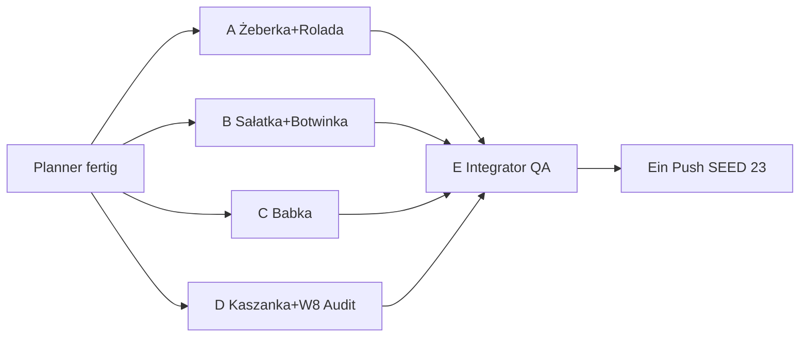

# Wave 9 — Execution Plan (Planner → 4 Implementer → Integrator)

Status: **SHIPPED** (Integrator E · 2026-07-20)  
Live: `SEED_VERSION` **23** · Rezepte **47** · Blog **36** · Families **3**

Team-Modell: **1 Planner** (dieser Doc) → **4 parallele Implementer (A–D)** → **1 Integrator/QA (E)** → **ein Push**.

---

## 1. Ist-Stand (nach Wave 8)

| Layer | LIVE | Notiz |
|-------|------|--------|
| Rezepte | **41** | Longform + `relatedPostIds`; W8 FACTS-Links auf W5–W7 nachgezogen |
| RecipeFamilies | **3** | Pierogi, Placki, Naleśniki |
| Blog | **36** | inkl. Pączki-Technik; kein neuer Pillar seit W8 nötig für W9-Set |
| Cluster-Hubs | **31** | Region thin → `noindex,follow` |
| `SEED_VERSION` | **22** | `src/lib/data/store.ts` |
| Blog:Rezept | **~1 : 1.1** | gesund |

**Silo-Lücken (nach W8, für W9):**

| Silo | Offen / dünn | W9-Antwort |
|------|--------------|------------|
| Fleisch / Sonntag | wenig jenseits Schabowy/Mielony/Zrazy/Gulasz | Żeberka, Rolada, Kaszanka |
| Beilagen | Mizeria + Kapusta da; Festtag-Salat fehlt | Sałatka jarzynowa |
| Suppen | Ogórkowa/Kapuśniak da; Botwinka/Frühling fehlt | Botwinka |
| Backen / Anlass | Makowiec/Sernik/Pączki; **Babka** in Wielkanoc-Hub erwähnt, keine Money Page | Babka |
| Wigilia-Süß | Makowiec stark; Piernik HOLD | nicht diese Runde |

**Linking-Gate (unverändert kritisch):**

| Ort | Pflicht |
|-----|---------|
| FACTS → expand() Longform | ≥ **4** Markdown-Links `/de|pl/...` pro Locale (≥2 Rezept + ≥2 Blog) |
| Neue Pillars (falls je) | ≥ **6** Inline-Links / Locale |
| Steps/Tips | ≥ **2** Inline-Links / Locale |
| Related | `relatedPostIds` ≥ 3; Backlinks bidirektional (Inline **und** Related wo sinnvoll) |

---

## 2. Wave 9 Ziel („mehr“ — Depth, kein Spray)

**Strategie:** HOLD-Klassiker aus Fleisch/Sonntag/Beilage/Suppe/Wielkanoc-Backen schließen. **Kein** neuer Blog-Pillar (Ownership reicht über bestehende Guides: Sonntag, Wielkanoc, Suppen, Kielbasa-Arten, Makowiec-Technik, Kiszenie). Kein Region-Spray, kein Meal-Prep, kein Kotlet-Family, kein Leniwe→Pierogi-Fold.

| Track | Deliverable | Warum jetzt |
|-------|-------------|-------------|
| Fleisch / Sonntag | **Żeberka pieczone**, **Rolada śląska** | Sonntags-Fleisch-Loop ohne Family-Umbau; Rolada ≠ Zrazy |
| Beilage / Fest | **Sałatka jarzynowa** | Wielkanoc/Sonntag-Salat; Intent ≠ Mizeria |
| Suppen | **Botwinka** | Frühlings-/Rote-Bete-Grün-Suppe; ≠ Barszcz/Chłodnik |
| Backen / Wielkanoc | **Babka** | Hub nennt Babka; Money Page ohne Pillar (Makowiec/Pączki Technik nur descriptiv) |
| Diaspora / Fleisch | **Kaszanka** | Polenladen-Klassiker; Kielbasa-Lexikon bleibt Types-Owner |

**Nach Wave 9 (Zielmengen):** Rezepte **47** (+6) · Blog **36** (+0) · Families **3** · `SEED_VERSION` **23**.

**Primary-KW (neu — Ownership-Doc erweitern):**

| Primary KW DE | Owner-URL |
|---------------|-----------|
| Żeberka pieczone / Ofenrippchen polnisch | `/rezepte/zeberka` |
| Rolada śląska | `/rezepte/rolada-slaska` |
| Sałatka jarzynowa | `/rezepte/salatka-jarzynowa` |
| Botwinka Rezept | `/rezepte/botwinka` |
| Babka Rezept / Babka wielkanocna | `/rezepte/babka` |
| Kaszanka Rezept | `/rezepte/kaszanka` |

**Nicht stehlen:**

| Fremd-Owner | Nur descriptive Anchors |
|-------------|-------------------------|
| Zrazy | Rolada = andere Roll-/Füll-Logik |
| Gulasz / Schabowy / Mielony | Fleisch-Nachbarn, nicht Primary |
| Mizeria | anderer Salat-Intent (Gurke/Śmietana) |
| Barszcz / Chłodnik / Ogórkowa / Kapuśniak / Żurek | Botwinka = junge Rübenblätter-Suppe |
| Kielbasa-Arten | Lexikon Types ≠ Kaszanka Cook |
| Makowiec Technik/Rezept, Sernik, Pączki | Babka = eigener Cook-Primary |
| Wielkanoc Speiseplan | Anlass-Owner; Babka/Salat nur Gerichte |
| Sonntagsessen | Kultur-Owner; Fleisch-Rezepte nur Cook |
| Region-Hubs / „Schlesien“-Blog | Rolada verlinkt Kluski/Zrazy, **kein** Region-Blog |

**Kandidaten bewusst übersprungen (Clash / Spray / HOLD):**

| Dish | Grund |
|------|--------|
| Gołąbki, Chłodnik, Fasolka, Knedle, Pierogi ruskie | bereits LIVE |
| Flaki, Piernik, Czernina | HOLD → W10 nach Messung / Depth-Batch |
| Zupa pomidorowa | hoher Generic-Clash DE „Tomatensuppe“; Suppen-Overview nennt sie schon |
| Placek po węgiersku | Intent-Overlap Placki + Gulasz |
| Makaron z serem, Drożdżówka | Spray / Hefe-Clash-Risiko |
| Kotlet family, Meal-Prep Woche, Lab-Tests, Region-Blogs | explizit HOLD |

---

## 3. Vier parallele Umsetzungspakete (A–D)

### Globale Gates (alle Pakete)

- Affiliate auf Rezepten: **guide-only** (keine neuen `relatedProductIds` / keine recipeIds in Affiliate-Katalog)
- FACTS Longform via expand ≥ **400 Wörter**/Locale
- Unique Unsplash-Cover pro neuem Asset
- Descriptive Anchors; Locale-Pfade: `/de/...` in DE, `/pl/...` in PL
- **Inline FACTS:** ≥ **4** Markdown-Links / Locale (≥2 Rezept + ≥2 Blog)
- **Steps/Tips:** ≥ **2** Inline-Links / Locale
- `relatedPostIds` ≥ 3
- **Kein** neuer Blog-Pillar in Wave 9
- `SEED_VERSION` nur Agent E → **23**
- Datei-Isolation analog W8: `wave9-a|b|c|d` — **nicht** fremde Paket-Dateien überschreiben

---

### Paket A — Fleisch / Sonntag (Żeberka + Rolada)

**Owner-Scope (exakt anlegen):**

1. `recipe-zeberka` — Żeberka pieczone (Ofenrippchen, Majeranek/Senf-Marinade typisch)
2. `recipe-rolada-slaska` — Rolada śląska (geschmorte Rinds-/Fleischroulade schlesischer Hausmannskost)

**Kein neuer Blog.**

**Dateien (isoliert):**

| Datei | Rolle |
|-------|--------|
| `src/lib/data/seed-recipes-wave9-a.ts` | Export `seedRecipesWave9A` |
| `src/lib/data/recipe-articles-w9-a.ts` | Export `W9_FACTS_A` (beide IDs, Markdown-Links) |
| `content/wave-9-status-a.md` | Status für E |
| `content/keyword-ownership.md` | +2 Primary-Zeilen (A-Anteil skizzieren) |

**Touch / Backlinks (erlaubt):**

- Bodies: `blog-bodies-wave2-de.ts` + `-pl.ts` (`post-sonntagsessen`, ggf. `post-majeranek` via w5 bodies)
- Seed related: `post-sonntagsessen`, `post-majeranek`, `post-dutch-oven` (Rolada/Żeberka Schmor-/Ofen-Feeling descriptiv)
- Optional Steps-Inline: `recipe-schabowy`, `recipe-zrazy`, `recipe-kluski-slaskie`, `recipe-gulasz` (Abgrenzung + Pairing)
- **Nicht:** `seed-recipes-wave9-b|c|d.ts`, Blog-Bodies anderer Pakete außer gelisteten, `SEED_VERSION`, Region-Hub-Intros

**Gates A:**

- [ ] 2 Rezepte published, unique covers
- [ ] FACTS ≥400; ≥4 Inline-Links DE+PL je Rezept
- [ ] Steps ≥2 Inline-Links DE+PL
- [ ] Rolada Intent klar ≠ Zrazy (andere Füllung/Bindung/Region-Feeling ohne Region-KW-Steal)
- [ ] Żeberka ≠ Gulasz (Ofenrippen vs Eintopf)

**Linking-Checklist A:**

| Rezept | `relatedPostIds` (mind.) |
|--------|--------------------------|
| zeberka | `post-sonntagsessen`, `post-majeranek`, `post-polenladen` oder `post-kielbasa-arten`, optional `post-gusseisen` / dutch-oven descriptiv |
| rolada-slaska | `post-sonntagsessen`, `post-dutch-oven`, `post-majeranek`, optional `post-kasza` |

**Inline Pflicht-Ziele FACTS:**

- Żeberka ↔ Sonntagsessen, Majeranek, Schabowy oder Gulasz (Nachbar), Polenladen
- Rolada ↔ Sonntagsessen, Zrazy (Abgrenzung), Kluski śląskie (Beilage), Dutch-Oven-Guide

**Backlinks (bestehende URLs):**

| Bestehend | Aktion |
|-----------|--------|
| `/blog/sonntagsessen-polnisch` (+ PL) | Inline + `relatedRecipeIds` → zeberka, rolada-slaska |
| `/blog/majeranek` (+ PL) | Inline → zeberka (und optional rolada) |
| `/blog/dutch-oven-kaufberatung` | Inline → rolada (Schmoren) |
| `/rezepte/zrazy` FACTS/steps | Abgrenzung + Link Rolada |
| `/rezepte/kluski-slaskie` | Inline → rolada (klassisches Pairing) |
| `/rezepte/gulasz-wieprzowy` oder schabowy | Optional 1 descriptive Fleisch-Nachbar → zeberka |

---

### Paket B — Beilage + Suppe (Sałatka + Botwinka)

**Owner-Scope:**

1. `recipe-salatka-jarzynowa` — Sałatka jarzynowa (polnischer Gemüsesalat mit Mayo; Fest/Sonntag)
2. `recipe-botwinka` — Botwinka (Suppe aus junger Rote Bete inkl. Blätter)

**Kein neuer Blog** (Suppen-Pillar bleibt `post-polnische-suppen`; Wielkanoc bleibt Speiseplan-Owner).

**Dateien:**

| Datei | Rolle |
|-------|--------|
| `src/lib/data/seed-recipes-wave9-b.ts` | `seedRecipesWave9B` |
| `src/lib/data/recipe-articles-w9-b.ts` | `W9_FACTS_B` |
| `content/wave-9-status-b.md` | Status |
| `content/keyword-ownership.md` | +2 Zeilen |

**Touch / Backlinks:**

- `blog-bodies-wave2-*`: `post-sonntagsessen`, `post-wielkanoc`, `post-polnische-suppen`
- `blog-bodies-w3c-*`: `post-barszcz-technik` (Abgrenzung Botwinka)
- FACTS/steps: `recipe-mizeria`, `recipe-chlodnik`, `recipe-barszcz`, `recipe-ogorkowa` (Abgrenzung)
- **Nicht:** Paket-A/C/D Seed-Dateien, Babka/Kaszanka, `SEED_VERSION`

**Gates B:**

- [ ] Sałatka ≠ Mizeria (Mayo-Gemüse vs Gurke/Śmietana)
- [ ] Botwinka ≠ Barszcz klar, ≠ Chłodnik (kalt), ≠ Ogórkowa
- [ ] Inline-Minima global

**Linking-Checklist B:**

| Rezept | `relatedPostIds` |
|--------|------------------|
| salatka-jarzynowa | `post-wielkanoc`, `post-sonntagsessen`, `post-polenladen` oder `post-ersatzprodukte-de` |
| botwinka | `post-polnische-suppen`, `post-barszcz-technik` (Abgrenzung descriptiv), `post-wielkanoc` oder `post-smietana-schmand` |

**Inline Pflicht-Ziele:**

- Sałatka ↔ Wielkanoc, Sonntagsessen, Mizeria (Schwester-Beilage), Schabowy optional
- Botwinka ↔ polnische-suppen, barszcz (Abgrenzung), chłodnik (Abgrenzung), ggf. ogorkowa

**Backlinks:**

| Bestehend | Aktion |
|-----------|--------|
| `/blog/wielkanoc-speiseplan` (+ PL) | Inline + related → salatka-jarzynowa (+ optional botwinka saisonal) |
| `/blog/sonntagsessen-polnisch` | Inline → salatka (A patcht Fleisch; B patcht Salat — Abschnitte trennen!) |
| `/blog/polnische-suppen` | Inline + `relatedRecipeIds` → botwinka |
| `/blog/barszcz-technik` | 1 Satz Abgrenzung → botwinka |
| `/rezepte/mizeria` | Inline ↔ salatka |
| `/rezepte/chlodnik-litewski`, `/rezepte/barszcz-czerwony` | FACTS Abgrenzung → botwinka |

**Konflikt-Hotspot mit A:** `post-sonntagsessen` Bodies — A und B **unterschiedliche Absätze** patchen; E dedupt Related-Arrays.

---

### Paket C — Backen / Wielkanoc (Babka only)

**Owner-Scope:**

1. `recipe-babka` — Babka (Hefegugelhupf / Babka wielkanocna; Diaspora-Ofen)

**Kein neuer Blog-Pillar.** Technik-Feeling nur descriptiv zu `post-makowiec-technik` / optional Pączki-Technik („Hefenachbar“), **ohne** Primary „Hefeteig“/„polnisches Backen“ zu stehlen.

**Dateien:**

| Datei | Rolle |
|-------|--------|
| `src/lib/data/seed-recipes-wave9-c.ts` | `seedRecipesWave9C` |
| `src/lib/data/recipe-articles-w9-c.ts` | `W9_FACTS_C` |
| `content/wave-9-status-c.md` | Status |
| `content/keyword-ownership.md` | +1 Zeile |

**Touch / Backlinks:**

- `blog-bodies-wave2-*`: `post-wielkanoc`, `post-tlusty-czwartek` optional (Festtag-Süß descriptiv, nicht Primary)
- `blog-bodies-w6-*`: `post-makowiec-technik` — 1 Abgrenzungs-Satz Babka ≠ Makowiec-Rolle
- FACTS: `recipe-makowiec`, `recipe-sernik`, `recipe-paczki` (Abgrenzung)
- **Nicht:** neuen `blog-bodies-w9` Pillar anlegen; Piernik; `SEED_VERSION`

**Gates C:**

- [ ] Primary „Babka Rezept“ nur auf `/rezepte/babka`
- [ ] Makowiec / Sernik / Pączki Primary unangetastet
- [ ] Wielkanoc bleibt Speiseplan-Owner
- [ ] Unique cover; FACTS/Steps Link-Minima

**Linking-Checklist C:**

| Asset | related |
|-------|---------|
| recipe-babka | `relatedPostIds`: `post-wielkanoc`, `post-makowiec-technik`, `post-polenladen` oder `post-ersatzprodukte-de`, optional `post-tlusty-czwartek` |

**Inline Pflicht-Ziele:** Wielkanoc, Makowiec-Technik (descriptiv), Sernik oder Makowiec (anderes Gebäck), Polenladen/Hefe-Zutaten.

**Backlinks:**

| Bestehend | Aktion |
|-----------|--------|
| `/blog/wielkanoc-speiseplan` (+ PL) | Inline + related → babka (**B** patcht Salat — C patcht Backen-Absatz) |
| `/blog/makowiec-technik` (+ PL) | Abgrenzung ↔ Babka |
| `/rezepte/makowiec`, `/rezepte/sernik` | Inline Abgrenzung |
| `/rezepte/paczki` | Optional „Festtag-Süß / Hefe“ descriptiv |

---

### Paket D — Kaszanka + Wave-8 FACTS-Link-Audit

**Owner-Scope:**

1. Neu: `recipe-kaszanka` — Kaszanka (gebraten / gegrillt / mit Zwiebel; Cook-Intent)
2. Retrofit/Audit: FACTS Markdown-Inline-Links für **alle Wave-8 Rezept-IDs** (sicherstellen ≥4 / Locale):

   - `recipe-mizeria`, `recipe-kapusta-zasmażana`
   - `recipe-ogorkowa`, `recipe-kapusniak`
   - `recipe-paczki`, `recipe-knedle-sliwki`

   Wenn W8 bereits ≥4 hat: nur Lücken schließen + Backlinks von neuen Dish-Nachbarn; **keine** Ownership-Umschreibung.

**Dateien:**

| Datei | Rolle |
|-------|--------|
| `src/lib/data/seed-recipes-wave9-d.ts` | `seedRecipesWave9D` (nur kaszanka) |
| `src/lib/data/recipe-articles-w9-d.ts` | `W9_FACTS_D` (kaszanka) |
| `src/lib/data/recipe-articles-w9-d-retrofit.ts` | `W9_FACTS_W8_RETROFIT` Patches |
| `content/wave-9-status-d.md` | inkl. Audit-Tabelle Linkcounts |
| `content/keyword-ownership.md` | +1 Zeile |

**Touch / Backlinks:**

- `post-kielbasa-arten` bodies (descriptiv → Kaszanka Cook, Types-Owner behalten)
- `post-sonntagsessen`, `post-polenladen`, `post-majeranek`
- Optional: `recipe-kapusta-zasmażana`, `recipe-bigos` (Beilagen-/Schmor-Nachbar)
- **Nicht:** Kielbasa Primary umschreiben; Flaki/Piernik anlegen; fremde W9 FACTS-Blöcke A–C

**Gates D:**

- [ ] Kaszanka Intent ≠ Kielbasa-Arten-Lexikon
- [ ] Audit: 6 W8-IDs × DE+PL mit ≥4 FACTS-Links oder dokumentierte „already green“
- [ ] guide-only affiliate

**Linking-Checklist D (Kaszanka):**

- `relatedPostIds`: `post-kielbasa-arten`, `post-polenladen`, `post-sonntagsessen`, optional `post-majeranek`
- Inline ↔ kielbasa-arten (descriptiv), kapusta zasmażana oder bigos, polenladen, sonntagsessen

**Backlinks Kaszanka:**

| Bestehend | Aktion |
|-----------|--------|
| `/blog/kielbasa-arten` (+ PL) | 1 Absatz: Types vs Cook → kaszanka; related += kaszanka |
| `/blog/polenladen-einkaufen` | Inline → kaszanka |
| `/blog/sonntagsessen-polnisch` | Optional (A/B Hotspot — eigener kurzer Absatz) |
| `/rezepte/kapusta-zasmażana` | Optional Pairing |

---

## 4. Integrator / QA — Paket E

**Einziger Merge + Docs + SEED + Push.**

### Merge-Reihenfolge

1. A + B + C + D Rezept-Seeds → `src/lib/data/seed-recipes-wave9.ts` (Aggregator wie W8)
2. `recipe-articles.ts`: `W9_FACTS_A|B|C|D` + W8-Retrofit einhängen (Links erhalten)
3. `seed.ts`: Imports, `relatedPostIds`-Maps, Blog `relatedRecipeIds` dedupt (Sonntag/Wielkanoc Hotspots)
4. `SEED_VERSION` **22 → 23** in `store.ts`
5. Docs final: `recipe-expansion-w4.md` (Wave-9 Abschnitt), `topical-backlog.md`, `topical-authority-status.md`, `keyword-ownership.md`, dieses Plan-Doc → Status **SHIPPED**
6. Optional Status-Docs A–D archivieren / als shipped markieren

### QA-Checkliste E

- [ ] **Ownership:** keine doppelten Primary KWs; Rolada≠Zrazy; Botwinka≠Barszcz/Chłodnik; Sałatka≠Mizeria; Babka≠Makowiec/Sernik/Pączki; Kaszanka≠Kielbasa-Lexikon
- [ ] **Bidirektional:** jedes neue Asset Related **und** ≥4 FACTS-Inline; alle §3-Backlink-Ziele gepatcht
- [ ] **Inline-Audit:** Stichprobe expand(FACTS) für 6 neue + W8-Audit-IDs
- [ ] **Wort-Gates:** Rezept-Longform ≥400; keine Stub-Bodies; **kein** neuer Pillar-Stub
- [ ] **Covers** unique (kein Diebstahl W4–W8)
- [ ] **Catalog / Sitemap / noindex:** Region-Hubs weiter thin=`noindex,follow`; neue URLs indexable
- [ ] **Build green** (lint + build laut Repo-Standard)
- [ ] **JSON-LD** Recipe author/dates/image ok
- [ ] **Ein Push** erst nach grünem QA — **kein** Teil-Push aus A–D

**A–D pushen nicht.** Nur lokale Worktrees/Branches; E integriert und pusht **einmal**.

---

## 5. Reihenfolge & Parallelisierung



| Parallel | Warten |
|----------|--------|
| A, B, C, D voll parallel | — |
| E | nach A+B+C+D |

**Konflikt-Hotspots (vor Merge abstimmen):**

| Datei / Body | Wer | Regel |
|--------------|-----|--------|
| `post-sonntagsessen` | A, B, (D) | Getrennte Absätze; E merged Related |
| `post-wielkanoc` | B, C | B = Salat; C = Babka |
| `recipe-articles.ts` | alle | Nur eigene `w9-*` Exports; E merged |
| `seed.ts` related maps | alle skizzieren | E dedupt |
| `keyword-ownership.md` | alle | E final dedupt |

---

## 6. Explizit HOLD / out of scope Wave 9

| Item | Warum HOLD |
|------|------------|
| Kotlet family hub | SEO-safe Split separat |
| Region-Blogs / Region-Hub-Intros ≥400 | eigener Depth-Batch |
| Meal-Prep Arbeitswoche | ≠ Freezer-Pierogi Owner |
| Lab Produkt-Tests | echte Tests nötig |
| Flaki, Piernik, Czernina | nächste Wave nach Messung |
| Zupa pomidorowa, Placek po węgiersku | Clash-/Spray-Risiko |
| Family #4 / Leniwe→Pierogi fold | nicht nötig |
| Neuer Blog-Pillar | Ownership nicht erforderlich diese Runde |
| Spray 5. Diaspora-Guide | Qualität vor Menge |

---

## Anhang — Copy-Paste Task Prompts

### Prompt Agent A

```
Repo: /Users/timrayburkhardt/Alemniam. Du bist Implementer A (Wave 9 Fleisch/Sonntag). Lies content/wave-9-plan.md Paket A. Kein Push. Kein SEED_VERSION-Bump.

Lege an:
- recipe-zeberka (slug de/pl: zeberka) — Żeberka pieczone
- recipe-rolada-slaska (slug: rolada-slaska) — Rolada śląska

Dateien isoliert:
- src/lib/data/seed-recipes-wave9-a.ts (export seedRecipesWave9A)
- src/lib/data/recipe-articles-w9-a.ts (export W9_FACTS_A mit Markdown-Inline-Links)
- content/wave-9-status-a.md
- keyword-ownership.md +2 Primary-Zeilen

Gates: unique covers; FACTS ≥400 Wörter/Locale; ≥4 Inline-Links/Locale in FACTS (≥2 Rezept + ≥2 Blog); Steps/Tips ≥2 Links/Locale; affiliate guide-only; descriptive anchors; Rolada ≠ Zrazy; Żeberka ≠ Gulasz; kein Region-Blog-KW-Steal.

relatedPostIds + Backlinks laut Plan Paket A (sonntagsessen, majeranek, dutch-oven, zrazy, kluski-slaskie).

Am Ende: Diff-Liste + was Agent E mergen muss. Kein Commit-Push auf main.
```

### Prompt Agent B

```
Repo: /Users/timrayburkhardt/Alemniam. Du bist Implementer B (Wave 9 Beilage+Suppe). Lies content/wave-9-plan.md Paket B. Kein Push. Kein SEED_VERSION-Bump.

Lege an:
- recipe-salatka-jarzynowa (slug: salatka-jarzynowa)
- recipe-botwinka (slug: botwinka)

Dateien: seed-recipes-wave9-b.ts, recipe-articles-w9-b.ts (W9_FACTS_B), wave-9-status-b.md, keyword-ownership +2 Zeilen.

Kein neuer Suppen-Blog — Pillar bleibt post-polnische-suppen.

Gates: Sałatka ≠ Mizeria; Botwinka ≠ Barszcz/Chłodnik/Ogórkowa; FACTS ≥4 Inline-Links/Locale; Steps ≥2; guide-only affiliate.

Backlinks pflicht: wielkanoc, sonntagsessen (Salat-Absatz — nicht A-Fleisch-Absätze überschreiben), polnische-suppen, barszcz-technik Abgrenzung; FACTS mizeria/chlodnik/barszcz.

Am Ende: Diff-Liste für Integrator. Kein main-Push.
```

### Prompt Agent C

```
Repo: /Users/timrayburkhardt/Alemniam. Du bist Implementer C (Wave 9 Babka). Lies content/wave-9-plan.md Paket C. Kein Push. Kein SEED_VERSION-Bump. KEIN neuer Blog-Pillar.

Lege an:
- recipe-babka (slug: babka) — Babka wielkanocna / Hefegugelhupf

Dateien: seed-recipes-wave9-c.ts, recipe-articles-w9-c.ts (W9_FACTS_C), wave-9-status-c.md, keyword-ownership +1 Zeile.

Ownership:
- Primary „Babka Rezept“ nur /rezepte/babka
- Makowiec Technik/Rezept, Sernik, Pączki unangetastet (nur descriptive Abgrenzung)
- Wielkanoc = Speiseplan-Owner

relatedPostIds: post-wielkanoc, post-makowiec-technik, post-polenladen oder ersatzprodukte-de.
Backlinks: wielkanoc (Backen-Absatz — nicht B-Salat überschreiben), makowiec-technik, makowiec/sernik FACTS.

Gates: FACTS ≥4 Inline/Locale; Steps ≥2; ≥400 Wörter; unique cover; guide-only affiliate.

Am Ende: Diff-Liste. Kein main-Push.
```

### Prompt Agent D

```
Repo: /Users/timrayburkhardt/Alemniam. Du bist Implementer D (Wave 9 Kaszanka + W8 FACTS-Audit). Lies content/wave-9-plan.md Paket D. Kein Push. Kein SEED_VERSION-Bump.

1) Neu: recipe-kaszanka (slug: kaszanka) — Cook-Intent; Primary ≠ post-kielbasa-arten (Lexikon bleibt Types-Owner).
2) Audit/Retrofit: FACTS in recipe-articles für W8-IDs (mizeria, kapusta-zasmażana, ogorkowa, kapusniak, paczki, knedle-sliwki) — je Locale ≥4 echte Markdown-Links [/de|/pl/...]; Lücken schließen in recipe-articles-w9-d-retrofit.ts.

Dateien: seed-recipes-wave9-d.ts, recipe-articles-w9-d.ts, recipe-articles-w9-d-retrofit.ts, wave-9-status-d.md (Audit-Tabelle), keyword-ownership +1.

Backlinks: kielbasa-arten (descriptiv Types→Cook), polenladen, optional sonntagsessen/kapusta.

Gates: guide-only; FACTS/Steps Link-Minima; keine Flaki/Piernik.

Am Ende: Audit-Tabelle ID → Linkcount DE/PL + Diff-Liste. Kein main-Push.
```

### Prompt Agent E (Integrator/QA)

```
Repo: /Users/timrayburkhardt/Alemniam. Du bist Integrator/QA Wave 9. Lies content/wave-9-plan.md §4. Einziger Push.

Merge A–D:
- Aggregator src/lib/data/seed-recipes-wave9.ts (wie wave8)
- W9_FACTS_* + W8-Retrofit in recipe-articles.ts
- seed.ts Imports + related* Maps dedupt (sonntagsessen/wielkanoc Hotspots)
- SEED_VERSION 22→23 in store.ts

Docs final: recipe-expansion-w4.md, topical-backlog.md, topical-authority-status.md, keyword-ownership.md, wave-9-plan.md → SHIPPED.
Zielmengen: Rezepte 47, Blog 36, Families 3.

QA: Ownership-Trennungen laut Plan; bidirektionale Links; Inline-Audit ≥4 FACTS; Wortgates; unique covers; Region-Hubs noindex; build green; JSON-LD ok.
Nur bei Grün: ein kombinierter git add . && git commit -m "..." && git push origin main (bzw. vereinbarter Branch).
A–D haben nicht gepusht.
```
